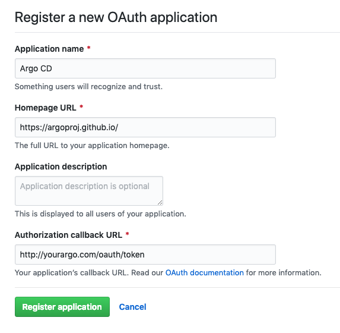
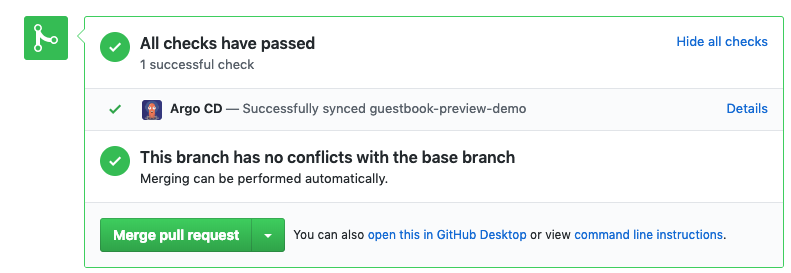

# Preview

Argo CD supports the concept of a **preview app**. 

Currently, this is constrained:

* You must be able to set-up your Argo CD instance so that Github can send messages to it.
* You're happy to deploy to a single namespace named "preview" within the same cluster as the app.
* Any preview apps that go wrong need to be manually fixed.  

To create a preview app you need to.

## Configure Externally Facing URL

You'll need to make sure your Argo CD can be seen by Github. Typically, it might be behind a firewall and you'll need to set-up ingress to allow Github to reach it.

Make sure you configure the public URL in your settings, see [declarative setup](declarative-setup.md).

## Configure WebHooks

This feature only works if you have Github set-up to send events to your Argo CD instance. Read [WebHook](webhook.md)

## Set-up Argo CD as an OAuth app in Github

Create an application using: https://github.com/settings/applications/new.

Note: the callback must be `/oauth/token`.

Then you need to add the client ID and client secret to your Argo CD instance:

~~~bash
kubectl -n argocd edit secret argocd-secret
~~~

And add them:

~~~yaml
stringData: 
  github.clientId: "******"
  github.clientSecret: "******"
~~~

Restart Argo CD, and then connect it to Github by opening: http://yourargo.yourorg.com/oauth/authorize.

You should see the "Complete" when done.

## Create A Preview Namespace

~~~bash
kubectl create namespace preview
~~~

## Create Your App

For example:

~~~bash
argocd app create guestbook \
    --repo https://github.com/alexec/argocd-example-apps.git \
    --path guestbook \
    --revision master \
    --dest-namespace default \
    --dest-server https://localhost:6443
~~~

Create a branch of your app, then create a pull request

~~~bash
git clone https://github.com/alexec/argocd-example-apps.git
cd argocd-example-apps
git checkout -b test
vi guestbook/guestbook-ui-deployment.yaml ;# maybe increase the replicas
~~~

Et voila - you should see a new app name `guestbook-preview-test`. You should also see the application status in Github:

