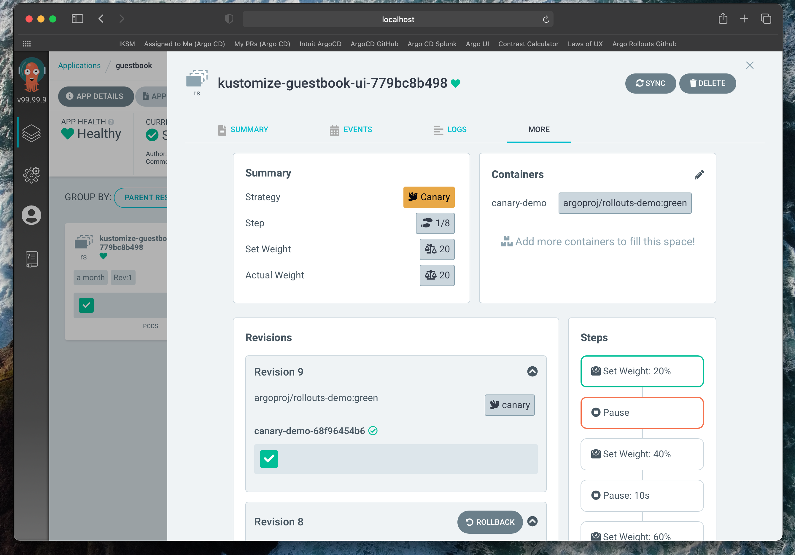

# Argo CD Extensions


## Summary

This proposal is to provide a mechanism to extend Argo CD such that it can provide resource-specific visualizations, capabilities and interactions in the following ways:

1. Richer and context-sensitive UI components can be displayed in the user interface about custom resources.
2. Custom health checks can be configured to assess the health of the resource.
3. Custom actions could be performed to manipulate resources in predefined ways.


## Motivation

Argo CD is commonly used as a dashboard to Kubernetes applications. The current UI is limited in that it only displays very general information about Kubernetes objects. Any special visualizations can currently only be done for native Kubernetes kinds.

For custom resources, Argo CD does not by default have any special handling or understanding of CRs, such as how to assess the health of the object or visualizations. When examining a resource, a user can only see a YAML view of the object, which is not helpful unless they are familiar with the object's spec and status information.

Note that Argo CD does currently have a resource customizations feature, which allows operators to define health checks and actions via lua scripts in the argocd-cm ConfigMap. However, the current mechanism of configuring resource customizations is difficult and highly error prone.

This proposal would allow operators to more easily configure Argo CD to understand custom resources, as well as provide more powerful visualization of objects.


## Use cases

### Use case 1: 
As a user, I would like to see visual information about my Rollout without having to use the CLI or otherwise leave Argo CD.

### Use case 2:
As an operator, I would like to configure Argo CD to be able to assess the health of a custom resource based on its status.

### Use case 3:
As an operator, I would like to configure Argo CD to perform pre-defined actions (object mutations) on a custom resource, for example restarting a Rollout.


### Goals

- Enable new visualizations in the UI for resources that do not have baked-in support
- Extensions can be configured by operators at runtime, without a feature being built directly into Argo CD, and with no need to recompile UI code.
- Extensions should be easy to develop and install.
- Loose coupling between Argo CD and extensions.
- Replace current resource customizations in `argocd-cm` ConfigMap with extensions


## Proposal
 
A new `ArgoCDExtension` CRD would be introduced which will allow operators configure Argo CD to understand how to handle and visualize custom resources. Visualizing a object requires javascript to render the object, and health/actions require lua scripts. As such, the extension CR would need to point to some location where the javascript/lua code would be hosted.

It is proposed that a git repository be used to contain the javascript code, as well as the lua scripts necessary to assess health or perform actions of a resource.


### ArgoCDExtension CRD

In the most simplest form, an Argo CD extension could simply be a pointer to a git repository at a revision:

```yaml
kind: ArgoCDExtension
metadata:
  name: argo-rollouts
spec:
  repository: https://github.com/argoproj-labs/rollout-extension
  revision: HEAD
```

### Git Repository Structure

The git repository would have an expected structure, such that the scripts and UI component could be discovered easily by Argo CD based on resource kind.

```
├── README.md
├── argoproj.io
│   ├── AnalysisRun
│   │   ├── actions
│   │   │   ├── discovery.lua
│   │   │   └── terminate
│   │   │       └── action.lua
│   │   └── health.lua
│   ├── Experiment
│   │   └── health.lua
│   └── Rollout
│       ├── ui
│       │   └── extension.js   # dynamically loaded by argocd-server
│       ├── actions
│       │   ├── abort
│       │   │   └── action.lua
│       │   ├── discovery.lua
│       │   ├── promote-full
│       │   │   └── action.lua
│       │   ├── restart
│       │   │   └── action.lua
│       │   ├── resume
│       │   │   └── action.lua
│       │   ├── retry
│       │   │   └── action.lua
```

Note that it may be necessary to support multiple versions of a resource (e.g. v1alpha1 vs. a v1 version of a custom esource), and so the path structure may need to also support incorporating the version in the path. For example:

```
├── argoproj.io
│   ├── v1alpha1
│   │   ├── AnalysisRun
```

### User Interface

In the UI, a new tab in the Resource View will be made available. The contents of that tab would dynamically loaded by the Argo CD API server at the git URL specified in the extension, which would be cloned locally by the API server.


## Implementation Details

At a high level an Argo CD extension is simply a React component, which is dynamically loaded at runtime by the Argo CD API server.

In order for the component to render some visualization about a resource, it needs to be supplied at least two key peices of information:
1. The full resource object itself
2. The entire Application Resource Tree

We provide the entire application tree to accomplish two things: 

1. Extensions get basic (shallow) live updates for free because the Resource Tree is already live updated
2. Extensions may wish to display richer hierarchical structure for other related objects (e.g. the Rollout extension would want to display ReplicaSets and Pods)

Further, if an Extension needs richer information than that provided by the Resource Tree, it can request additional information about a resource from the Argo CD API server.

```typescript
interface Extention {
    ResourceTab: React.Component<{resource: any}>;
}
```


The UI will dynamically import an Extension React component from the Argo CD API Server. This is accomplished by specifying the generic Extension component as a Webpack external, and including a `<script>` tag in the `index.html` template that refers to the Argo CD API Server's generic extension endpoint (i.e. `/api/v1/extensions`). The API Server serves a different instantiation of the generic Extension component depending on the Resource being displayed; the generic extensions endpoint will have intelligence that reverse proxies the relevant third-party Extension API. The third-party Extension itself must conform to certain standards for this dynamic import (i.e. it must not bundle React). 

### Installation

Installing Argo CD Extensions support will be enabled with a single `kubectl apply`. This will:

1. Install the `ArgoCDExtension` CRD
2. Patch the Argo CD API Server with a sidecar

The sidecar will be responsible for cloning repos specified in `ArgoCDExtension` CRs and mounting them in a well known location understood by the API server. 

Some changes are required in the Argo CD API server:

1. It will serve Javascript assets mounted by the sidecar in the well known location to the UI at an endpoint (i.e. `/api/v1/extensions/<resource-kind>`)
2. It will retrieve Actions Lua scripts from the same well known location mounted by the sidecar instead of from `argocd-cm`


### UI Extention Interface

TODO


### Detailed examples

TODO

#### Argo Rollout Extension PoC: 



### Security Considerations

- Any write operations must be configured as Lua scripts defined in the ArgoCDExtension Custom Resource so that Argo CD RBAC can be enforced when a user invokes an action


### Risks and Mitigations

We will be allowing the Argo CD UI to serve dynamically imported UI assets; while these dynamic imports will only occur from same-origin, malicious Extensions may inject hazardous code. We may also consider publishing a list of "sanctioned" or "approved" Extensions that we believe to be trustworthy (e.g. Argo Rollouts' or Workflows' Extensions).


### Upgrade / Downgrade Strategy

Existing Argo CD instances should be unaffected by this change. Extensions are opt-in only, and ideally none should be installed by default. 

To opt in, operators will need to install services that comply with the Argo CD Extensions API and expose that service such that it is reachable by the Argo CD API Server. To uninstall an extension should be as simple as deleting the ArgoCDExtension CR.

## Drawbacks

Argo CD was designed to be a GitOps tool, not a cluster visualization dashboard. Extensions open the door to increase Argo CD's scope in a way that may not be desirable.

## Alternatives

We originally considered building native support for resources like a Rollout directly into Argo CD. However, this tightly couples the Argo CD Server to an Argo Rollouts version, which is problematic when Argo CD manages several clusters all running different Rollouts versions.

We additionally considered requiring recompilation of the Argo CD UI (and by extension, the API server) to install Extensions in a similar fashion to Config Management Plugins. However, this is a headache for operators, and given that we are in the process of improving the Config Management Plugin paradigm, we should not go down this path if possible.

## Open Questions

It will be important to allow Extensions to specify their own documentation URLs to be displayed as a button or banner to users, as to make clear that UI with support requests for third party extensions.
