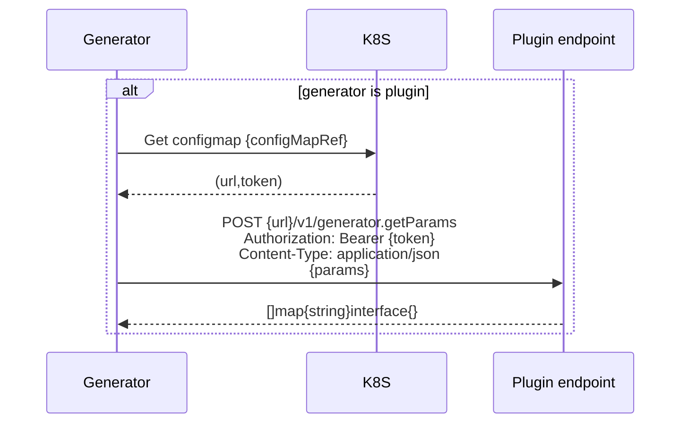

# ApplicationSet `plugin` generator

Provide a generator that request its values through a RPC call.

## Summary

ApplicationSet generators are useful for modeling templates using external data sources to deploy applications.

Today, generators have been developed based on the needs of the community, and when a new need arises, it's necessary to modify the Appset codebase.

The proposal here is to have a "plugin" generator that would allow extending the codebase according to specific needs, without having to modify it directly.

## Motivation

Using the current generators, we sometimes encounter a need that arises, which may or may not be useful for the community. In such cases, several procedures need to be undertaken to make the modification, and sometimes it may be rejected because it's not in everyone's interest.

The plugin approach also reduces the burden on community developers by externalizing feature requests into plugins that are outside the Appset controller's scope. From a security and scalability perspective, this can be advantageous.

With this approach, it becomes possible to offer a catalog of plugins and encourage people with specific needs to develop standalone plugins that are independent of the controller's codebase.

### Goals

Empowering community developers to develop and use plugins that extend the list of generators can be a significant advantage. It would be possible to offer a page listing plugins maintained by the community, which can help promote the development of a rich ecosystem of plugins for various use cases. This can enhance the overall user experience by providing more options for generating application templates.

Additionally, allowing developers to create plugins and share them with the community can foster innovation and encourage experimentation with new features and functionalities. It can also reduce the workload on the Appset development team, enabling them to focus on core features and functionalities.

Overall, giving autonomy to community developers through plugins is a practical way to enhance the Appset platform and provide more value to users.

### Non-Goals

The concept of the plugin should not undermine the spirit of GitOps by externalizing data outside of Git. The goal is to be complementary in specific contexts.

For example, when using one of the PullRequest generators, it's impossible to retrieve parameters related to the CI (only the commit hash is available), which limits the possibilities. By using a plugin, it's possible to retrieve the necessary parameters from a separate data source and use them to extend the functionality of the generator. This approach allows for greater flexibility and can help overcome limitations imposed by GitOps.

Overall, the use of plugins should be considered as a way to enhance the capabilities of existing tools and processes rather than as a replacement for them. By leveraging plugins, developers can take advantage of the strengths of different tools and technologies, resulting in a more robust and flexible development process.

## Proposal

### Add a new `generator` plugin

```
apiVersion: argoproj.io/v1alpha1
kind: ApplicationSet
metadata:
  name: fb-plugin
  namespace: argo-system
spec:
  generators:
    - plugin:
        configMapRef: fb-plugin
        name: feature-branch-plugin
        params:
          repo: "my-repo"
          branch: "my-branch"
        requeueAfterSeconds: 10
  template:
...
```

### Add a configMap to configure the plugin

The configMap name must match the configMapRef value in the plugin configuration. The configMap must be in the namespace of argo.

```
apiVersion: v1
kind: ConfigMap
metadata:
  name: fb-plugin
  namespace: argo-system
data:
  token: $plugin.myplugin.token # Alternatively $<some_K8S_secret>:plugin.myplugin.token
  baseUrl: http://myplugin.plugin.svc.cluster.local
```

- token is used a bearer token in the RPC request. It could be a [sensitive reference](https://argo-cd.readthedocs.io/en/stable/operator-manual/user-management/#sensitive-data-and-sso-client-secrets).

### Reconciliation logic

Here is a diagram describing what the plugin generator should do to get the params to return:




### Use cases

#### Use case 1:
As a user, I would like to enrich PullRequest generator params with digests of images generated by the pull request CI pipeline.

I could define a generator matrix like

```yaml
  generators:
    - matrix:
        generators:
          - pullRequest:
              github:
                owner: binboum
                repo: argo-test
                labels:
                - preview-matrix
                tokenRef:
                  secretName: github-secret
                  key: token
          - plugin:
              configMapRef: cm-plugin
              name: plugin-matrix
              params:
                repo: "argo-test"
                branch: "{{.branch}}"
```

When pullRequest returns a new PR matching my labels, the plugin will be called with the branch name and would return a set of digests like

```json
[
  {
    "digestFront": "xxxxxxxx",
    "digestBack": "xxxxxxxx",
  }
]
```

Values can then be used in the template section :

```yaml
  template:
    metadata:
      name: "fb-matrix-{{.branch}}"
    spec:
      source:
        repoURL: "git@github.com:binboum/argo-test.git"
        targetRevision: "HEAD"
        path: charts/app-client
        helm:
          releaseName: feature-test-matrix-{{.branch}}
          valueFiles:
            - values.yaml
          values: |
            front:
              image: registry.my/argo-test/front:{{.branch}}@{{ .digestFront }}
            back:
              image: registry.my/argo-test/back:{{.branch}}@{{ .digestBack }}
      destination:
        server: https://kubernetes.default.svc
        namespace: "{{.branch}}"
```

### Detailed examples

### Security Considerations

* Plugin server only has access to the params content. When deployed outside of the applicationset controller pod, operator must ensure the communication between applicationset controller and the plugin server is properly secured (https/network policy...). A few authentication mechanism are handled to help the plugin server authenticate the request.
* For now, the response payload is considered trusted and returned params are used as-is upstream

### Risks and Mitigations

TBD

### Upgrade / Downgrade Strategy

On the evolution of the plugin, and calls :

The RPC method is standardized with a versioning system, which allows for a version parameter to be included in the API call. This makes it possible to avoid breaking changes in case of architecture changes in the future.

Thought that the contract interface with the plugin server is kept simple to reduce future changes and breaking changes

## Drawbacks

No idea

## Alternatives

1. A design similar to Argo Workflow executor plugin :

    ```
    generators:
    - plugin:
        hello: {}
    ```

    A set of ConfigMaps or a specific CRDs to express configuration of the plugin endpoint would be walk by ApplicationSet server. For each configuration, call the plugin endpoint with the content of plugin until one return a valid response.
    
    Reconciliation should be fast as fast as possible and trying out every endpoint to figure out which one is able to handle the plugin payload could induce a lot of delay.
   
    Configuration rely on implicit and weakly typed convention which make the usage of the plugin less self documented.

2. Plugin server as defacto sidecars

    Some magic could have inject a container image for the plugin in the ApplicationSet controller in a similar way, Argo Workflow does when creating a pod to execute a job.

    Require an external controler or manual configuration. The plugin would not scale independently of the ApplicationSet controller.