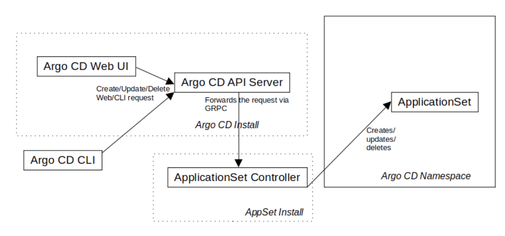

# Neat Enhancement Idea

This is a proposal to add support for creating ApplicationSets via the Argo CD Web/CLI, by adding support to the ApplicationSet and API Server backend that respects Argo CD RBAC.

## Summary

Currently, users can only create ApplicationSets by applying configurations declaratively using `kubectl`. Introducing support for CLI/UI would improve the overall experience for managing large number of applications using ApplicationSet.

## Motivation

As ApplicationSet Controller is now part of ArgoCD installation, we would like to allow users to be able to create/update/delete application sets via CLI/UI.

### Goals

* **Expose endpoints in the API server to interact with ApplicationSets**

  Users should be able to create/update/delete ApplicationSets using argocd CLI/UI.

* **Changes to CLI**

  Add a new argocd command option `appset` with `create`, `delete`, `update` and `list` sub-commands.

## Proposal

This is the high level overview of creation (update/deletion) of an ApplicationSet via Argo CD CLI/UI.



1. User issues `argocd appset create/update/delete`(or Web UI equivalent) command from CLI, into an Argo CD server on which they are logged-in. The command converts the command request into GRPC and sends it off to Argo CD API Server.

#### **Argo CD API Server:**

2. The API Server receives Create/Update/Delete request via GRPC and verifies that ApplicationSet controller is installed within the namespace (if not, return an error response back to user). 
3. The API Server sends the GRPC request to the ApplicationSet controller via GRPC including authentication information from the user in the request.

#### **ApplicationSet controller:**

4. ApplicationSet controller receives Create/Update/Delete GRPC. (These next steps will be a create example, but update and delete are similar.)

5. ***Pre-generate check:*** Application controller will perform various checks before creating ApplicationSet:

    * Ensure user has appropriate RBAC to run the generator:
      * Verify that the user can access the Git repository (for Git generators)
      * Verify that user has cluster access (to see the clusters, for Cluster generator)
      * Verify that the user has permission to create/update/delete (depending on the request type) at least one Application within the RBAC policy. We want to prevent the generators being invoked by users that don't have permissions to create any Applications (since generators or templates might be exploited to DoS the ApplicationSet controller, using a malicious ApplicationSet)

6. Once the pre-checks have been confirmed, the controller will run the generator, and render the parameters into the template. Upon generating the template, the controller will need to perform some checks before creating the Applications.

7. ***Post-generate check:*** Look at the generated Applications (but don't apply them yet!), and verify that user has the required RBAC permissions to perform the required actions. This is a dynamic (or runtime) check, as it works on the dynamically generated applications; eg. it is not possible to predict the result of these checks without first running the generator, unlike the static checks.

8. Once all the checks have passed, apply the ApplicationSet and the Applications, to the namespace.

#### **Should we add a new 'applicationset' RBAC resource?**

* Do we need to add a new RBAC resource for applicationsets, alongside the existing ones? (clusters, projects, applications, repositories, certificates, accounts, gpgkeys)
Not mandatory for the design explained in this proposal.

* If we DID add a new RBAC resource, this would require application administrators to add a new ApplicationSet resource to the RBAC policy list, alongside their existing Application policies and to keep the ApplicationSet and Application RBAC policy lists in sync. Or, said another way: there would be very few (if any) cases where a user would need to be able to create an Application, but not be able to create an ApplicationSet (and vice versa). When it comes to security, the less moving parts that need to be synchronized, the better (with some minor loss in flexibility, eg the ability to specifically prevent access to ApplicationSet resource).

* If there is no RBAC resource for applicationsets, how do we control access to them?
Instead of an applicationset rbac resource, we instead examine the Applications that are owned by the applicationset. An ApplicationSet inherits permissions from its generated children.
Example: if you try to delete an ApplicationSet, we check if you can delete it’s child Applications.

#### **ApplicationSet Deletion Algorithm:**

A user is only able to delete an ApplicationSet if they have permissions to delete all of the Applications managed by the ApplicationSet. This check is performed in ApplicationSet controller, on receiving a delete request via GRPC from API server.

* For each application owned by the ApplicationSet that the user is attempting to delete:
    * Check if the user has delete permission on the Application
    * Check if the user has delete permission within the project (?)
* If the user does NOT have permission on least one of these, the operation should fail.
* On pass, ApplicationController server deletes (ie kubectl delete) the ApplicationSet resource.

#### **ApplicationSet Update Algorithm:**

A user can only update an ApplicationSet if the user has permission to create, update, delete all of the Applications currently owned by the ApplicationSet.

* When the user makes a change to an ApplicationSet, we assume that it's possible that the change might affect any or all of the Applications, and thus we require the user to have write access to all of those Applications.
* We likewise check that the resulting generated Applications are also compliant with the user's permissions.

Algorithm is, if the user attempts to update an ApplicationSet via Web UI/CLI:

* ApplicationSet controller receives a request to update an ApplicationSet from API server
* The ApplicationSetController looks at all the Applications owned by the ApplicationSet (via ownerref or annotation):
    Verify that the user has permission to act on all of the Applications currently managed by the ApplicationSet
* If the above precondition is met, proceed to the next step, otherwise fail.
* The ApplicationSet is generated and rendered into a template
  * Look at the generated Applications, and make sure the user has appropriate privileges
    * All the same checks done by the Create workflow, described above, are done here (user can access repo, cluster, etc
* Finally, on success, the API server applies (kubectl apply) the requested change to the ApplicationSet (and the Applications).

#### **ApplicationSets and AppProjects:**

An important design constraint in this area: ApplicationSets do not belong to projects. They generate Applications that are a part of projects, but they themselves are not part of a project.

1. Why not just include a project field on ApplicationSet CR?

   A single ApplicationSet has the power to produce Applications within multiple projects, so it does not necessarily make sense to include an ApplicationSet within a single project.

2. Why not just include a projects field (array of strings) on ApplicationSets, to allow it to belong to multiple projects?

   This is getting closer to ideal, but still limits the expressive power of the ApplicationSet: it requires a user to specify, up front, what projects they expect to generate applications for. Eg you must statically define an ApplicationSet's projects. This excludes the scenario where the projects that a particular ApplicationSet will generate Applications for is truly dynamic, eg coming from a configuration file in Git, and thus not known at creation.

3. We still need a way to limit the scope of user actions against ApplicationSets. Even though ApplicationSets don't belong to a project, we still need to prevent users from modifying ApplicationSets that they don't have RBAC access to. By looking at the projects of child objects, we achieve the same goal. We don't want users to be able to delete ApplicationSets that they don't have RBAC access to. But, since ApplicationSets don't have a project, we need some way to tell what applications/projects an ApplicationSet manages. So we use the applications and projects within it.

#### **Command Design:**

```shell
argocd appset create "(filename.yaml)"
argocd appset delete "(applicationset resource name)"
argocd appset apply  "(filename.yaml)"
```

This proposal assumes that the ApplicationSet controller is still an optional, standalone install. Thus all argocd appset commands should fail if the ApplicationSet controller is not installed. (The Argo CD API server would check if the ApplicationServer is running by looking for a deployment with a specific 'applicationset controller' annotation, or similar mechanism.)

This command proposal differs significantly from how the argocd app create command is designed: notice the lack of parameters to appset create/apply besides the filename. Rather than creating an application(set) by adding support for a large number of parameters, eg:

```shell
argocd app create guestbook --repo https://github.com/argoproj/argocd-example-apps.git --path guestbook --dest-namespace default --dest-server https://kubernetes.default.svc --directory-recurse
```

Instead appset create and appset apply will just take as a parameter, a path to a YAML file, in the form of a standard ApplicationSet CR:

```yaml
# cluster-addons.yaml:
apiVersion: argoproj.io/v1alpha1
kind: ApplicationSet
metadata:
  name: cluster-addons
spec:
  generators:
  - git:
      repoURL: https://github.com/argoproj-labs/applicationset.git
      revision: HEAD
      directories:
      - path: examples/git-generator-directory/cluster-addons/*
  template:
    metadata:
      name: '{{path.basename}}'
    spec:
      project: default
      source:
        repoURL: https://github.com/argoproj-labs/applicationset.git
        targetRevision: HEAD
        path: '{{path}}'
      destination:
        server: https://kubernetes.default.svc
        namespace: '{{path.basename}}'

```

```shell
# Create the above ApplicationSet
argocd appset create cluster-addons.yaml
```

In general, the reason to use YAML is that CLI parameters aren't a good fit for allowing the user to fully express what can be represented with an ApplicationSet resource.

#### **Why use YAML file, over CLI params:**

* Easier for users to specify a YAML file, than specifying a bunch of parameters
  * By my count, if creating an ApplicationSet using parameters, it would take at least 8 parameters (16+ command arguments)
  * For example, the above ApplicationSet would look like: 

```shell
appset create --name cluster-addons --gitGeneratorRepoURL "repo url" --gitGeneratorRevision "HEAD" --gitGeneratorDirectory "examples/git-generator-directory/cluster-addons/*" --templateMetadataName "{{path.basename}}" --templateProject "default" --templateSrcRepoURL "https://github.com/argoproj-labs/applicationset.git" --templateSrcRevision "HEAD" --templateSrcPath "{{path}}" --templateDestServer "https://kubernetes.default.svc" --templateDestNamespace "{{path.basename}}"
```

* Matrix generator is especially tough to represent with parameters, as it takes two generators as input, eg:

```shell
spec:
  generators:
  - matrix:
      generators:
        - git:
            name: cluster-deployments	
            repoURL: https://github.com/argoproj-labs/applicationset.git
            revision: HEAD
            directories:
            - path: examples/proposal/matrix/cluster-addons/*
        - clusters:
            selector:
              matchLabels:
                argocd.argoproj.io/secret-type: cluster
```

* Likewise, tough to get full expressive power of YAML, due to support for arrays of generators:

```yaml
spec:
  generators:
  - list: 
    # (...)
  - list:
    # (...)
  - list:
    # (...)   
```

#### **Why use CLI params, instead of YAML:**

* Users might be more familiar with Argo CD CLI style commands
* Some folks are less literate in YAML, and thus don't grok YAML's hierarchy/parsing rules (which is totally fair, they are initially obtuse)
* CLI has the advantage of hiding the hierarchy (for better or worse)


#### A new component for Application Set

The Application Set will follow the same design as the rest of ArgoCD project by having separate components with different responsibilities. With that, Application Set Controller will not expose any API (internal or external) and be a simple Kubernetes Controller with a single responsibility of reconciling ApplicationSet resources. In order to expose the API endpoints for Application Set controller, we need to come up with a new additional server running Application Set controller + Application Set API.

Later, we would plan to move the code of this new server into existing controller package, but this would require a separate proposal on it's own.

## Alternatives

Rather than using Argo CD's CLI, we could create a new AppSet CLI "appset" that would communicate directly with the ApplicationSet deployment, rather than going through the Argo CD API Server as an intermediary (though if we were adding web UI support, this would still be required regardless).
