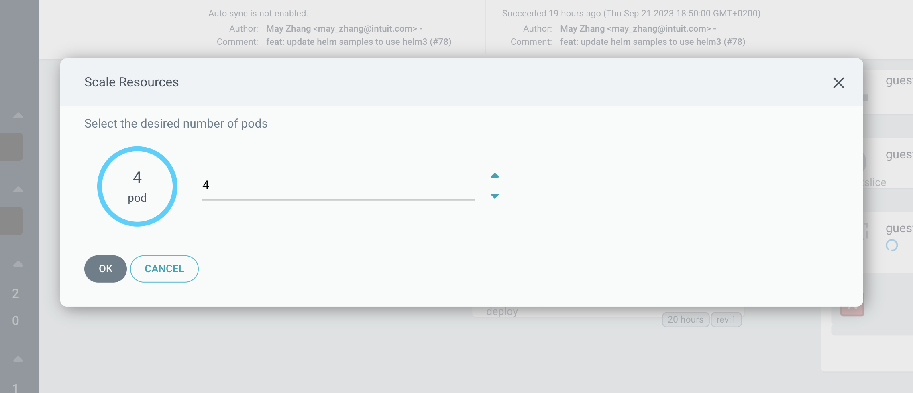

# Scale up and down the resources in the UI

## Summary

Implement UI where users could scale up and down the resources by clicking arrows or entering inputs.

## Motivation

The main motivation is to provide a convenient way to scale resources from ArgoCD UI, this can be useful for users who are not aware of yaml language and provide a user-friendly way to scale resources.

### Goals

Eliminate the need of accessing configuration files for users without technical knowledge (e.g. PROD support), but on the other hand provide an ability to scale up and down the resources in the UI.

### Non-Goals
Only Jobs/Deployment/StatefulSet is in scope of this task

## Proposal
1. Add Configure Resources button to the context menu of Jobs/Deployment/StatefulSet
2. Once user press it, popup is displayed
3. In the popup user can type number of Pods in the input field or increase/decrease it by clicking arrows
4. Validation should be implemented which prohibit entering any value less than 0 or more than max int or any non-numeric value
5. If user cancel changes, UI should not make a call to the BE
6. If user submit the changes, UI should make a call on the BE which performs custom actions
7. As part of this story, inputs to the custom actions should be added across the app(including lua scripts) in order to pass user selected value
8. On the BE side lua script should be executed which perform scale up or down

### Use cases

#### Use case 1:
As a user, I should be able to configure number of Pods for Jobs/Deployment/StatefulSet in the input field and then save

#### Use case 2:
As a user, I should be able to configure number of Pods for Jobs/Deployment/StatefulSet when I click the arrows and then save

#### Use case 3:
As a user, I should not be able to enter non-numeric value in the input field for Jobs/Deployment/StatefulSet

#### Use case 4:
As a user, I should not be able to select negative value for the Jobs/Deployment/StatefulSet resources

#### Use case 5:
As a user, I should be able to cancel the changes 

### Detailed examples

### Security Considerations

We think this change will not have a direct impact on the security of Argo CD or the applications it manages.

### Risks and Mitigations

We do not see any risks in implementing this solution, because this functionality is already available by editing the configuration file.

### Upgrade / Downgrade Strategy

Upgrading to new version and downgrading to old version should be frictionless, safe and won't require any configuration settings.

## Drawbacks

This change will add input parameters to resource action which can be identified as a breaking change

## Alternatives

We do not see any alternatives for this solution