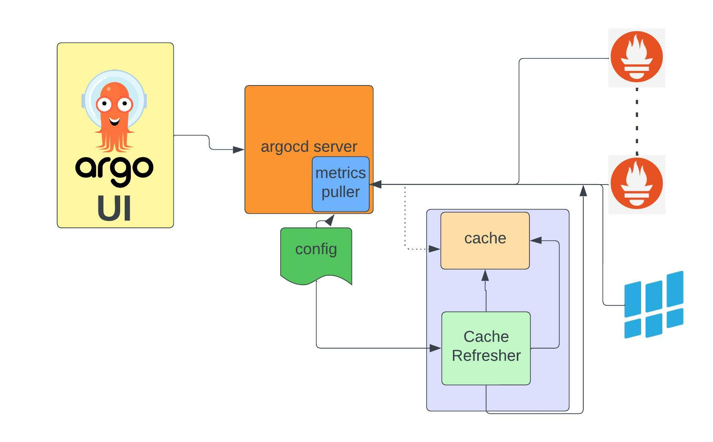

## Summary

Enhancing ArgoCD UI to display the Resource Metrics on the Resource Page will help the user to quickly triage 
the resource status and make decisions instead of viewing other metrics tools.
 
POC demo : https://github.com/argoproj/argo-cd/issues/9562

## Motivation

Currently, ArgoCD user needs to go to third-party tools to view the resource KPI for triaging the issue which is 
time-consuming to decide on application recovery.

### Goals
Phase 1:
1. Show the Metrics tab in Resource tab
2. Show the configured dashboard in Metrics tab
3. Able to configure the dashboard for each application and resources
4. Support Prometheus as metrics provide in MVP release
5. Adding feature flag to enable and disable this feature
Phase 2:
1. Adding Caching layer to improve the API performance

### Non-Goals


## Proposal

##### ArgoCD UI:
Enhancing ArgoCD UI to support the Metrics tab on the resource page. This Tab will be enabled and disabled using the feature flag. 
This Metrics component will make an API call to render the metrics dashboard from the new Metrics Server.

##### ArgoCD Server:
Enhancing ArgoCD Server to have metrics puller and will expose the APIs to provide the Dashboard and Metrics information. Metrics Puller will read the Dashboard, Graph, and metrics provider configuration from Configmap.  

##### Authentication:
No need for separate implementation

##### Defining Metrics page:
The metrics page is fully configurable. UI will call API to get the dashboard layout and graph information from the server. User

##### Enable/Disable the feature:
The server will return HTTP resource code:405  if the feature is not enabled. UI will show/hide the metrics tab.


### Use cases
1. User can compare KPIs for rollout releases  quickly.
2. User can review the service performance.

### Implementation Details/Notes/Constraints [optional]

##### Metrics Tap:
This feature is going to be first class citizen in ArgoCDUI. Adding Metrics Component in Resource page. Implement Metrics
Service  to make API call to query the Dashboard configuration and Graph data.

##### Metrics Puller:
Metrics Puller module will be implemented in ArgoCD Server. ArgoCD API server to expose the APIs for Metrics Dashboard and Graph data.

Metric Dashboard and Graph query can be fully configurable.  All Dashboard and Graph query  will be configure in Configmap. 
Metric puller will read the appropriate dashboard configuration based on application/resource kind. Metrics puller will read the graph
query from configmap and execute it in configured metrics provider(`prometheus`).

##### Architecture:



New APIs:
`/api/metrics/:application/:cluster/:group/:kind/dashboard → Get Dashboard config`

Response:
http://localhost:9003/api/metrics/application/o11y/application/test/test/v1/pod/dashboard
```json
{
  "group": "v1",
  "kind": "pod",
  "rows": [
    {
      "Name": "HTTP",
      "graphs": [
        {
          "name": "http_duration",
          "title": "HTTP duration",
          "description": "",
          "graphType": "pie",
          "Duration": "1d",
          "queryExpression": "rate(container_cpu_user_seconds_total{pod=\"{{.name}}\", namespace={{.namespace}}}[30s])*100"
        }
      ]
    }
  ]
}

```

`/api/metrics/:application/:cluster/:group/:kind/:row/:graph→ Get Metrics for Graph`

Dashboard and Graph Configuration:

Application, Dashboard and cluster has `default` element.  Default Application will be return if there is not special config for application.
Metrics puller will execute query on default cluster if there is no config for the cluster.

```yaml
{
  "prometheus": {
    "applications": [
      {
        "name": "default",
        "default": true,
        "dashboards": [
          {
            "group": "v1",
            "kind": "pod",
            "rows": [
              {
                "name": "HTTP",
                "graphs": [
                  {
                    "name": "http_duration",
                    "title": "HTTP duration",
                    "graphType": "pie",
                    "duration": "1d",
                    "queryExpression": "rate(container_cpu_user_seconds_total{pod=\"{{.name}}\", namespace={{.namespace}}}[30s])*100"
                  }
                ]
              }
            ]
          }
        ],
        "clusters": [
          {
            "Name": "default",
            "default": true,
            "address": "http://localhost:9001"
          }
          {
            "Name": "cluster",
            "address": "http://localhost:9002"
          }
        ]
      }
    ]
  }
}
```
### Detailed examples


