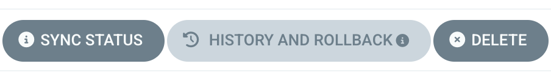
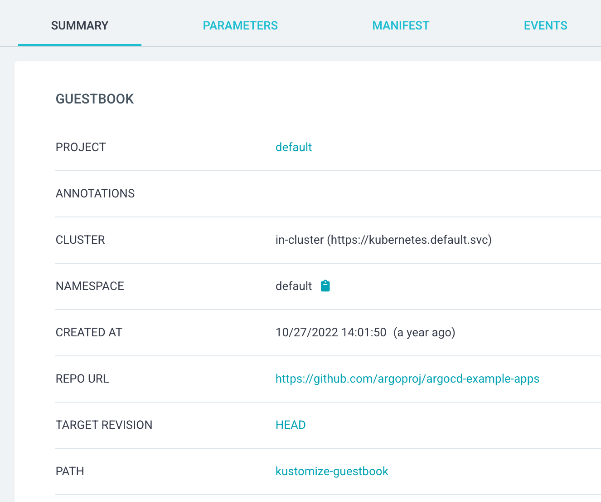
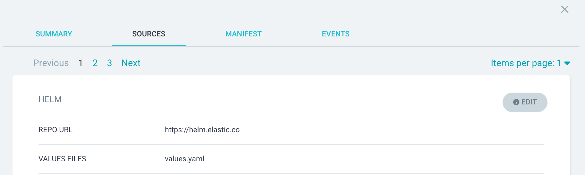
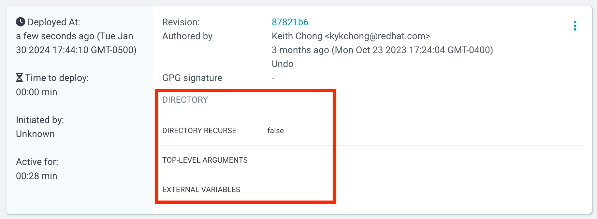
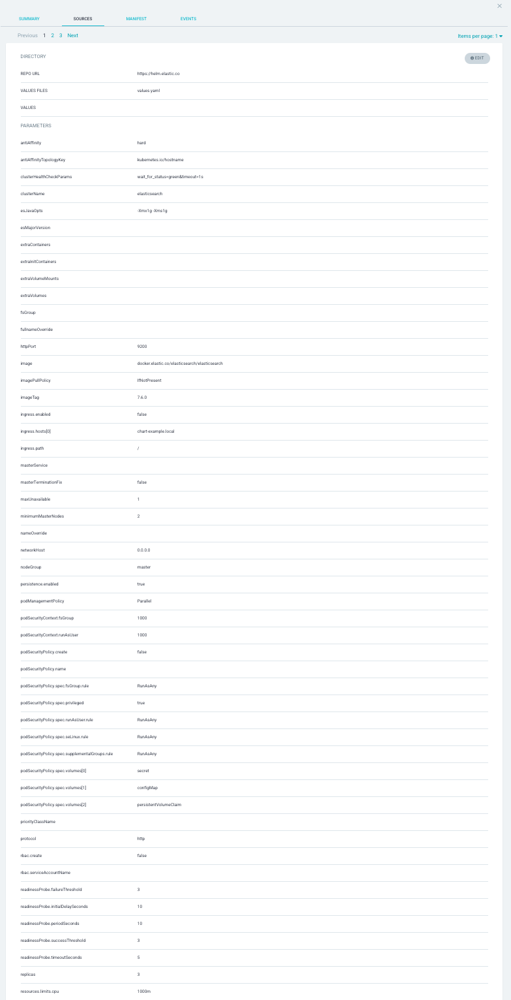

# UI Support for Multiple Sources in Applications

This is the proposal for the UI changes to support multiple sources for an Application.

Related Issues:
* [Proposal: Support multiple sources for an application](https://github.com/argoproj/argo-cd/blob/master/docs/proposals/multiple-sources-for-applications.md)
* [Issue for the Proposal: Support multiple sources for an application](https://github.com/argoproj/argo-cd/issues/677)

## Summary

This is a follow-on proposal to supporting Multiple Sources for Applications, but for the UI.

The above [original](https://github.com/argoproj/argo-cd/blob/master/docs/proposals/multiple-sources-for-applications.md#changes-to-ui) ‘core’ proposal deferred
any design changes for the UI to a separate feature or secondary proposal. The proposal implementation that was made in [PR 10432](https://github.com/argoproj/argo-cd/pull/10432) 
enabled the UI to tolerate multi-source applications with the new Sources field, while still supporting the original Source field. 

Here are the current restrictions and limitations of the UI when applications with multiple sources are used:

1. The application’s details page (for [example](https://cd.apps.argoproj.io/applications/argocd/guestbook?view=tree&node=argoproj.io%2FApplication%2Fargocd%2Fguestbook%2F0&resource=)) 
currently shows one ApplicationSource, regardless of whether the application has one source or multiple sources. With the PR 10432 implementation, if the application has multiple sources,
the UI displays only the first of the sources. Also, in particular, in the Summary tab, the source parameters are non-editable. 

2. History and Rollback is disabled for multi-source applications. The button is disabled. Jorge has submitted a PR for 
rollback which includes [controller and UI changes](https://github.com/argoproj/argo-cd/pull/14124).

   

3. The New Application dialog currently only allows users to provide one source.

Thus, multiple source applications are not considered first class citizens in the UI.

Note, see the [Open Questions](https://github.com/argoproj/argo-cd/docs/proposals/multiple-sources-for-applications-ui.md#open-questions) 
section for concerns regarding the priority or value of some of the above changes.

## Motivation

The motivation behind this change is to add a more complete story for the multiple source feature. The UI should support 
the creation of multiple source applications, and also support the viewing and editing of parameters from all sources. The three
points in the summary above are the base or core changes that need to be addressed.

### Goals

The goals of the proposal are:

- Provide first-class support of multiple sources for applications in the UI (e.g. address the aforementioned restrictions)
- Outline stages of implementation that will help ease PR review, and reduce the risk of introducing regressions/issues.

### Non-goals
* The design changes for the Argo CD CLI is beyond the scope of this proposal (The server APIs can probably be reused)

## Proposal

As mentioned in the previous summary section, the application source parameters are surfaced in the UI in three locations.
The Resource details pages, specifically, the Summary and Parameters tabs, the deployment history, and the Application
Create panel page. These pages should be updated.

### Resource Details

The following describes the current behavior and proposed changes for the Summary tab and the Parameters Tab.

#### i) Summary Tab

_Current Behavior:_ 

The current Summary tab includes source-related information, including the repository. For example, in Figure 1 below,
the REPO URL and PATH.

Figure 1: The current Summary tab

_Proposed Change:_

To support multiple sources, the source-related information, from a single-source-based design, will be ‘pulled out’ 
and put into a new tab called **Sources**, and it will be combined with the **Parameters** tab (more details following). 
The new **Sources** tab will allow users to view all the information related to each source, including the repo URL 
and path, chart and revision for Helm, etc. 

The view should show one source at a time (similar to what the UI is doing now, which only shows one source), but with 
widgets to allow users to cycle (via pagination or combo selector?) through each source. There are API calls to retrieve 
the data for each source.

Figure 2. The new SOURCES tab will allow access to view all sources and application parameters.

#### ii) Parameters Tab
_Current Behavior:_ 

The Parameters tab shows the application parameters for the application’s repository details type or source. These can 
be Helm, Kustomize, Directory or Plugin (CMP).

_Proposed Change:_

The Parameter tab will be removed but the contents of the current parameters tab will be ‘reused’ and will be shown in 
the new **SOURCES** tab as described above. The parameters and parameter values will be shown for whatever source is 
selected by the user.

#### iii) Update/Edit Capability in the New Sources Tab

The above points describe how all the sources will be rendered.  However, the Sources tab should be the page to allow 
users to delete and add sources. (You can currently change the repo URL and path from the Summary tab, or manually edit 
the application by hand, in the Manifest tab, but this is not considered as ‘guided’ editing.)

_Current Behavior:_ 

The current form-based UI doesn’t support deleting a chosen/desired source of a multi-source application. It,
obviously, does not support deleting the only source in a single-source application.

_Proposed Change:_

In addition to adding the new SOURCES tab from section i) and ii), two new buttons (_Add Source_ and _Delete Source_) will 
be added to the page. For the _Add Source_ button, a separate dialog/panel will need to appear to allow the user to
input the parameters or other information.

Validation of any newly added source should prevent users from adding the same resource, and prevent users from
deleting all sources, etc.

### History and Rollback

Current Behavior: The History and Rollback button for multi-source apps is disabled. It's only enabled
for single-source apps, and shows source information as shown in Figure 3.

Figure 3: Source information in History

Jorge has submitted a [PR](https://github.com/argoproj/argo-cd/pull/14124) for rollback which includes controller and UI changes. 
This can be treated as a separate, independent proposal.

Other related changes pertain to the Last Synced Details. The Sync Details panel needs to be updated to show sync info
from multiple sources.  See [Issue 13215](https://github.com/argoproj/argo-cd/issues/13215).

### New App Dialog

_Current Behavior:_ 

The dialog currently allows users to ‘quickly’ create a single source application..

_Proposed Changes:_

Make the form view of the dialog support adding, updating and viewing of multiple sources. The issue with the current 
single source New App wizard is that it can lead to loss of “input” provided by the user. The content in the form-based 
editor and the YAML editor (accessed via the Edit as YAML button) must match. If the user provides multiple sources in 
the YAML editor, and then switches back to the form view, the form will only show the first source. The other sources 
are effectively ‘lost’. Furthermore, if the user switches back to the YAML editor, only one source will be shown as well.

The design and changes (React components) from the new Sources tab can likely be reused in this dialog.

Other Changes. This includes the underlying plumbing to create an app using the Sources field of the Application CR, so that the 
deprecated Source field can be removed in the future.

### Use cases

The use cases involves those areas in the UI where the current source is displayed. These have been described
in the Summary and Proposal sections.

### Implementation Details

The implementation plan can be divided into different stages. Read-only capability can be provided first and it will 
be the safest change. The UI currently is not showing all the sources for the multi-source application so this should 
be the highest priority. (Before you can edit, you have to first display it.)

Here are the general enhancements to be implemented (Upstream issues to be opened if not already):

1. Create new Sources tab to replace Parameters tab so that all sources can be displayed (Read-only)
2. Update History and Rollback to show a summary of all sources of an application
   As mentioned above, this is already covered by Jorge’s [PR](https://github.com/argoproj/argo-cd/pull/14124)
3. Add _Add Source_ and _Delete Source_ buttons to Sources tab. This will depend on #1 above. (Update and Delete)
4. Update New App dialog. (Creation)
   - Support adding multiple sources in New App dialog. (This will likely depend on the Components from #1 and #3)
   - Use Sources field instead of Source field. Clean up code.

### Security Considerations
None

### Risks and Mitigations
None

### Upgrade / Downgrade Strategy
If downgraded, the UI will revert to showing just the first source.

## Drawbacks
None

## Open Questions

Supporting multiple sources in the New App dialog may not be ‘worth’ the effort? The drawback is that switching from the 
YAML editor and form editor can lead to loss of information.

Users can simply edit the application manifest to add their sources by hand.

## Appendix
Multiple sources can be shown as a list of collapsible cards or sections, one below the other, under one page of the
SOURCES tab. However, this can be cumbersome especially when a source, like Helm, has many source parameters.
so it'll be difficult to find the desired source. Perhaps showing one source per page  will be better.

Appendix Figure 1: Zoomed out view of the Helm source parameter list

