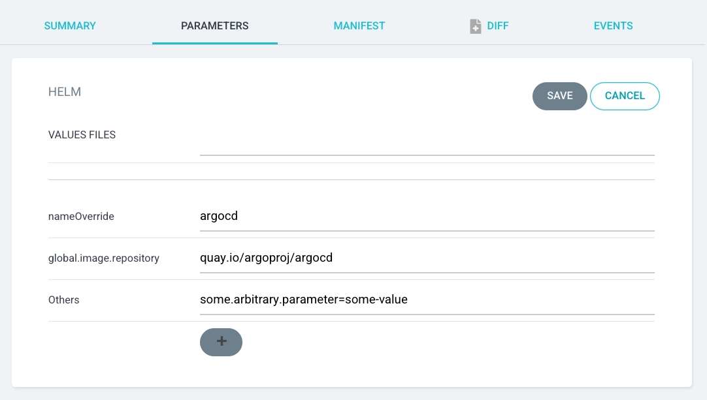
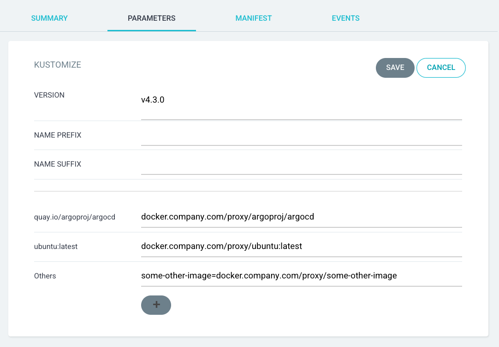
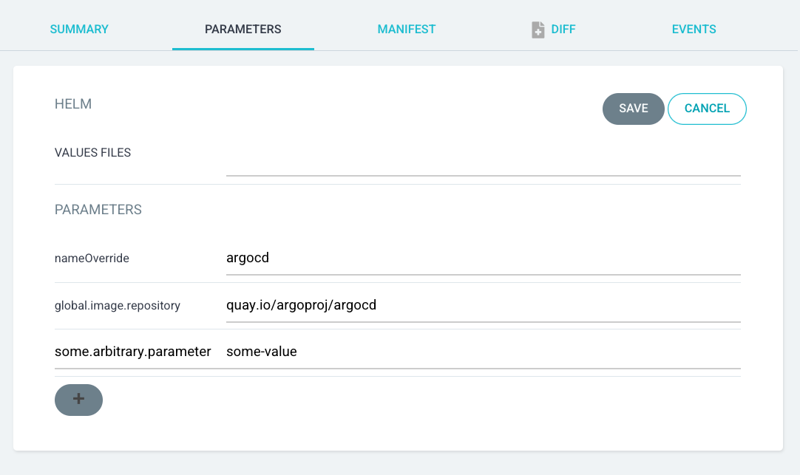
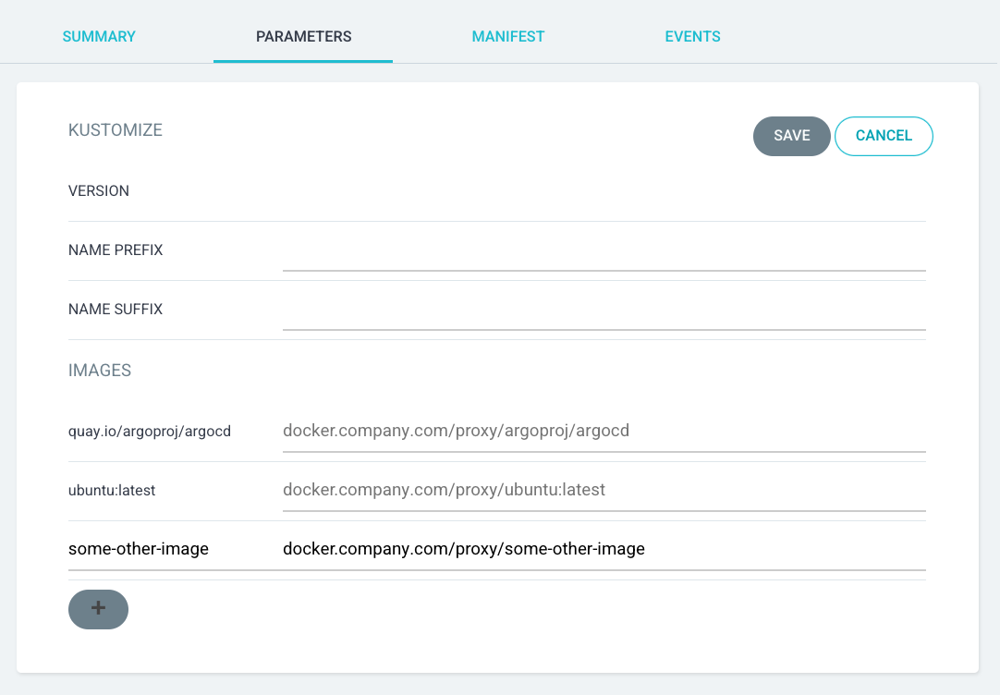
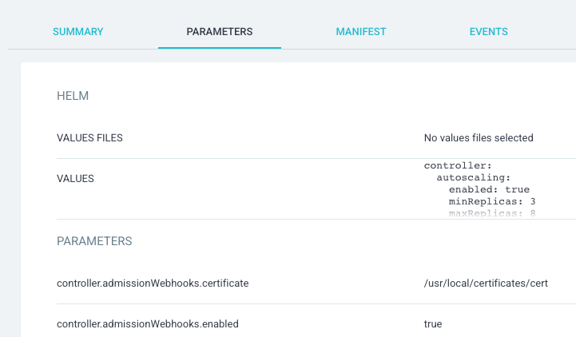

# Parameterized Config Management Plugins

Config Management Plugin (CMP) parameterization defines a way for plugins to "announce" and then consume acceptable 
parameters for an Application. Announcing parameters allows CMPs to provide a UI experience on par with native config 
management tools (Helm, Kustomize, etc.).

- [Parameterized Config Management Plugins](#parameterized-config-management-plugins)
    * [Open Questions](#open-questions)
        + [Env Var Translation](#env-var-translation)
        + [CMP Config File Spec](#cmp-config-file-spec)
            - [UI config as part of the parameter descriptions](#ui-config-as-part-of-the-parameter-descriptions)
                * [Helm example for integrated UI/param config](#helm-example-for-integrated-uiparam-config)
                * [Kustomize example for integrated UI/param config](#kustomize-example-for-integrated-uiparam-config)
            - [UI config as separate ConfigManagementPlugin item](#ui-config-as-separate-configmanagementplugin-item)
                * [Helm example for separate UI/param config](#helm-example-for-separate-uiparam-config)
                * [Kustomize example for separate UI/param config](#kustomize-example-for-separate-uiparam-config)
            - [UI config as part of the parameter descriptions - v2](#ui-config-as-part-of-the-parameter-descriptions---v2)
                * [Helm example for integrated UI/param config v2](#helm-example-for-integrated-uiparam-config-v2)
                * [Kustomize example for integrated UI/param config v2](#kustomize-example-for-integrated-uiparam-config-v2)
    * [Summary](#summary)
    * [Motivation](#motivation)
        + [1. CMPs are under-utilized](#1-cmps-are-under-utilized)
        + [2. Decisions about config management tools are limited by the core code](#2-decisions-about-config-management-tools-are-limited-by-the-core-code)
        + [3. Ksonnet is deprecated, and CMPs are a good place to maintain support](#3-ksonnet-is-deprecated-and-cmps-are-a-good-place-to-maintain-support)
        + [Goals](#goals)
        + [Non-Goals](#non-goals)
    * [Proposal](#proposal)
        + [Use cases](#use-cases)
            - [Use case 1: building Argo CD without config management dependencies](#use-case-1-building-argo-cd-without-config-management-dependencies)
            - [Use case 2: writing CMPs with rich UI experiences](#use-case-2-writing-cmps-with-rich-ui-experiences)
        + [Implementation Details/Notes/Constraints](#implementation-detailsnotesconstraints)
            - [Prerequisites](#prerequisites)
            - [Terms](#terms)
            - [How will the ConfigManagementPlugin spec change?](#how-will-the-configmanagementplugin-spec-change)
            - [How will the CMP know what parameter values are set?](#how-will-the-cmp-know-what-parameter-values-are-set)
            - [How will the UI know what parameters may be set?](#how-will-the-ui-know-what-parameters-may-be-set)
        + [Detailed examples](#detailed-examples)
            - [Example 1: trivial parameterized CMP](#example-1-trivial-parameterized-cmp)
            - [Example 2: Helm parameters from Kustomize dependency](#example-2-helm-parameters-from-kustomize-dependency)
            - [Example 3: simple Helm CMP](#example-3-simple-helm-cmp)
        + [Security Considerations](#security-considerations)
            - [Increased scripting](#increased-scripting)
        + [Risks and Mitigations](#risks-and-mitigations)
        + [Upgrade / Downgrade Strategy](#upgrade--downgrade-strategy)
    * [Drawbacks](#drawbacks)
    * [Alternatives](#alternatives)

## Open Questions

### Env Var Translation

Is there a way to make it easier for the generate command to consume parameters? (Easier than parsing a JSON object, 
that is.)
* We could translate all parameters to env vars, like `ARGOCD_PARAM_{group}_{param name}`.
  * Advantage: no need to pull the param from JSON.
  * Disadvantage: we'd need an easy-to-predict and collision-resistant way to translate arbitrary parameter names
    to env vars. 
    * Option 1: Enforce some parameter name convention which allows a 1:1 translation to env
      vars. Is limiting the param namespace worth it for the usability win?
    * Option 2: Only translate to an env var if the param name happens to be in the safely-translatable
      namespace. For example, `set-file` becomes `SET_FILE`, but `omg!!!param` doesn't get translated to an env var.
    * Option 3: Add an `envVar` field to the [parameter definition schema](#how-will-the-ui-know-what-parameters-may-be-set) to specify
      a target env var (prefixed with `ARGOCD_PARAM_`).
* We could add a field to the  [parameter definition schema](#how-will-the-ui-know-what-parameters-may-be-set) to indicate whether the 
  parameter is intended as an argument to the `generate.command` command. For example, if the `set-file` parameter's 
  `asArg` field is `true`, then we could pass `--set-file {value}` to `generate.command`.

### CMP Config File Spec

In the CMP config file, should the UI config information be part of each parameter description in the parameters
announcement? Or should the UI config information be its own section?

#### UI config as part of the parameter descriptions

Pros:
 * No additional `ui` field in the ConfigManagementPlugin spec
 * Less cognitive load on plugin developers
 * Easier to implement

Cons:
 * No group-level UI configuration
 * More JSON/YAML in the parameter descriptions (maybe more repetition?)
 * `parameters[]` spec in ConfigMapPlugin is different from `parameters[]` spec in `Application` manifest (because 
   parameters in ConfigMapPlugin have more/different fields)

##### Helm example for integrated UI/param config

```yaml
apiVersion: argoproj.io/v1alpha1
kind: ConfigManagementPlugin
metadata:
  name: helm
spec:
  parameters:
    - name: values-files
      title: VALUES FILES
      tooltip: Path of a Helm values file to apply to the chart.
  dynamicParameters:
    command: ["example-params.sh"]
```

`dynamicParameters.command` will produce something like this:

```yaml
[
  {
    "name": "nameOverride",
    "group": "helm-parameters",
    "defaultValues": [
      "argocd"
    ]
  },
  {
    "name": "global.image.repository",
    "group": "helm-parameters",
    "defaultValues": [
      "quay.io/argoproj/argocd"
    ]
  }
  ... etc ...
  {
    "name": "_plus",
    "group": "helm-parameters",
    "defaultValues": []
    "isList": true
    "title": "Others"
    "tooltip": "Add additional Helm chart parameters."
  }
]
```

The UI produced by the combination of the declarative `announcements` and the `dynamicAnnouncements` will look like this:



Differences from native Helm:
 - No group heading (though we could theoretically pull that from the `group` field)
 - No values multi-line box (though we could theoretically re-add that by supporting `type: multiline-string`)
 - Arbitrary values are added via a special `_plus` parameter marked as `isList: true`. Users add their own `=` sign.

##### Kustomize example for integrated UI/param config

```yaml
apiVersion: argoproj.io/v1alpha1
kind: ConfigManagementPlugin
metadata:
  name: kustomize
spec:
  parameters:
    - name: version
      title: VERSION
      defaultValues: [v4.3.0]
    - name: name-prefix
      title: NAME PREFIX
    - name: name-suffix
      title: NAME SUFFIX
  dynamicParameters:
    command: ["example-params.sh"]
```

`dynamicParameters.command` will produce something like this:

```yaml
[
  {
    "name": "quay.io/argoproj/argocd",
    "group": "kustomize-images",
    "defaultValues": [
      "docker.company.com/proxy/argoproj/argocd"
    ]
  },
  {
    "name": "ubuntu:latest",
    "group": "kustomize-images",
    "defaultValues": [
      "docker.company.com/proxy/ubuntu:latest"
    ]
  }
  ... etc ...
  {
    "name": "_plus",
    "group": "kustomize-images",
    "defaultValues": []
    "isList": true
    "title": "Others"
    "tooltip": "Add additional image overrides."
  }
]
```

The UI produced by the combination of the declarative `announcements` and the `dynamicAnnouncements` will look like this:



Differences from native Kustomize:
- No group heading (though we could theoretically pull that from the `group` field)
- No digest checkbox
- No `tag` field - it's all in the main input field (though we could theoretically add support with `type: image`)
- Arbitrary values are added via a special `_plus` parameter marked as `isList: true`. Users add their own `=` sign.

#### UI config as separate ConfigManagementPlugin item

Pros:
 * The UI can be configured at the section level. This allows things like:
   * Easy titles
   * `canAddMore: true`, which is simpler than the `_plus` mechanism
   * Separate name/value input fields in the "Add another" interface
 * Less repetition in the `parameters` field where `type` is not the default (makes it simpler to implement `type: images`).

Cons:
 * More difficult to implement
 * More cognitive load for plugin developers.
   * Since the `ui` field can configure both group-level and param-level presentation, the dev has to think harder about 
     what their spec means.
   * Plugin developers might not easily see the relationship between the `ui` and `parameters`/`dynamicParameters` 
     objects.
 * There's no way to dynamically configure the UI. We could add a `dynamicUI.command`, but that's more cognitive load.

##### Helm example for separate UI/param config

```yaml
apiVersion: argoproj.io/v1alpha1
kind: ConfigManagementPlugin
metadata:
  name: helm
spec:
  parameters:
    ui:
    - name: values-files
      title: VALUES FILES
      tooltip: Path of a Helm values file to apply to the chart.
    - group: helm-parameters
      title: Parameters
      userCanAddMore: true
    static:
    - name: values-files
    dynamic:
      command: ["example-params.sh"]
```

`parameters.dynamic.command` will produce something like this:

```yaml
[
  {
    "name": "nameOverride",
    "group": "helm-parameters",
    "value": "argocd"
  },
  {
    "name": "global.image.repository",
    "group": "helm-parameters",
    "value": "quay.io/argoproj/argocd"
  }
  ... etc ...
]
```

The UI produced by the combination of the declarative `announcements` and the `dynamicAnnouncements` will look like this:



Differences from native Helm:
- No values multi-line box (though we could theoretically re-add that by supporting `type: multiline-string`)
- Arbitrary values are added with plus button and split name/value inputs

##### Kustomize example for separate UI/param config

```yaml
apiVersion: argoproj.io/v1alpha1
kind: ConfigManagementPlugin
metadata:
  name: kustomize
spec:
  parameters:
    ui:
    - group: kustomize-images
      title: Images
      userCanAddMore: true
    static:
    - name: version
      title: VERSION
    - name: name-prefix
      title: NAME PREFIX
    - name: name-suffix
      title: NAME SUFFIX
    dynamic:
      command: ["example-params.sh"]
```

`parameters.dynamic.command` will produce something like this:

```yaml
[
  {
    "name": "quay.io/argoproj/argocd",
    "group": "kustomize-images",
    "value": "docker.company.com/proxy/argoproj/argocd"
  },
  {
    "name": "ubuntu:latest",
    "group": "kustomize-images",
    "value": "docker.company.com/proxy/ubuntu:latest"
  }
  ... etc ...
]
```

The UI produced by the combination of the declarative `announcements` and the `dynamicAnnouncements` will look like this:



Differences from native Kustomize:
- No digest checkbox
- No `tag` field - it's all in the main input field (though we could theoretically add support with `type: image`)
- Arbitrary values are added with plus button and split name/value inputs

#### UI config as part of the parameter descriptions - v2

Questions:
1. How do users encode parameters in the Application manifest?
   1. Suggestion: Use the same structure as the announcement.

      Example:

      ```yaml
      apiVersion: argoproj.io/v1alpha1
      kind: Application
      spec:
        source:
          plugin:
            parameters:
            - name: name-prefix
              value: my-company-
            - name: images
              map:
              - name: ubuntu:latest
                value: docker.company.com/proxy/ubuntu:latest
              - name: guestbook:v0.1
                value: docker.company.com/proxy/guestbook:v0.1
      ```
      
      Problem: How do we handle UI fields in the parameter items?
      1. Suggestion: Don't include UI fields in the CRD version of the items.
      2. Suggestion: Ignore UI fields. Problem: UI fields will still show up in IDE hints for the Application CRD.

2. How does the UI know what type of input to use for "add more" on array and map-type parameters?

   Example:
 
   ```yaml
   - name: parameter
     title: Parameter Overrides
     map:
     - name: param1
       string: param1
     - name: param2
       boolean: false
     - name: param3
       number: 1
   ```

   1. Suggestion: Use the type of the last item in the map or array. Problem: What if the map/array is empty?
      1. Suggestion: default to string.
   2. Suggestion: Declare the type at the top level. Problem: What do we do if the top-level type doesn't match some
      item's type?
      
      Example:
   
      ```yaml
      - name: parameter
        title: Parameter Overrides
        type: string
        map:
        - name: param1
          boolean: false
      ```
      1. Suggestion: Throw a validation error in the CMP server, which gets communicated up to the UI.
3. What do we do if the CMP announcement sets more than one of `value`/`array`/`map` or `string`/`number`/`boolean`?
    
   Example:

   ```yaml
   - title: Resources
     name: resources
     itemType: number
     map:
     - name: cpu
       string: '100'
       number: 100
     - name: memory
       string: '1000'
       boolean: false
   ```

   1. Suggestion: Throw a validation error in the CMP server, which gets communicated up to the UI.
4. What do we do if the CMP user sets more than one of `value`/`array`/`map` or `string`/`number`/`boolean` in the 
   Application spec?

   Example:

   ```yaml
   apiVersion: argoproj.io/v1alpha1
   kind: Application
   spec:
     source:
       plugin:
         parameters:
         - title: Resources
           name: resources
           itemType: number
           map:
           - name: cpu
             string: '100'
             number: 100
           - name: memory
             string: '1000'
             boolean: false
   ```
   1. Suggestion: Throw an exception in the controller and mark the Application as unhealthy. Throw an exception in the
      CMP server and refuse to generate manifests for the Application.
5. What do we do if the user sets both `name` and `value.name`?
    
   Example:

   ```yaml
   - name: name-prefix
     title: NAME PREFIX
     value:
       name: prefix
       string: "my-company-"
   ```
   1. Suggestion: Ignore the inner `name` field. Problem: It could be confusing for CMP developers.
   2. Suggestion: Don't include the `name` field in the `value` type. Problem: More types, more complexity.
6. What do we do if the user sets `array[].name`s?

   Example: 

   ```yaml
   - title: Image Overrides
     name: images
     array:
     - name: ubuntu:latest
       value: docker.company.com/proxy/ubuntu:latest
     - name: guestbook:v0.1
       value: docker.company.com/proxy/guestbook:v0.1
   ```
    
   1. Suggestion: Ignore the `name` field. Problem: It could be confusing for CMP developers.
   2. Suggestion: Don't include the `name` field in the `array` item type. Problem: More types, more complexity.
   3. Suggestion: Instead of an `array` field, use a `values` field, where absence of `name` implies array.
      Problem: What if some items have names but not others?
7. How do we handle duplicate `name` fields in a `map`?
    
   Example:

   ```yaml
   - name: parameter
     title: Parameter Overrides
     map:
     - name: global.image.repository
       value: quay.io/argoproj/argocd
     - name: global.image.repository
       value: docker.company.com/proxy/argoproj/argocd
   ```
   1. Suggestion: Allow duplicates. Problem: `map` is a confusing name for what is actually a list of key/value pairs.
      1. Suggestion: Rename the `map` field.
   2. Suggestion: De-duplicate in the CMP server. Problem: CMP developers might not expect that behavior.
8. What golang type will represent `number`?

   Example:

   ```yaml
   - name: resources
     map:
     - name: cpu
       number: 0.1  # should probably be a float or decimal
     - name: memory
       number: 100  # should probably be an integer or decimal
   ```
   
   1. Suggestion: Use decimal type. Problem: The CMP might need to infer float/int for a given parameter.
9. How will the UI know the difference between the zero-values of `string`/`number`/`boolean` and absence of those
   fields?

   Example:

   ```yaml
   - name: name-prefix
     value:
       string: ""  # How does CMP server know this value isn't actually a `number` type?
   ```
   1. Suggestion: Use pointer types instead of the primitives. This will let us detect absent or `null` fields as `nil`.
10. How will the UI know that adding more items to an array or a map is allowed?
    1. Suggestion: Always assume it's allowed to add to a map or array. i.e. if the CMP author wants an immutable array
       or map, they should just break it into individual params.
11. What do we do if a CMP announcement doesn't include any type info?
   
    Example:

    ```yaml
    - name: name-prefix
      value: {}
    # or
    - name: name-prefix
    ```
    1. Suggestion: Default to `string`, since it's the most common type.
12. What do we do if a map parameters has one or more items with an empty or absent `name` field?

    Example:

    ```yaml
    - name: parameter
      title: Parameter Overrides
      map:
      - name: ""
        value: quay.io/argoproj/argocd
      - value: docker.company.com/proxy/argoproj/argocd
    ```
    1. Suggestion: Throw a validation error in the CMP server when handling an announcement. Throw a validation error
       in the controller and mark the Application as unhealthy if the invalid spec is in the Application. Throw an error
       in the CMP server and refuse to generate manifests in the CMP server if given invalid parameters.
13. What do we do if a parameter has a missing or absent top-level `name` field?

    Example:

    ```yaml
    - title: Parameter Overrides
      map:
      - name: global.image.repository
        value: quay.io/argoproj/argocd
      - name: global.image.repository
        value: docker.company.com/proxy/argoproj/argocd
    ```
    1. Suggestion: Throw a validation error in the CMP server when handling an announcement. Throw a validation error
       in the controller and mark the Application as unhealthy if the invalid spec is in the Application. Throw an error
       in the CMP server and refuse to generate manifests in the CMP server if given invalid parameters.
   
Tentative parameters data structures:

```go
package cmp

// ParameterValue represents a single value for a parameter. Only one field may be set.
type ParameterValue struct {
	String  *string `json:"string,omitempty"`
	Number  *int    `json:"number,omitempty"`
	Boolean *bool   `json:"boolean,omitempty"`
}

// ParameterNameAndValue represents a single name/value pair in a map parameter. Only one field besides Name may be set.
type ParameterNameAndValue struct {
	Name    string  `json:"name,omitempty"`
	String  *string `json:"string,omitempty"`
	Number  *int    `json:"number,omitempty"`
	Boolean *bool   `json:"boolean,omitempty"`
}

// ParameterAnnouncement represents a CMP's announcement of one acceptable parameter.
type ParameterAnnouncement struct {
	Name     string                  `json:"name,omitempty"`
	Value    *ParameterValue         `json:"value,omitempty"`
	Map      []ParameterNameAndValue `json:"map,omitempty"`
	Array    []ParameterValue        `json:"array,omitempty"`
	Title    string                  `json:"title,omitempty"`
	Tooltip  string                  `json:"tooltip,omitempty"`
	Required bool                    `json:"required,omitempty"`
}

// ParametersAnnouncement is a list of announcements. This list represents all the parameters which a CMP is able to 
// accept.
type ParametersAnnouncement []ParameterAnnouncement

// Parameter represents a single parameter name and its value. One of Value, Map, or Array must be set.
type Parameter struct {
	Name  string                  `json:"name,omitempty"`
	Value *ParameterValue         `json:"value,omitempty"`
	Map   []ParameterNameAndValue `json:"map,omitempty"`
	Array []ParameterValue        `json:"array,omitempty"`
}

// Parameters is a list of parameters to be sent to a CMP for manifest generation.
type Parameters []Parameter
```

##### Helm example for integrated UI/param config v2

```yaml
apiVersion: argoproj.io/v1alpha1
kind: ConfigManagementPlugin
metadata:
  name: helm
spec:
  parameters:
    static:
    - name: values-files
      title: VALUES FILES
      tooltip: Path of a Helm values file to apply to the chart.
      array: []
    dynamic:
      command: ["example-params.sh"]
```

`parameters.dynamic.command` will produce something like this:

```yaml
[
  {
    "name": "helm-parameters"
    "title": "Parameters",
    "map": [
      {
        "name": "nameOverride",
        "string": "argocd"
      },
      {
        "name": "global.image.repository",
        "string": "quay.io/argoproj/argocd"
      }
    ]
  }
]
```

##### Kustomize example for integrated UI/param config v2

```yaml
apiVersion: argoproj.io/v1alpha1
kind: ConfigManagementPlugin
metadata:
  name: kustomize
spec:
  parameters:
    static:
    - name: version
      title: VERSION
      value:
        string: v4.3.0
    - name: name-prefix
      title: NAME PREFIX
      value:
        string: ""
    - name: name-suffix
      title: NAME SUFFIX
      value:
        string: ""
    dynamic:
      command: ["example-params.sh"]
```

`parameters.dynamic.command` will produce something like this:

```yaml
[
  {
    "name": "images",
    "title": "Image Overrides",
    "map": [
      {
        "name": "quay.io/argoproj/argocd",
        "string": "docker.company.com/proxy/argoproj/argocd"
      },
      {
        "name": "ubuntu:latest",
        "string": "docker.company.com/proxy/argoproj/argocd"
      }
    ]
  }
]
```

## Summary

Config Management Plugins allow Argo CD administrators to define custom manifest generation tooling.

The only existing way for users to parameterize manifest generation is with environment variables.

This new feature will allow a plugin to "announce" acceptable parameters for an Application. It will also allow the
plugin to consume parameters once the user has defined them.

Parameters definitions may be simple (advertising a simple key/value string pair) or rich (advertising more information 
about the expected value). An "image" would be an example of a rich parameter description. The plugin would announce 
that it expects an image parameter, and the UI would build the appropriate input.

## Motivation

### 1. CMPs are under-utilized

CMPs, especially the sidecar type, are under-utilized. Making them more robust will increase adoption. Increased
adoption will help us find bugs and then make CMPs more robust. In other words, we need to reach a critical mass of 
CMP users.

More robust CMPs will make it easier to start supporting tools like [Tanka](https://tanka.dev/).

### 2. Decisions about config management tools are limited by the core code

For example, there's a [Helm bug](https://github.com/argoproj/argo-cd/issues/7291) affecting Argo CD users. The fix 
would involve importing the Helm SDK (a very large dependency) into Argo CD. 

### 3. Ksonnet is deprecated, and CMPs are a good place to maintain support

Offloading Ksonnet to a plugin would allow us to support existing users without maintaining Ksonnet code in the more
actively-developed base. But we need CMP parameters to provide Ksonnet support on-par with native support.

### Goals

Parameterized CMPs must be:
* Easy to write
  * An Argo CD admin should be able to write a simple parameterized CMP in just a few lines of code.
  * An Argo CD admin should be able to write an _advanced_ parameterized CMP server relying on thorough docs.
    
    Writing a custom CMP server might be preferable if the parameters announcement code gets too complex to be 
    an inline shell script.
* Easy to install
  * Installing a simple CMP or even a CMP with a custom server should be intuitive and painless.
* Easy to use
  * Argo CD end-users (for example, developers) should be able to
    1. View and set parameters in the Argo CD Application UI
    2. See the parameters reflected in the Application manifest
    3. Easily read/modify the generated parameters in the manifest (they should be structured in a way that's easy to read)
  * CMPs should be able to announce parameters with more helpful interfaces than a simple text field.
    * For example, numbers and booleans should be represented in the UI with the appropriate inputs.
* Future-proof
  * Since the rich parameters UI is an important feature for config management tools, the parameter definition schema 
    should be flexible enough to announce new _types_ of parameters so the UI can customize its presentation.
* Backwards-compatible
  * CMPs written before this enhancement should work fine after this enhancement is released.
* Proven with a rich demonstration
  * The initial release of this feature should include a CMP implementation of the Helm config tool. This will
    1. Serve as a rich example for others CMP developers to mimic
    2. Allow us to decouple the Helm config management release cycle from the Argo release cycle
    3. Allow us to work around [this bug](https://github.com/argoproj/argo-cd/issues/7291) without including the Helm 
       SDK in the core Argo CD code
  * The Helm CMP must be on-par with the native implementation.
    1. It must present an equivalent parameters UI.
    2. It must communicate errors back to the repo-server (and then the UI) the same as the native implementation.

### Non-Goals

We should not:
* Re-implement config management tools as CMPs (besides Helm)

## Proposal

### Use cases

#### Use case 1: building Argo CD without config management dependencies

As an Argo CD developer, I would like to be able to build Argo CD without including the Helm SDK as a dependency.

The Helm SDK includes the Kubernetes code base. That's a lot of code, and it will make builds unacceptably slow.

#### Use case 2: writing CMPs with rich UI experiences

As an Argo CD user, I would like to be able to parameterize manifests built by a CMP.

For example, if the Argo CD administrator has installed a CMP which applies a last-mile kustomize overlay to a Helm
repo, I would like to be able to pass values to the Helm chart without having to manually discover those parameter names
(in other words, they should show up in the Application UI just like with a native Helm Application). I also shouldn't 
have to ask my Argo CD admin to modify the CMP to accommodate the values as environment variables.

### Implementation Details/Notes/Constraints

#### Prerequisites

Since this proposal is designed to increase CMP adoption, we need to make sure there aren't any bugs that make CMPs
less robust than native tools.

Bugs to fix:
1. [#8145](https://github.com/argoproj/argo-cd/issues/8145) - `argocd app sync/diff --local` doesn't account for sidecar CMPs
2. [#8243](https://github.com/argoproj/argo-cd/issues/8243) - "Configure plugin via sidecar" ⇒ child resources not pruned on deletion

#### Terms

* **Parameter definition**: an instance of a data structure which describes an individual parameter that may be applied
  to a specific Application. (See the [schema](#how-will-the-ui-know-what-parameters-may-be-set) below.)
* **Parameters announcement**: a list of parameter definitions. (See the [schema](#how-will-the-ui-know-what-parameters-may-be-set) below.)

  "Parameters" is plural because each "announcement" will be a list of multiple parameter definitions.
* **Parameterized CMP**: a CMP which supports rich parameters (i.e. more than environment variables). A CMP is
  parameterized if either of these is true:
  1. its configuration includes the sections consumed by the default CMP server to generate parameters announcements
  2. it is a fully customized CMP server which implements an endpoint to generate parameters announcements

#### How will the ConfigManagementPlugin spec change?

This proposal adds a new `parameters` key to the ConfigManagementPlugin config spec.

```yaml
apiVersion: argoproj.io/v1alpha1
kind: ConfigManagementPlugin
metadata:
  name: cmp-plugin
spec:
  version: v1.0
  generate:
    command: ["example.sh"]
  discover:
    fileName: "./subdir/s*.yaml"
  # NEW KEY
  parameters:
    static:
    # The declarative announcement follows the parameters announcement schema. This is where a parameter description
    # should go if it applies to all apps for this CMP.
    - name: values-file
      title: Values File
      tooltip: Path of a Helm values file to apply to the chart.
    # The (optional) generated announcement is combined with the declarative announcement (if present).
    # NEW KEY
    dynamic:
      command: ["example-params.sh"]
```

The currently-configured parameters (if there are any) will be communicated to both `generate.command` and 
`parameters.dynamic.command` via an `ARGOCD_APP_PARAMETERS` environment variable. The parameters will be encoded 
according to the [parameters serialization format](#how-will-the-cmp-know-what-parameter-values-are-set) defined below.

Passing the parameters to the `parameters.dynamic.command` will allow configuration of parameter discovery. For example:

```yaml
apiVersion: argoproj.io/v1alpha1
kind: Application
spec:
  source:
    plugin:
      parameters:
      - name: ignore-helm-charts
        value: '["chart-a", "chart-b"]'
```

#### How will the CMP know what parameter values are set?

Users persist parameter values in the `spec.source.plugin.parameters` list.

Each parameter has a `name` and a `value`. The name should match the name of some parameter announced by the CMP. (But 
the user can set any parameter name, so it's the CMP's job to ignore invalid parameters.) The parameter `value`
can be any string. The `group` field is optional and should be set according to the CMP documentation. 

This example is for a hypothetical Helm CMP. This CMP accepts a `values` and a `values-files` parameter which are 
implicitly in the "main" group, since `group` isn't explicitly set. The hypothetical Helm CMP also accepts arbitrary 
values in the `set-value` group.

```yaml
apiVersion: argoproj.io/v1alpha1
kind: Application
spec:
  source:
    repoURL: https://github.com/argoproj/argocd-example-apps.git
    plugin:
      parameters:
        - name: values  # implicitly in the "main" group
          value: >-
            resources:
              cpu: 100m
              memory: 128Mi
        - name: values-files  # implicitly in the "main" group
          value: '["values.yaml"]'
        - name: image.repository
          value: my.company.com/gcr-proxy/heptio-images/ks-guestbook-demo
          group: set-value
        - name: image.tag
          value: "0.1"
          group: set-value
```

When Argo CD generates manifests (for example, when the user clicks "Hard Refresh" in the UI), Argo CD will send these
parameters to the CMP as JSON (using the equivalent structure to what's shown above) on an environment variable called
`ARGOCD_APP_PARAMETERS`.

```shell
echo "$ARGOCD_APP_PARAMETERS" | jq
```

That command, when run by a CMP with the above Application manifest, will print the following:

```json
[
  {
    "name": "values",
    "value": "resources:\n  cpu: 100m\n  memory: 128Mi"
  },
  {
    "name": "values-files",
    "value": "[\"values.yaml\"]"
  },
  {
    "name": "image.repository",
    "value": "my.company.com/gcr-proxy/heptio-images/ks-guestbook-demo",
    "group": "set-value"
  },
  {
    "name": "image.tag",
    "value": "0.1",
    "group": "set-value"
  }
]
```

Another way the CMP can access parameters is via environment variables. For example:

```shell
echo "$VALUES" > /tmp/values.yaml
helm template --values /tmp/values.yaml .
```

Environment variable names are set according to these rules:

1. If a parameter is in the "main" (default) group, the format is `escaped({name})` (`escaped` is defined below).
2. If a parameter is not in the "main" group, the format is `escaped({group}_{name})`.
3. If an escaped env var name matches one in the [build environment](https://argo-cd-docs.readthedocs.io/en/latest/user-guide/build-environment/),
   the build environment variable wins.
4. If more than one parameter name produces the same env var name, the env var later in the list wins.

The `escaped` function will perform the following tasks:
1. It will uppercase the input.
2. It will replace any characters matching this regex with an underscore: `[^A-Z0-9_]`.
3. If, after those steps, the first character is a number, the name will be prefixed with an underscore. For example:
   `1_DIRECTION` -> `_1_DIRECTION`.

#### How will the UI know what parameters may be set?

A parameter definition is an object with following schema:

```go
type ParameterDefinitionType string
const (
    ParameterTypeString  ParameterDefinitionType = "string"
    ParameterTypeBoolean ParameterDefinitionType = "boolean"
    ParameterTypeNumber  ParameterDefinitionType = "number"
)

type ParameterDefinition struct {
    // Name is the name identifying a parameter. Should be machine friendly (no spaces). (required)
    Name string `json:"name"`

    // Title is a human readable text of the parameter name. (optional)
    Title string `json:"title"`

    // Tooltip is a human readable description of the parameter. (optional)
    Tooltip string `json:"tooltip"`

    // Type is the type of the parameter. Can be used to validate the provided values.
    // (optional: default is string)
    Type ParameterDefinitionType `json:"type"`

    // IsList defines if the parameter can be passed multiple times. (optional: default false)
    IsList bool `json:"isList"`

    // Required defines if this given parameter is mandatory. (optional: default false)
    Required bool `json:"required"`

    // Group is used to identify parameters that bellongs to the same context (E.g. 'helm'). (optional)
    Group string `json:"group"`

    // DefaultValues defines the values that should be provided by default in case no change is
    // required by the user. If the list has more than one item `IsList` must be true. (optional)
    DefaultValues []string `json:"defaultValues"`
}
```

```go
type ParametersAnnouncement []ParameterDefinition
```

Example:

```json
[
  {
    "name": "values-files",
    "type": "enum",
    "uiConfig": "{\"values\": [\"values.yaml\"]}"
  },
  {
    "name": "image",
    "type": "image",
    "section": "Helm Parameters"
  }
]
```

### Detailed examples

#### Example 1: trivial parameterized CMP

```yaml
apiVersion: argoproj.io/v1alpha1
kind: ConfigManagementPlugin
metadata:
  name: trivial-cmp
spec:
  version: v1.0
  generate:
    command: 
      - sh
      - -c
      - |
        # Pull one parameter value from the "main" section of the given parameters.
        CM_NAME_SUFFIX=$(echo "$ARGOCD_APP_PARAMETERS" | jq -r '.["main"][] | select(.name == "cm-name-suffix").value')
        cat << EOM
        {
          "kind": "ConfigMap",
          "apiVersion": "v1",
          "metadata": {
            "name": "$ARGOCD_APP_NAME-$CM_NAME_SUFFIX",
            "namespace": "$ARGOCD_APP_NAMESPACE"
          }
        }
        EOM
  discover:
    fileName: "./trivial-cmp"
  parameters:
    command:
      - sh
      - -c
      - |
        echo '[{"name": "cm-name-suffix"}]'
```

#### Example 2: Helm parameters from Kustomize dependency

**Plugin config**

```yaml
apiVersion: argoproj.io/v1alpha1
kind: ConfigManagementPlugin
metadata:
  name: kustomize-helm-proxy-cmp
spec:
  version: v1.0
  generate:
    command: [/home/argocd/generate.sh]
  discover:
    fileName: "./kustomization.yaml"
  parameters:
    command: [/home/argocd/get-parameters.sh]
```

**generate.sh**

This script would be non-trivial. Kustomize only accepts YAML-formatted values for Helm charts. The script would have to
convert the dot-notated parameters to a YAML file.

**get-parameters.sh**

```shell
kustomize build . --enable-helm > /dev/null

get_parameters() {
while read -r chart; do  
  yq e -o=p "charts/$chart/values.yaml" | jq --arg chart "$chart" -nR 'inputs | sub(" .*"; "") | {name: ., section: "\($chart) Helm chart properties"}'
done << EOF
$(yq e '.helmCharts[].name' kustomization.yaml)
EOF
}

get_parameters | jq --slurp
```

**Dockerfile**

```dockerfile
FROM ubuntu:20.04

RUN apt install jq yq helm kustomize -y

ADD get-parameters.sh /home/argocd/get-parameters.sh
```

#### Example 3: simple Helm CMP

This example demonstrates how the Helm parameters interface could be achieved with a parameterized CMP.



```yaml
apiVersion: argoproj.io/v1alpha1
kind: ConfigManagementPlugin
metadata:
  name: simple-helm-cmp
spec:
  version: v1.0
  generate:
    command: [/home/argocd/generate.sh]
  discover:
    fileName: "./values.yaml"
  parameters:
    announcement:
      - name: values files
      - name: values
        uiConfig: '{"multiline": true}'
    command: [/home/argocd/get-parameters.sh]
```

**generate.sh**

```shell
VALUES_FILES=$(echo "$ARGOCD_APP_PARAMETERS" | jq -r '.["main"][] | select(.name == "values files").value')
# Put the extra values at a random filename to avoid conflicting with existing files.
EXTRA_VALUES_FILENAME="values-$(openssl rand -base64 12).yaml"
echo "$ARGOCD_APP_PARAMETERS" | jq -r '.["main"][] | select(.name == "values").value' > "$EXTRA_VALUES_FILENAME"
# Convert JSON parameters to comma-delimited k=v pairs.
PARAMETERS=$(echo "$ARGOCD_APP_PARAMETERS" | jq -r '.["parameters"] | map("\(.name)=\(.value)") | join(",")')
helm template --values "$VALUES_FILES" --values "$EXTRA_VALUES_FILENAME" --set "$PARAMETERS"
```

**get-parameters.sh**

```shell
# Pull params from values.yaml and then append the default ("main") parameters announcements.
yq e -o=p values.yaml | jq -nR '[inputs | sub(" .*"; "") | {name: ., section: "Properties"}]'
```

### Security Considerations

#### Increased scripting

Our examples will have shell scripts, and users will write shell scripts. Scripts are difficult
to write securely - this is especially true when the scripts are embedded in YAML, and developers don't get helpful 
warnings from the IDE.

Our docs should emphasize the importance of handling input carefully in any scripts (or other programs) which will be
executed as part of CMPs.

The docs should also warn against embedding large scripts in YAML and recommend plugin authors instead build custom
images with the script invoked as its own file. The docs should also recommend taking advantage of IDE plugins as
well as image and source code scanning tools in CI/CD.

### Risks and Mitigations

1. Risk: encouraging CMP adoption while missing critical features from native tools.

   Mitigation: rewrite the Helm config management tool as a CMP and test as many common use cases as possible. Write a
   document before starting on the Helm CMP documenting all major features which must be tested.

### Upgrade / Downgrade Strategy

Upgrading will only require using a new version of Argo CD and adding the `parameters` settings to the plugin config.

Downgrading will only require using an older version of Argo CD. The `parameters` section of the plugin config will 
simply be ignored.

## Drawbacks

Sidecar CMPs aren't really battle-tested. If there are major issues we've missed, then moving more users towards CMPs
could involve a lot of growing pains.

## Alternatives
