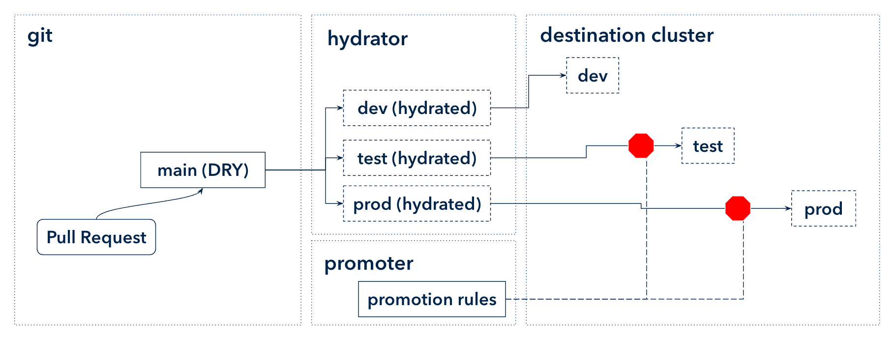

# Proposal: GitOps Promotion/Rollback Tool

This proposal describes an opinionated set of API/tools to manage change promotion and reversion in a GitOps environment.

This talk from ArgoCon Europe 2024 provides an overview of the proposal: https://www.youtube.com/watch?v=p5EPKY3vM-E

## Open Questions

### Where will the code reside?

This proposal includes several new controllers which should be able to run independently of Argo CD. It's likely that the code should live in one or more repositories separate from Argo CD itself.

### Will Argo CD provide out-of-the-box integration with this tooling?

We believe Argo CD users would benefit greatly from the features provided by this system. But it's possible that the functionality could be offered via add-ons, including adjacent controllers and UI extensions.

### What SCMs will be supported by default?

We believe that this tool should provide first-class support for at least GitHub and GitLab. But we do understand that there's a tradeoff between number of SCMs supported and maintenance cost.

We should implement the first-class SCM support using the same plugin system that other SCMs use, so that we ensure a good plugin development/installation/use experience.

### What terminology should we use for manifests and manifest sources?

"Rendered manifests" has become a common term of art in the last ~2 years. But it has no obvious corrollary term for "non-rendered manifest sources."

Options:
* **dry (Don't Repeat Yourself) manifests / hydrated manifests**
* Manifest sources / rendered manifests
* Others?

We should choose something clear and intuitive. For now, the proposal uses "dry/hydrated."

### What should be the API group(s)?

The CRDs defined below use `promoter.argoproj.io/v1alpha1` and `commit-status.argoproj.io/v1alpha1`.

Should those be collapsed into a single group?

Should these CRDs be under an `argoproj` group at all, or maybe something new?

### How should we represent repo access?

Argo CD's model of using Secrets to represent repositories has problems:

1) No fine-grained RBAC access: you either have access to Secrets or not, there's no way to specify "just repo secrets"
2) Argo-arbitrary interface: the Secret schema is meaningful only for Argo and not for other GitOps operators/tools
3) No schema validation: since Secrets have a relatively open-ended spec, writing and operating on repo secrets requires special care

This seems like a good opportunity to define a new repo interface which has a clear and specific API and can be easily used by other tools.

### How should the system handle change contention?

To keep things simple, we think new changes should always supersede old changes.

Consider a PromotionStrategy covering dev, test, and prod. If the test environment has an open PR against the hydrated branch (pending change), and someone pushes another commit to the main (DRY) branch, the PR will be updated to include the new changes, and the PR will wait for the dev environment to finish deploying and verifying that new commit.

It's possible that a high-churn low environment could block merges on higher environments. So far, we think that's an acceptable tradeoff. Our recommendation will be that teams move as much of the change validation as possible to the pre-commit stage so that changes can be promoted relatively quickly through environments, and high-churn low environments won't block promotions to higher environments.

Of course, for hot-fixes, manually hitting the "merge" button on a higher environment is always an option to overcome contention.

## Motivation

Promoting and reverting changes in a GitOps environment is often toilsome and error-prone. In an effort to avoid toil, many adopt GitOps anti-patterns. We believe that these problems are the result of a lack of a clear GitOps promotion/reversion pattern and the necessary tooling to accompany that pattern.

### Promotion

Promoting changes in a GitOps environment today follows one of two patterns: promote-by-sync or promote-by-push.

Promote-by-sync relies on disabling Argo CD auto-sync (intentionally introducing drift), pushing a change to manifests shared by several environments (represented by Argo CD applications), and then syncing those environments in a defined order. If a human does the syncing, they risk human error (prematurely syncing, syncing in the wrong order, forgetting to sync, etc.). If an automation tool does the syncing, the state of the system lives outside of git, defeating many of the benefits of GitOps. App-of-apps with sync waves and ApplicationSets' progressive syncs are examples of promote-by-sync. Using a CI tool like Jenkins to orchestrate syncs is another example of promote-by-sync.



Promote-by-push relies on having an external system push manifest changes in a defined order. For example, one could write a Jenkins pipeline to push an image tag update to the manifests for dev, test, then prod, waiting for Argo CD apps to become healthy after each step. This solves the problem of config drift. But it still has the problem of representing the state of the promotion system outside git (i.e. in a CI tool or other custom tool). So developers must monitor this external system in order to manage promotions. These systems tend to be heavily customized and only work for the organization for which they were constructed.


### Reversion

Existing reversion tools roll back changes only in-cluster (e.g. Argo CD's "History and Rollback" tool), introducing intentional drift and defeating many benefits of GitOps. Some tools are only partial (e.g. Argo Rollouts' automated rollback), which means that a rollback may not revert all relevant changes (for example, it may roll back an image tag but not the associated ConfigMap change).

## Summary

We propose a pattern and tooling to implement promotion and reversion based on common SCM primitives: Pull Requests and Commit Statuses. By representing the promotion/reversion process using these primitives, we keep the entire GitOps system "in git." We can take advantage of developers' existing comfort with git tooling as well as the vast ecosystem of tooling integrating with git and its supporting SCMs.

### Goals

* The user experience must be intuitive
    * No confusion about the state of my change in the promotion process
    * No waiting around for the system to communicate its state
* There must be no intentional drift between hydrated branches and the cluster
* The tool must be usable by non-Argo GitOps tools - e.g. Flux should be able to integrate with this system without using esoteric adapters
* We must focus on providing a declarative, eventually-consistent experience rather than a "pipeline-driven" experience

### Non-Goals

* This is not an image updater; automated tag bumps must be done by another system, and this system can promote that change

## Proposal

#### Promotion

This proposal introduces a system of push-by-pr-merge. Instead of representing the change promotion state in some external system, it is represented as PRs against environment branches containing "hydrated" (or "rendered") manifests. The "wait" stages of the promotion process (performance tests, manual approvals, etc.) are represented as commit statuses blocking PR merges. The state of the entire system is visible in the git/SCM interface. This system is generalizable to many organizations, relying on near-ubiquitous SCM concepts, allowing the promotion tool to be open-sourced.


**IMPORTANT:** "Environment branches" here refers only to the machine-generated branches and their machine-generated contents. Directories are a much better "write" user interface, so directories in a single branch should be used for users to declare their intent (via Helm, Kustomize, etc.). Only the automated tooling should interact with the environment branches. Using a branch per environment allows us to easily model "one change to one environment" as a PR without dealing with complex merge scenarios against a single branch. It also provides a readable, intuitive "history of this environment" interface via the SCM's commit history page.

#### Reversion

This proposal introduces a system for automated, atomic rollbacks via PRs. When a problem is detected, a PR is automatically opened against the affected environment's hydrated manifest branch reverting to the last known-healthy commit. The PR may be automatically merged, may wait for certain checks to pass, or may wait for a user to manually merge it.

### Concepts

#### Change

Every change is represented as a commit on a "DRY" branch in a git repo. The contents of the branch depend completely on the manifest hydration tool. For example, Kustomize may include kustomization.yaml and a few related manifest files; Helm may include values.yaml and supporting chart files; and so on.

#### Environment

An "environment" is represented as a branch in a git repo. That branch contains plain (hydrated) Kubernetes manifests for one or more Applications (Argo CD apps or otherwise). The branch also includes (for each app represented by this environment), a README.md detailing the process of reproducing manifest hydration locally as well as provenance about how the commit was generated (such as DRY branch commit SHA, hydrator tool version, etc.).

### APIs

#### PromotionStrategy

The PromotionStrategy defines the order in which changes are committed to environment branches as well as what checks must pass before a change is promoted.

A PromotionStrategy monitors a particular dry branch of a particular git repo. It also monitors all the  ProposedCommit resources targeting the specified environment branches.

When a ProposedCommit appears, the PromotionStrategy evaluates whether it is eligible from being committed to the associated environment branch. To proceed, the following must be true:

1) In other words, no moving backwards: The ProposedCommit's drySHA must appear _after_ the active dry commit of all subsequent environments in the dry branch.
2) The active drySHA values for all preceding environments (if there are any) must be the same as the ProposedCommit's drySHA. In other words, all preceding environments must be on the SHA which is currently being promoted.
3) The CommitStatuses of the preceding environment's (if there is one) active drySHA must all be passing (these will be things like "Applications synced and healthy").
4) The CommitStatuses of the proposed commit itself must all be passing (these will be things like "does the manifest pass kubelint").

##### Example

```yaml
apiVersion: promoter.argoproj.io/v1alpha1
kind: PromotionStrategy
metadata:
  annotations:
    # The PromotionStrategy state needs to be synced with git state, so we need a mechanism to refresh the resource.
    # This field should be set by a webhook handler, similar to how an Application is refreshed in Argo CD.
    promotor.argoproj.io/refreshedAt: <timestamp>
spec:
  # This repoRef links the PromotionStrategy to a single repo in git. Promotion strategies across multiple repos are 
  # not supported.
  repoRef:
    # Only name is available for now. In the future we may add "namespace" to allow self-service repo management.
    name:
    
  # The PromotionStrategy controller promotes "changes" where a "change" is a commit to a DRY manifest branch. To 
  # maintain the proper order of change promotion, the controller must monitor this branch.
  dryBranch: main
  
  # Active commit statuses describe whether a given commit is "healthy" in a particular environment. The 
  # PromotionStrategy controller uses these commit statuses to determine whether a change has succeeded in an 
  # environment and is therefore cleared to proceed to the next environment. The first environment (for example, 
  # "dev" in the environments listed below) of course has no preceeding environment and therefore "promotions" to 
  # the first environment are not blocked on any active commit statuses.
  activeCommitStatuses:
   # The commit status key tells the PromotionController which CommitStatus resources to inspect to determine a 
   # commit's suitability for promotion. 
   # For example, if the PromotionController is considering promoting dry commit df12129 from dev to test, it would
   #  1) find the corresponding hydrated SHA for the dev environment by inspecting the the notes on the `dev` branch
   #  2) find the corresponding CommitStatus resource by looking for a CommitStatus with label 
   #     commit-status.argoproj.io/key=argocd-sync and `spec.sha` equal to the hydrated commit SHA
   #  3) check whether the CommitStatus's spec.phase is equal to `success`
   # If once the above contitions are met, dry commit df12129 is considered to have passed this check for the `dev` 
   # environment. Once all activeCommitStatuses are passing for a given dry SHA, that SHA is eligible for promotion 
   # to the next environment.
   - key: argocd-sync
   # The PromotionStrategy author is responsible for populating the correct commit status keys in this spec. Other tools 
   # (such as Argo CD) are responsible for creating and updating the CommitStatus resources to which these keys refer. 
   # In other words, other tools have to tell the PromotionStrategy controller, via CommitStatus resources, what changes 
   # are considered promotable.
   - key: argocd-health

  # Proposed commit statuses describe the promotability of a change by itself, rather than the success of a change in a 
  # particular environment. These statuses answer the question "is this commit itself suitable to promote" rather than "has this commit proven successful in another environment."
  proposedCommitStatuses:
  # kubelint is a good example of a check that doesn't refer to some preceding environment. A controller may run 
  # kubelint on a proposed commit before allowing the PR to be merged. It must be run for the proposed environment, 
  # because the exact hydrated manifest for a given dry SHA may be different than it is for other environments.
   - key: kubelint
  
  # Promotions are linear, from environment to environment. An environment is represented by a branch containing 
  # hydrated manifests.
  # If more than one application should be promoted in parallel, those parallel applications should reference the same 
  # "environment branch."
  environments:
      # The branch refers to the branch holding an environment's hydrated manifests.
    - branch: dev
      # Promotions happen via PRs. By default, autoMerge is true, indicating that once the relevant commit status checks 
      # pass, the PR will be merged.
      # autoMerge may be set to false if you would prefer that someone manually click the "merge" button to promote a 
      # change.
      autoMerge: true
    - branch: test
      # This environment-specific field allows specifying additional, non-global commit statuses required for only this 
      # environment.
      activeCommitStatuses:
         # The test environment is specifying that it requires a load test to run and report successful before a change 
         # may be promoted to the next environment.
       - key: load-test
    - branch: prod
      # This environment-specific field allows specifying additional, non-global commit statuses required for only this 
      # environment.
      proposedCommitStatuses:
        # The prod environment has a check to ensure deployments don't happen during a prod deployment freeze.
        # This is a proposedCommitStatus instead of an activeCommitStatus because the prod deployment freeze doesn't 
        # describe any prerequisite environment - it just describes whether a proposed commit is allowed to proceed to 
        # prod.
       - key: prod-deployment-freeze
      # The prod branch disables auto-merge because a developer is expected to manually click the "merge" button for 
      # prod changes.
      autoMerge: false
status:
  # The PromotionStrategy controller monitors activeCommitStatuses and proposedCommitStatuses associated with each 
  # environment and stores that information here.
  environments:
  - branch: dev
    active:
      # This is the SHA of the dry branch commit from which the currently-active hydrated SHA was built. This SHA comes 
      # from a git note on the hydrated commit.
      drySHA:
      # This is the SHA of the currently active commit on the environment's hydrated branch, i.e. the SHA of the commit 
      # on the tip of the branch.
      hydratedSHA:
      # Aggregate status of all listed activeCommitStatuses for this hydrated SHA.
      commitStatus: 'in-progress'
    proposed:
      # This is the SHA of the dry branch commit from which the current ProposedCommit associated with this environment 
      # was built. The SHA comes from a git note on the hydrated commit at the tip of the proposed branch.
      drySHA:
      # This is the SHA of the commit at the tip of the proposed branch.
      hydratedSHA:
      # This is the aggregate status of the proposedCommitStatuses for this hydrated SHA.
      commitStatus: 'healthy'
    # To facilitate rollbacks, we'll keep track of recent drySHAs that were healthy for this environment.
    lastHealthyDrySHAs:
     - sha:
       time:
  - branch: test
    active:
      drySHA:
      hydratedSHA:
      commitStatus:
    proposed:
      drySHA:
      hydratedSHA:
    lastHealthyDrySHAs:
     - sha:
       time:
  - branch: prod
    active:
      drySHA:
      hydratedSHA:
      checksStatus:
    proposed: 
      drySHA:
      hydratedSHA:
    lastHealthyDrySHAs:
     - sha:
       time:
```

#### ProposedCommit

A ProposedCommit represents a commit which is a candidate to be pushed to the `hydratedBranch` of an ActiveCommit (in other words, promoted).

The proposed commit specifies a dry SHA (i.e. the SHA for which the manifests were hydrated) and a hydrated SHA.

The ProposedCommit can select a group of CommitStatus resources by label. For example, one check might be YAML validation.

##### Example

```yaml
apiVersion: promoter.argoproj.io/v1alpha1
kind: ProposedCommit
metadata:
  labels:
    # This label could be used for quickly searching ProposedCommits. For the purposes of other controllers, a custom indexer on the spec.activeBranch field would accomplish the same thing.
    promoter.argoproj.io/active-branch: dev
  annotations:
    promotor.argoproj.io/refreshedAt: <timestamp> # Reconcilation due to webhook on commit changes.
spec:
  repoRef:
    name:
  proposedBranch: dev-next
  activeBranch: dev
  # For each list item, there must be one and only one passing CommitStatus with label `commit-status.argoproj.io/key: {key}` and with CommitStatus.sha == this.hydratedSHA.
  commitStatuses:
   # commit-status.argoproj.io/key
   - key: image-allowed
   - key: code-freeze
   - key: promotion
status:
  proposed:
    drySHA: # This comes from git note on the dev-next branch.
    hydratedSHA: # Just the sha of dev-next at time of reconcile.
  active:
    drySHA: # Comes from git note of the hydrated dev branch, we copy this from the source when we merge to dev.
    hydratedSHA: # Just the sha of dev at time of reconcile.
  commitStatuses:
   - key: image-allowed
     phase: pending
   - key: code-freeze
     phase: pending
   - key: promotion
     phase: pending
```


#### RevertCommit

##### Example

```yaml
apiVersion: promoter.argoproj.io/v1alpha1
kind: RevertCommit
metadata:
  labels:
    promoter.argoproj.io/active-branch: dev
spec:
  repoRef:
    name:
  drySHA:
  activeBranch: dev
status:
```

#### CommitStatus

A CommitStatus represents some piece of information about the state of a particular commit, for example "this commit is running in a cluster and is healthy" or "this commit is approved for promotion to production."

Suppose the `environments/qal` branch holds the manifests for Argo CD Applications `example-qal-usw2` and `example-qal-use2`. Argo CD may create a CommitStatus indicating that hydrated commit cd5ba4a is `failed` because `example-qal-usw2` is synced and in a Degraded state.

The controller responsible for promoting a change through environments could create a CommitStatus indicating that dry commit 82bf3ac is `successful` because the associated hydrated commits have been committed to all environments and have all been deployed and marked as healthy.

The CommitStatus controller will synchronize the cluster state of a CommitStatus with the appropriate SCM (e.g. GitHub or Gitlab) via their commit APIs.

SCM support must be implemented via a plugin interface so that the community can contribute support for their SCMs of choice.

##### Relationship to other controllers

This CRD will be created by other controllers, an example being an Argo CD specific Health/Sync status controller which will stay updated in realtime for Health/Sync status of an App (or group of apps). There is another type of Pre-Commit type check that can be generated such as kustomzie build type checks these types share the same CommitStatus CRD where it is used determines its type. If it's on a ProposedCommit, it's a pre commit check. If it's just on the PromotionStrategy activeCommitStatuses, it's an active health check used for promotion.

##### Relationship to PromotionStrategy

A CommitStatus by itself has no direct relationship to any PromotionStrategy (described below). To have any effect on promotion, the CommitStatus must be referenced (via a key selector) by a PromotionStrategy or a ProposedCommit which, in turn, is referenced by a PromotionStrategy. CommitStatus is meant to simply be an abstraction of the SCMs' commit status concepts. On its own, this abstraction should have no awareness of change promotion, GitOps, etc.

##### Example

```yaml
apiVersion: commit-status.argoproj.io/v1alpha1
kind: CommitStatus
metadata:
  labels:
    commit-status.argoproj.io/key: argocd-health
spec:
  repoRef:
    name:
  # These fields roughly correspond to the fields available in the GitHub Checks API and the 
  # Gitlab Commit "pipeline status" API. 
  sha: xyz321  # Corresponds to the hydrated SHA
  # Name is meant to be very brief. Corresponds to the `name` field in GitHub and the `name`/`context` field in Gitlab.
  name: hydration-successful
  # A longer description of the check. For GitHub, corresponds to the output.summary field (`name` will be reused for the output.title). For GitLab, corresponds to the `description` field.
  description:
  # The field is named `phase` to avoid implying it directly corresponds to either GitHub's `status` or GitLab's `state` field.
  phase: success # queued, in_progress, success, failure, or cancelled
  url: # For details about the status
status:
  plugin:
    github:
      checkRunId: # Optional int
    gitlab:
    # others can store their status here
```

#### PullRequest

A PullRequest represents a PR in some SCM.

For the purposes of environment promotion, this resource will be created by the ProposedCommit and RevertCommit controllers.

```yaml
apiVersion: promoter.argoproj.io/v1alpha1
kind: PullRequest
spec:
  title:
  description:
  sourceBranch:
  targetBranch:
status:
  provider:
    github:
      id:
    gitlab:
      id:
```
### How to Use

The GitOps Promoter, by itself, can't do much. An external tool has to provide information about active commits, proposed commits, and commit statuses.

The external tools are responsible for the following:

1) Creating a PromotionStrategy defining the order of environment promotion. This info will likely come from the end user.
2) Updating the "-next" branch for an environment when a new hydrated manifest is available for promotion, and adding a git note to the commit to refer back to the corresponding dry commit SHA.
3) Keeping all CommitStatus resources up to date for all active and proposed commits.

### Use cases

### Security Considerations

This focus so far in this document has been user experience. We need to spend a _lot_ more time building out the specifics of the security considerations for this tool.

#### Git Push Access

This tool inherently must have git push access. We need to evaluate what systems/recommendations/documentation we need to make the system secure.

At a minimum, no component should have access to git push secrets which does not _need_ that access. For example, the controller which opens GitHub PRs should live in its own namespace with access to its push secrets, but the Argo CD ApplicationSet controller (for example) should not have access to those secrets.

We should also encourage users to use their SCM's branch protection features to limit environment branch push access to only the promotion/rollback tool. Developers shouldn't directly manipulate those branches.

#### Secret-Injection CMPs

This tool is not compatible with CMPs that inject secrets, because those secrets would then be pushed to git.

This tool will not be responsible for checking that no secrets are being written to git - that's the responsibility of the hydrator tool is creating ProposedCommits (for our purposes, that's Argo CD).

### Risks and Mitigations

### Upgrade / Downgrade Strategy

## Drawbacks

## Alternatives

* [Kargo](https://github.com/akuity/kargo)
    * Relies on many new concepts (Freight, Warehouse, etc.) instead of existing git/SCM concepts - i.e. requires training for developers to use
    * Currently focuses on promote-by-sync and promote-by-push (which have drawbacks, as described in [Motivation](#motivation))
    * Could be adapted to implement promote-by-pr-merge, but this is just one mode of many
* [Telefonistka](https://github.com/wayfair-incubator/telefonistka)
    * Very close in principle to this proposal
    * Is IaC-agnostic (supports Terraform, etc.)
    * Does not rely on the "rendered (hydrated) manifest" pattern, which has some drawbacks (no full manifest history)
    * No 1st-class Argo CD integration (they work together nicely, but it's not quite a fully-integrated experience)

## TODO:

- [ ] Define a new GitRepo API and design an adapter to the Argo CD repo secret standard
- [ ] Document how Argo CD is meant to enable the PromotionStrategy controller to do its job
- [ ] Write a proposal for the change preview feature
- [ ] Describe how DORA metrics will work (do we need provenance of upstream changes, like app change -> image bump in manifest?)
