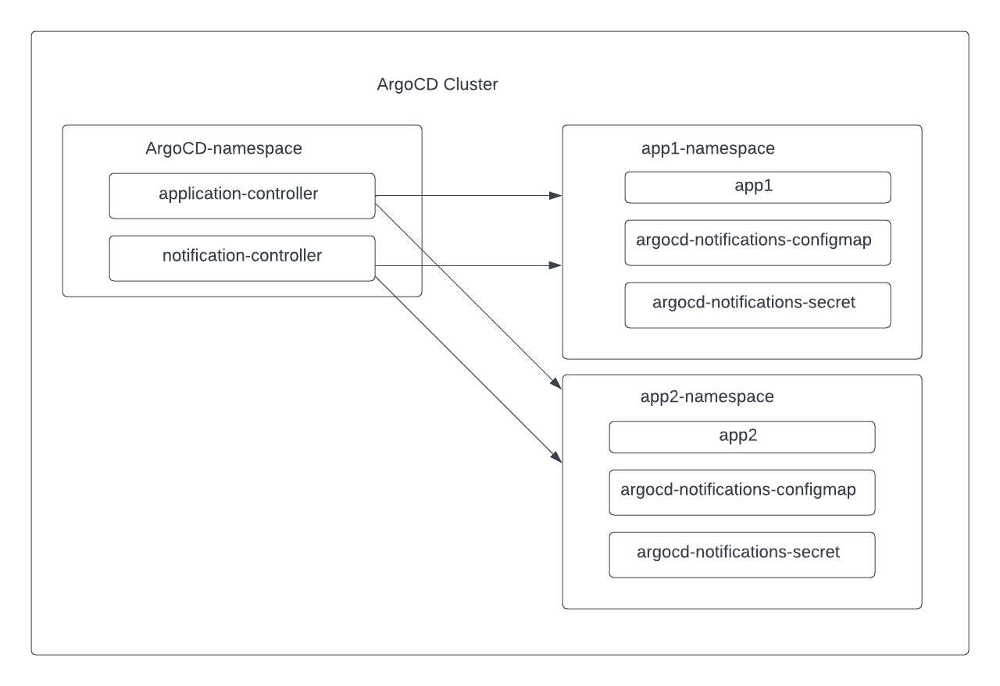

# Self Service Notification for ArgoCD

## Summary
This proposal is to enable application teams to have their own configurations of ArgoCD notifications aka self-service notification.
Application team will be able to receive notifications from the default (using the configuration from the namespace of the notification controller) as well as their own configuration of notifications.

## Motivation
As of now the configuration for ArgoCD notification is centrally managed. Only ArgoCD admin can make notification configuration changes.

When application teams use PagerDutyV2 for their notification service, every application team needs to create an integration key for each service in Pager Duty.
ArgoCD admin needs to add the integration key to kubernete's secret `argocd-notifications-secret`,
also needs to modify configmap `argocd-notifications-cm` to add the reference to the integration key stored in above secret under the list of `serviceKeys`

When there are many application teams want to use PagerDutyV2 for their notification service, they all have to go to ArgoCD admin team. This does not scale.

Teams also want to control the notification templates and triggers independently of what ArgoCD admin configured.

We need to enable application team's the ability to configure their own notification configurations.

## Proposal
Deploy notification configuration resources (configmap, secret) in the same namespace where the ArgoCD application is at.
ArgoCD applications are in any namespace using apps in any namespace feature.

Enhance ArgoCD notification controller to support app in any namespace.
Notification controller will know the namespaces to monitor by using `--application-namespaces` startup parameter. 

Enhance ArgoCD notification controller to use notification-engine's function `NewControllerWithNamespaceSupport()`. 
This function uses the application's `metadata.namespace` field to find the location of the configmap and secret. 
This controller uses both the self-service configuration and the admin defined default configuration.



In ArgoCD UI, when subscribing to notifications, user will be presented with a dropdown list of default-configuration and self-service-configuration if exists.
Based on the selection of configurations, list of services and triggers will be shown for each respective configuration.

### Use cases

Add a list of detailed use cases this enhancement intends to take care of.

#### Use case 1: application team wants to configure ArgoCD notification using pager duty V2.
I want to receive Pager Duty notification when my application is syncing, but our default ArgoCD notification is using slack.

* Create two additional resources `argocd-notifications-secret` and `argocd-notifications-cm`.
  In these resources I used PagerDutyV2 as service type.
* Deploy these two additional resources to the same namespace as my ArgoCD application.


#### Use case 1 Detailed example
My application resource is as below. It is deployed in namespace `some-namespace`. 
PagerDuty service that I want to alert on is called `my-service`

My own self-service notification configurations are in `argocd-notifications-cm` and `argocd-notifications-secret`.
These two resources are also deployed in namespace `some-namespace`, the same namespace as my application above,
therefore this self-service notification configuration is also used for this application in addition to the default configuration.

```yaml
apiVersion: argoproj.io/v1alpha1
kind: Application
metadata:
  annotations:
    notifications.argoproj.io/subscribe.on-sync-running.pagerdutyv2: my-service
    notifications.argoproj.io/subscribe.on-sync-running.slack: <the_slack_channel_name>
  name: guest-book
  namespace: some-namespace
spec:
  destination:
    namespace: <detination_namespace>
    server: https://xxxx
  project: default
  source:
    path: guestbook
    repoURL: https://github.com/xxxx.git
    targetRevision: HEAD
```

```yaml
apiVersion: v1
data:
  service.pagerdutyv2: |
    serviceKeys:
      my-service: $pagerduty-key-my-service
  template.app-sync-running: |
    pagerdutyv2:
      summary: "App {{.app.metadata.name}} sync running "
      severity: "info"
      source: "{{.app.metadata.name}}"
  trigger.on-sync-running: |
    - description: Application is being synced
      send:
      - app-sync-running
      when: app.status.operationState.phase in ['Running']
kind: ConfigMap
metadata:
  name: argocd-notifications-cm
  namespace: some-namespace
```

```yaml
apiVersion: v1
data:
  pagerduty-key-my-service: ++++++++
kind: Secret
metadata:
  name: argocd-notifications-secret
  namespace: some-namespace
type: Opaque
```

#### Use case 2: application team wants to configure custom template
ArgoCD admin has configured basic templates, as end user, I want to receive more detailed information that only pertains to my team.

#### Use case 3: application team wants to configure custom trigger
ArgoCD admin has configured basic triggers, as end user, I want to receive a notification based on a trigger that pertains to my team.

### Security Considerations
The security model for this feature is gitops-first. The Argo CD admin is expected to use apps-in-any-namespace and permit the user to deploy Applications, ConfigMaps, and Secrets to their team's Application namespace.
This extends the existing multitenancy-by-namespace design from just Applications to an additional item of configuration: notification templates/tokens.

### Risks and Mitigations

### Considerations
This adds a new configuration pattern to ArgoCD. Today, ArgoCD has a few different patterns for configuration. 
This proposal aligns itself with apps in any namespace pattern.

## Drawbacks

## Alternatives
Multitenancy-by-namespace is a design decision which particularly suits gitops. Argo CD also supports multitenancy governed by AppProjects. But that multitenancy model must be completely managed by the Argo CD admin, and users may not self-serve Argo CD config via GitOps.
Alternatives to this gitops-first design could include:
1) Allowing self-serve notifications config via the API, segmented by project (i.e. not gitops)
2) Associating notifications config with an AppProject instead of an Applications namespace (could still be gitops, depending on the association mechanism)
3) Associating notifications config with an Application directly (maybe via a ConfigMapRef field or an annotation?) instead of an Applications namespace (could probably also be gitopsed, but is a bit more complicated)
   
This choice is important, because it sets a precedent for how we expect self-service, gitops-first multi-tenancy to scale in Argo. Basically: how do we let users configure _stuff_ about their applications via gitops without requiring massive administrative overhead. The model we establish could later expand to configuring resource customizations, sync windows, etc.

