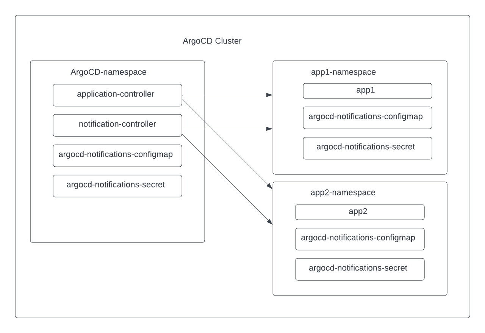

# Self Service Notification for ArgoCD

## Summary
This proposal is to enable application teams to have their own configurations of ArgoCD notifications aka self-service notification.
Application team will be able to receive notifications from the default (using the configuration from the namespace of the notification controller) as well as their own configuration of notifications.

## Motivation
As of now the configuration for ArgoCD notification is centrally managed. Only ArgoCD admin can make notification configuration changes.

When application teams use PagerDutyV2 for their notification service, every application team needs to create an integration key for each service in Pager Duty.
ArgoCD admin needs to add the integration key to kubernete's secret `argocd-notifications-secret`,
also needs to modify configmap `argocd-notifications-cm` to add the reference to the integration key stored in above secret under the list of `serviceKeys`

When there are many application teams want to use PagerDutyV2 for their notification service, they all have to go to ArgoCD admin team. This does not scale.

Teams also want to control the notification templates and triggers independently of what ArgoCD admin configured.

We need to enable application team's the ability to configure their own notification configurations.

## Proposal
Deploy notification configuration resources (configmap, secret) in the same namespace where the ArgoCD application is at.
ArgoCD applications are in any namespace using apps in any namespace feature.

Enhance ArgoCD notification controller to support app in any namespace.
Notification controller will know the namespaces to monitor by using `--application-namespaces` startup parameter. 
It can also be conveniently set up and kept in sync by specifying the application.namespaces settings in the argocd-cmd-params-cm ConfigMap.

Enhance ArgoCD notification controller to use notification-engine's function `NewControllerWithNamespaceSupport()`. 
This function uses the application's `metadata.namespace` field to find the location of the configmap and secret. 
This controller uses both the self-service configuration and the admin defined default configuration.



### Use cases

Add a list of detailed use cases this enhancement intends to take care of.

#### Use case 1: application team wants to configure ArgoCD notification using pager duty V2.
I want to receive Pager Duty notification when my application is syncing, but our default ArgoCD notification is using slack.

* Create two additional resources `argocd-notifications-secret` and `argocd-notifications-cm`.
  In these resources I used PagerDutyV2 as service type.
* Deploy these two additional resources to the same namespace as my ArgoCD application.


#### Use case 1 Detailed example

```yaml
apiVersion: argoproj.io/v1alpha1
kind: Application
metadata:
  annotations:
    notifications.argoproj.io/subscribe.on-sync-running.pagerdutyv2: hello-2_xxxx
    notifications.argoproj.io/subscribe.on-sync-running.slack: may-test
  name: guest-book
  namespace: app-may-test
spec:
  destination:
    namespace: app-may-test
    server: https://xxxx
  project: default
  source:
    path: guestbook
    repoURL: https://github.com/mayzhang2000/argocd-example-apps.git
    targetRevision: HEAD
```

```yaml
apiVersion: v1
data:
  service.pagerdutyv2: |
    serviceKeys:
      hello-2_xxxxx: $pagerdutyv2-key-hello-2_xxxx
  template.app-sync-running: |
    pagerdutyv2:
      summary: "App {{.app.metadata.name}} sync running "
      severity: "info"
      source: "{{.app.metadata.name}}"
  trigger.on-sync-running: |
    - description: Application is being synced
      send:
      - app-sync-running
      when: app.status.operationState.phase in ['Running']
kind: ConfigMap
metadata:
  labels:
    app.kubernetes.io/instance: mayeast
  name: argocd-notifications-cm
  namespace: app-may-test
```

```yaml
apiVersion: v1
data:
  pagerdutyv2-key-hello-2_4759196499290493255: ++++++++
kind: Secret
metadata:
  labels:
    app.kubernetes.io/instance: mayeast
  name: argocd-notifications-secret
  namespace: app-may-test
type: Opaque
```

#### Use case 2: application team wants to configure custom template
ArgoCD admin has configured basic templates, as end user, I want to receive more detailed information that only pertains to my team.

#### Use case 3: application team wants to configure custom trigger
ArgoCD admin has configured basic triggers, as end user, I want to receive a notification based on a trigger that pertains to my team.

### Security Considerations

### Risks and Mitigations

### Considerations
This adds a new configuration pattern to ArgoCD. Today, ArgoCD has a few different patterns for configuration. 
This proposal aligns itself with apps in any namespace pattern.

## Drawbacks

## Alternatives

