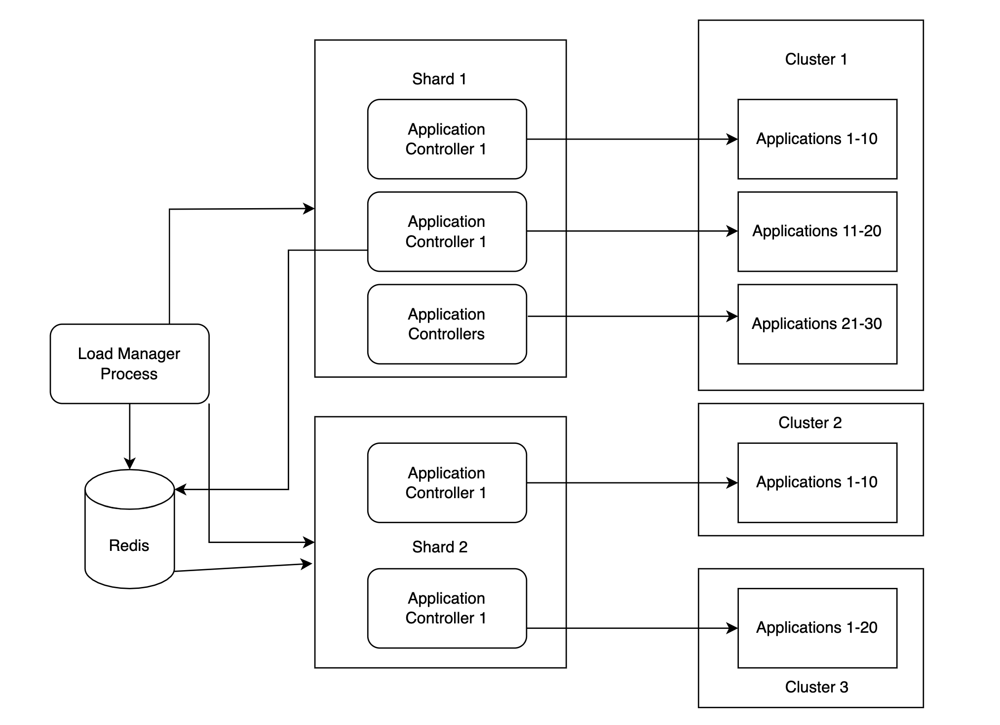
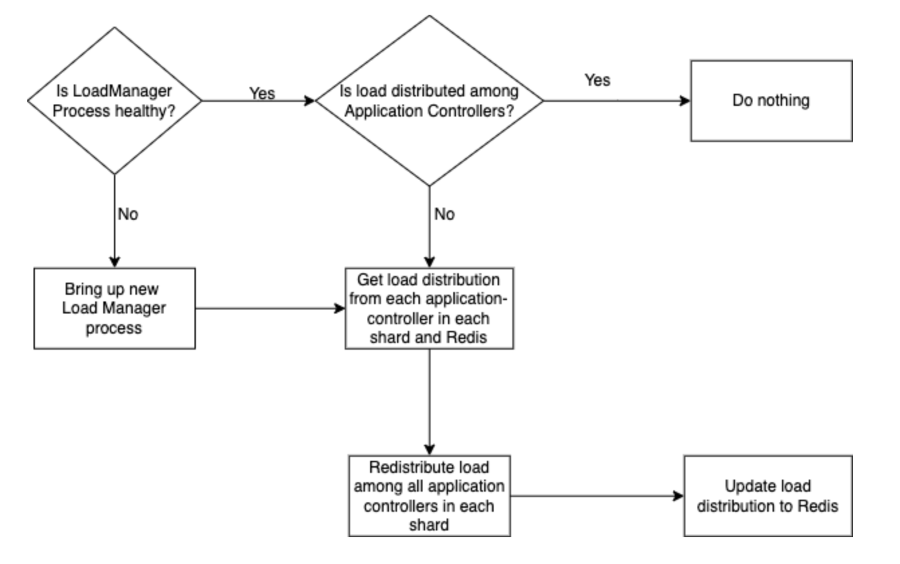

# Sharding Apllication Controller Enhancement

We want the application controller to scale automatically to provide high availability.

## Summary

Currently, the Argo CD application controller comes as a StatefulSet that can be scaled up to the limit of the number of managed clusters, that is one application controller can be used to manage one or more cluster(s) of the Argo CD configuration.
We do want to remove this limitation, and have the application controller scale beyond this, so that a set of X application controllers could be used to manage any number of applications on any number of clusters.

## Motivation

Currently, the application-controller does not provide high availability to support workload distribution. This causes conflicts and leads to orphaned/unmanaged applications in scenarios where the application controller handling these resources malfunctions/crashes.

### Goals

To scale application controller so that a set of X application controllers could be used to manage any number of applications on any number of clusters.

### Non-Goals

Provide high availability to support workload distribution

## Proposals

### Proposal 1: New Application Controller Manager

We can create a separate process that would be responsible for checking the health status of each application-controller in the shard by sending a heartbeat message to every application controller. If any of the application controllers would go down, it would read the cached list of managed applications by the specific application-controller and distribute it among the healthy controllers in the shard.

This approach would also help in scenarios where a new application controller is added to the shard or the dead application controller comes back alive. The process would read the load on each application-controller in the shard and shuffle the applications handled by all of the application controllers for a cluster within the shard.

This approach would shift the single point of failure on the new process. Although this would not stop any of the application-controllers, it would not redistribute the number of applications handled by each application-controller within a cluster.

#### Pros:
- The new process will take the responsibility of redistributing the number of applications within the cluster.
- Single point of failure will shift from application-controller to the new process making sure that if a specific application-controller fails, the managed applications in the cluster will be redistributed and managed by remaining healthy application-controllers.

#### Cons:
- An additional process to be managed by Argo CD
- Does not remove the single point of failure completely. If the new process fails, it would not stop the current application controllers to continue managing applications. It would just stop redistributing the workload across application controllers.

### Proposal 2: Leader Election
 
Implementing Leader Election would help resolve these conflicts and provide high availability. By implementing leader elections, each shard can contain more than one replica of the application-controller and manage the applications in the shard. If one of the controllers crashes, the load can be distributed among the remaining controllers to continue providing high availability of the applications. Having multiple controllers would also allow for various features like rolling updates for deployments, replication/backup in cases of malfunctioning controllers, etc.

For a distributed application architecture, Leader Election is a way that involves the selection of a leader among the healthy candidates eligible for the election. In this process, the leader continues to send the heartbeat request to each candidate in a loop to make sure all the candidates are working properly. In case any of the candidates fail to return the heartbeat response to the leader for a couple of iterations, the leader assumes the candidate to have died and notifies other candidates to pick up the workload handled by the dead candidate. In case the leader’s health check fails, the candidates start a re-election to elect the next leader among them. This is critical for services where the leader is the single point of contact to orchestrate the service delivery. Zookeeper, etcd are such services which rely on a leadership election process.

One of the possible examples for selecting the leader is by checking the load handled by each healthy candidate and selecting the candidate which has the least load / number of processes running on it.

There are various examples in kubernetes that support leader election as well, like control-manager, scheduler, etc. There is recent enhancement with outstanding PR in argocd-rollouts which supports leader elections.

### Implementation Details/Notes/Constraints

#### Proposal 1:

In this approach, the load manager process (the new process to be added) will continuously keep monitoring every Application Controller in every shard with a heartbeat mechanism. Using this heartbeat mechanism, it will fetch the application controllers workload distribution and maintain the data in Redis. Also, every time a new Application Controller is added or if the load among the Application Controllers in any shard reduces, the load manager process will redistribute the applications among the required number of application controllers. For example, if we reduce the number of  applications managed from 300 to 200, the load manager process will signal one of the application controllers to terminate itself redistributing it’s managed applications among the remaining healthy application controllers.

The workflow would look something like above. If the load manager process is healthy and running, it will check all the application controllers in every shard periodically maintaining their states in Redis. In case it finds the load among the application controllers is not even, it will try redistributing the applications among the application-controllers in that particular shard. The load manager process will read the saved load distribution from Redis and match it with the load distribution that would come via every heartbeat call. In case of differences, it will update Redis with a new load distribution and redistribute the load accordingly.

In case the load manager process itself is not healthy, it will create a point of failure for redistributing the load among the application controllers, but will not stop application controllers from managing the applications. We will replace the load manager process immediately. Upon starting, the load manager process will read the Redis cache to get the last stored load distribution and compare it with the new heartbeat updates from every application controller from every shard

#### Proposal 2:

We have a story/proposal in argo-cd available defining the leader election process for application-controllers https://github.com/argoproj/argo-cd/issues/3073.

