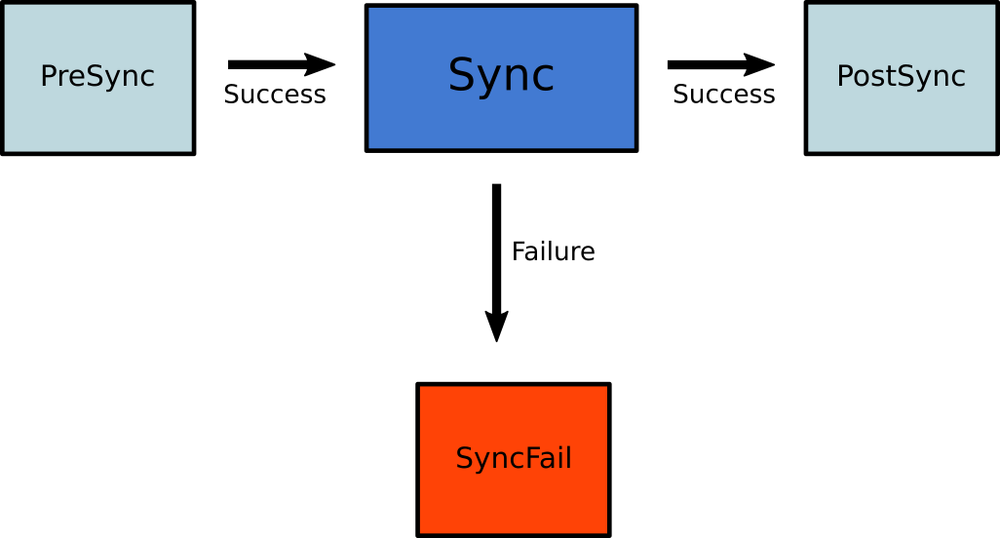

When an application has multiple Kubernetes resources Argo CD will by default handle their deployment in the order that makes the most sense. For example, namespaces and CRDs will be created before replicasets.
You can see all the details in the [source code](https://github.com/argoproj/gitops-engine/blob/bc9ce5764fa306f58cf59199a94f6c968c775a2d/pkg/sync/sync_tasks.go#L27-L66).

Sometimes however, you need to override the default order of components and define a specific sequence of resources that should be applied. 

Some common examples are:

 * You want to run a database migration task _before_ the application is deployed
 * You want to run an email notification task _after_ the application is deployed
 * You want to run a preflight check that will decide if the main sync operation will take place or not
 * You want to run smoke tests or some other kind of check after a deployment has taken place in order to validate it


All these scenarios can be covered using Sync Phases and/or Sync Waves.

## Sync Phases

If you want to easily run a specific task or deploy a specific resource before or after the main sync operation you can use sync phases and hooks.

Argo CD has the following hook types:

| Hook | Description |
|------|-------------|
| `PreSync` | Executes prior to the application of the manifests. |
| `Sync`  | Executes after all `PreSync` hooks completed and were successful, at the same time as the application of the manifests. |
| `Skip` | Indicates to Argo CD to skip the application of the manifest. |
| `PostSync` | Executes after all `Sync` hooks completed and were successful, a successful application, and all resources in a `Healthy` state. |
| `SyncFail` | Executes when the sync operation fails. |

To assign a resource to a specific phase you need to use the `argocd.argoproj.io/hook` annotation. During a Sync operation, Argo CD will apply the resource during the appropriate phase of the
deployment. Hooks can be any type of Kubernetes resource kind, but tend to be Pod, [Job](https://kubernetes.io/docs/concepts/workloads/controllers/jobs-run-to-completion/)
or [Argo Workflows](https://github.com/argoproj/argo). Multiple hooks can be specified as a comma
separated list. 

### How phases work

Once you have assigned resources to different phases, during a sync operation Argo CD will do the following.

1. Apply all the resources marked as `PreSync` hooks. If _any_ of them fails the whole sync process will stop
1. Apply all the resources marked as `Sync` hooks. If _any_ of them fails the whole sync process will be marked as failed. Hooks marked with `SyncFail` will also run
1. Apply all the resources marked as `PostSync` hooks. If _any_ of them fails the whole sync process will be marked as failed. 
1. Hooks marked with `Skip` will not be applied.


Here is a graphical overview of the sync process:



You can use this simple lifecycle method in various scenarios. For example you can run an essential check as a `PreSync` hook. If it fails
then the whole sync operation will stop preventing the deployment from taking place. In a similar manner you can run smoke tests as `PostSync` hooks. If they succeed you know that your application has passed the validation. If they fail then the whole deployment will be marked as failed and Argo CD can then notify you in order to take further actions.

Hooks at the `SyncFail` phase can be used for cleanup actions and other housekeeping tasks. Note that if themselves fail, Argo CD will not do anything special (other than marking the whole operation as failed).

!!! warning
    Hooks are not run during a selective sync operation.

### Graphical representation

Any resources that are marked with a hook annotation will have a small "anchor" icon in the UI.


### Hook lifecycle and cleanup

Argo CD offers several methods to clean up hooks and decide how much history will be kept for previous runs.

In the most basic  case you can use the `argocd.argoproj.io/hook-delete-policy` to decide when a hook will be deleted.

This can take the following values:

| Policy | Description |
|--------|-------------|
| `HookSucceeded` | The hook resource is deleted after the hook succeeded (e.g. Job/Workflow completed successfully). |
| `HookFailed` | The hook resource is deleted after the hook failed. |
| `BeforeHookCreation` | Any existing hook resource is deleted before the new one is created (since v1.3). It is meant to be used with `/metadata/name`. |

Named hooks (i.e. ones with `/metadata/name`) will only be created once. If you want a hook to be re-created each time either use `BeforeHookCreation` policy  or `/metadata/generateName`. 

Example of integration tests that will automatically be deleted if they succeed:

```yaml
apiVersion: batch/v1
kind: Job
metadata:
  generateName: integration-test-
  annotations:
    argocd.argoproj.io/hook: PostSync
    argocd.argoproj.io/hook-delete-policy: HookSucceeded
```

Apart from the `hook-delete-policy` annotation you can also use any annotation which is valid for the respective controller that manages the resource. 

For example in the case of Kubernetes jobs you can also define [restart policies , back off limits etc.](https://kubernetes.io/docs/concepts/workloads/controllers/job/#job-termination-and-cleanup).


### Sync Status with Jobs/Workflows with Time to Live (ttl)

Jobs support the [`ttlSecondsAfterFinished`](https://kubernetes.io/docs/concepts/workloads/controllers/ttlafterfinished/)
field in the spec, which let their respective controllers delete the Job after it completes. Argo Workflows support a 
[`ttlStrategy`](https://argoproj.github.io/argo-workflows/fields/#ttlstrategy) property that also allow a Workflow to be 
cleaned up depending on the ttl strategy chosen.

Using either of the properties above can lead to Applications being OutOfSync. This is because Argo CD will detect a difference 
between the Job or Workflow defined in the git repository and what's on the cluster since the ttl properties cause deletion of the resource after completion.

However, using deletion hooks instead of the ttl approaches mentioned above will prevent Applications from having a status of 
OutOfSync even though the Job or Workflow was deleted after completion.


## Sync Waves

Argo CD also offers an alternative method of changing the sync order of resources. These are sync waves. They are defined by the `argocd.argoproj.io/sync-wave` annotation. The value is an integer that defines the ordering (ArgoCD will start deploying from the lowest number and finish with the highest number).

```yaml
metadata:
  annotations:
    argocd.argoproj.io/sync-wave: "5"
```

Hooks and resources are assigned to wave 0 by default. The wave can be negative, so you can create a wave that runs before all other resources.

When a sync operation takes place, Argo CD will:

1. Order all resources according to their wave (lowest to highest)
1. Apply the resources according to the resulting sequence

!!! note
    There is currently a delay between each sync wave in order to give other controllers a chance to react to the spec change
    that was just applied. This also prevents Argo CD from assessing resource health too quickly (against the stale object), causing
    hooks to fire prematurely. The current delay between each sync wave is 2 seconds and can be configured via the environment
    variable `ARGOCD_SYNC_WAVE_DELAY`.

### Combining Sync waves and hooks

While you can use sync waves on their own, for maximum flexibility you can combine them with hooks. This way you can use sync phases for coarse grained ordering and sync waves for defining the exact order of a resource within an individual phase.


When Argo CD starts a sync, it orders the resources in the following precedence:

1. The phase
1. The wave they are in (lower values first)
1. By kind (e.g. [namespaces first and then other Kubernetes resources, followed by custom resources](https://github.com/argoproj/gitops-engine/blob/bc9ce5764fa306f58cf59199a94f6c968c775a2d/pkg/sync/sync_tasks.go#L27-L66))
1. By name 

Once the order is defined:

1. First Argo CD determines the number of the first wave to apply. This is the first number where any resource is out-of-sync or unhealthy.
1. It applies resources in that wave. 
1. It repeats this process until all phases and waves are in-sync and healthy.

Because an application can have resources that are unhealthy in the first wave, it may be that the app can never get to healthy.


## Examples 

The following example uses the Slack API to send a a Slack message when sync completes: 

```yaml
apiVersion: batch/v1
kind: Job
metadata:
  generateName: app-slack-notification-
  annotations:
    argocd.argoproj.io/hook: PostSync
    argocd.argoproj.io/hook-delete-policy: HookSucceeded
spec:
  template:
    spec:
      containers:
      - name: slack-notification
        image: curlimages/curl
        command:
          - "curl"
          - "-X"
          - "POST"
          - "--data-urlencode"
          - "payload={\"channel\": \"#somechannel\", \"username\": \"hello\", \"text\": \"App Sync succeeded\", \"icon_emoji\": \":ghost:\"}"
          - "https://hooks.slack.com/services/..."
      restartPolicy: Never
  backoffLimit: 2
```

The following example runs a db migration command before the main sync operation (also in wave -1):


```yaml
apiVersion: batch/v1
kind: Job
metadata:
  name: db-migrate
  annotations:
    argocd.argoproj.io/hook: PreSync
    argocd.argoproj.io/hook-delete-policy: HookSucceeded
    argocd.argoproj.io/sync-wave: "-1"
spec:
  ttlSecondsAfterFinished: 360
  template:
    spec:
      containers:
        - name: postgresql-client
          image: my-postgres-data:11.5
          imagePullPolicy: Always
          env:
            - name: PGPASSWORD
              value: admin
            - name: POSTGRES_HOST
              value: my_postgresql_db              
          command: ["psql", "-h=my_postgresql_db", "-U postgres" , "-f preload.sql"]
      restartPolicy: Never
  backoffLimit: 1
```

The following example runs smoke tests after a deployment (also in wave 5):


```yaml
apiVersion: batch/v1
kind: Job
metadata:
  name: smoke-tests
  annotations:
    argocd.argoproj.io/hook: PostSync
    argocd.argoproj.io/hook-delete-policy: HookSucceeded
    argocd.argoproj.io/sync-wave: "5"
spec:
  ttlSecondsAfterFinished: 120
  template:
    spec:
      containers:
        - name: java-int-tests
          image: my-maven-image:3.5.2
          imagePullPolicy: Always
          env:
            - name: MAVEN_OPTS
              value: -Xmx2048m            
          command: ["mvn", "verify"]
      restartPolicy: Never
  backoffLimit: 1
```

For more information at possible scenarios look at [Kubernetes Jobs](https://kubernetes.io/docs/concepts/workloads/controllers/job/) and [Argo Workflows](https://argoproj.github.io/workflows/).