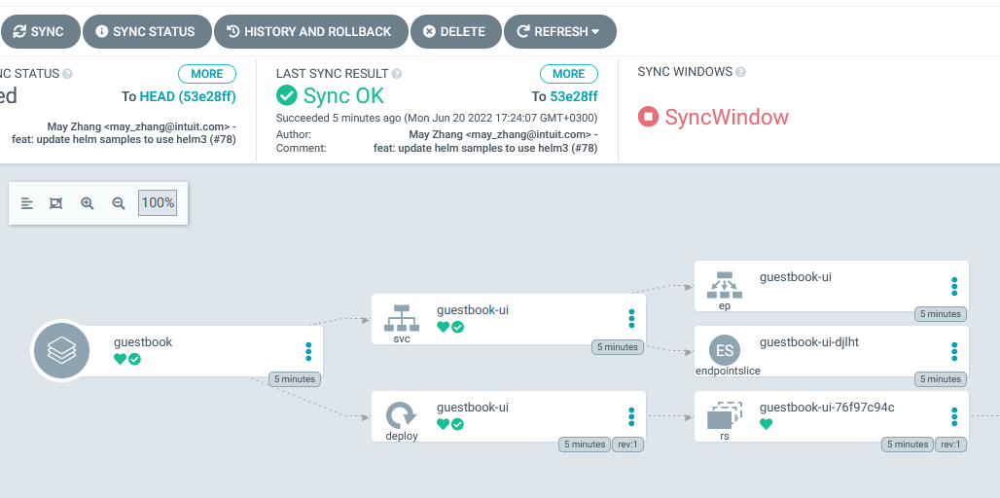
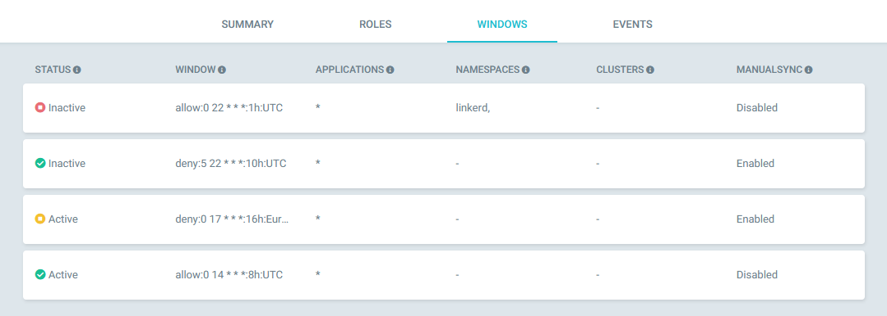
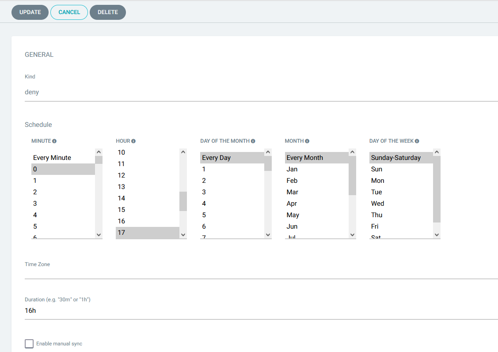

One of the main benefits of GitOps is the guarantee that your Git repository
always represents what is deployed right now in the cluster. This is easily enforced in ArgoCD by enabling the auto-sync option which means that ArgoCD will instantly update/sync the application in the cluster with any Git changes.

However, there are cases where you want to guarantee the exact opposite, that no sync operation will take place either automatically or by human intervention at a specific time period.

Some common examples are:

 * No deployments should ever happen on Sunday
 * Deployments should only happen during working hours/days
 * Deployments should only happen every Monday and Thursday
 * Deployments should only happen at night at 4.00 am 

Depending on your organization needs you might have different limitations on when operations should/shouldn't happen. It is also possible that you need such scenarios in a dynamic manner (i.e. during an incident for application A, disable all sync operations for application B)

All these scenarios can be covered by using *Sync Windows*.

## How Sync windows work

Sync windows are time periods that you define where you can explicitly disable/enable application syncing. Sync operations will only be possible if the active syncing windows allow it.



For each sync window you define

* The time/day it starts (using cron expressions)
* How long it lasts 
* If during the window syncs are allowed or not
* a set of applications/clusters/namespace this window applies to (optional)
* The timezone. This is optional and by default all times are UTC
* If manual syncs will be still allowed or not

The last option gives you an escape hatch (if you need it) to override what the sync window does in a manual way. You can still disable syncing altogether for a sync window if you are absolutely certain that no sync operations should ever happen during that window.

## Rules for multiple/overlapping Sync windows

It is possible to create several sync windows and try to sync an application when multiple sync windows are taking effect at the same time. In general, the "deny" sync windows have always priority over "allow" sync windows.

The rules for sync windows are the following

1. If there are no windows matching an application then all syncs are allowed
1. If there are any "allow" windows matching an application then syncs will only be allowed when there is an active "allow" window. 
1. If there are any "deny" windows matching an application then all syncs will be denied when the "deny" windows are active
1. If there is an active "allow" window  and an active "deny" window then syncs will be denied as "deny" windows override "allow" windows. 

Note that the "manual Sync" property of a window will always allow you to override a sync operation if you have it enabled (even if a "deny" window is active).

## Scoping a sync window to a specific cluster/namespace/application

By default a sync window is attached to an ArgoCD Project and will apply to all applications of that project. If you are not using ArgoCD Projects then you can create sync windows under the `default` project that is always available after installation.

You can further define the scope of a sync window by defining:

 * namespaces
 * clusters
 * applications

For all the above you can use [glob expressions](https://en.wikipedia.org/wiki/Glob_(programming)).

Note however that all these options are executed in an `OR` manner. If for example you define a specific window for namespace `billing` and clusters `production-*` then it will apply to all applications that are in the namespace `billing` **OR** deployed in a cluster with a name that matches `production-*`. 

## Creating sync windows

Like all other resources in Argo CD, you can create sync windows with multiple methods

1. Directly from the UI (suggested for experimentation only)
2. Directly from the CLI (useful for quick fixes/urged issues)
3. Defined as a custom resource and committed to GIT (recommended for production)

Windows can be created using the CLI:

```bash
argocd proj windows add default --kind allow --schedule "0 22 * * *" --duration 1h --applications "*"

argocd proj windows add default --kind allow --schedule "0 22 * * *" --duration 1h --applications "billing-*"

argocd proj windows add default --kind deny --schedule "0 17 * * *" --duration 16h --clusters "*prod*"

argocd proj windows add default --kind allow --schedule "0 14 * * *" --duration 8h --namespaces "monitoring" --timezone=UTC
```

Alternatively, you can commit/sync an `AppProject` manifest:
 
```yaml
apiVersion: argoproj.io/v1alpha1
kind: AppProject
metadata:
  name: default
spec:
  syncWindows:
  - kind: allow
    schedule: '10 1 * * *'
    duration: 1h
    applications:
    - '*-prod'
    manualSync: true
  - kind: deny
    schedule: '0 22 * * *'
    duration: 1h
    namespaces:
    - default
   - kind: allow
     schedule: '0 23 * * *'
     duration: 1h
     clusters:
     - in-cluster
     - cluster1
```

In order to perform a sync when syncs are being prevented by a window, you can configure the window to allow manual syncs
using the CLI, UI or directly in the `AppProject` manifest:

```bash
argocd proj windows enable-manual-sync PROJECT ID
```

To disable

```bash
argocd proj windows disable-manual-sync PROJECT ID
```


## Viewing sync windows

Windows can be listed using the CLI:

```bash
argocd proj windows list PROJECT

ID  STATUS    KIND   SCHEDULE    DURATION  APPLICATIONS  NAMESPACES  CLUSTERS  MANUALSYNC
0   Active    allow  * * * * *   1h        -             -           prod1     Disabled
1   Inactive  deny   * * * * 1   3h        -             default     -         Disabled
2   Inactive  allow  1 2 * * *   1h        prod-*        -           -         Enabled
3   Active    deny   * * * * *   1h        -             default     -         Disabled
```

They can also be seen in the User Interface.



## Updating Sync windows

All fields of a window can be updated using either the CLI or UI. The `applications`, `namespaces` and `clusters` fields
require the update to contain all of the required values. For example if updating the `namespaces` field and it already
contains default and kube-system then the new value would have to include those in the list. 

```bash
argocd proj windows update PROJECT ID --namespaces default,kube-system,prod1
```

You can also edit sync windows from the User Interface



