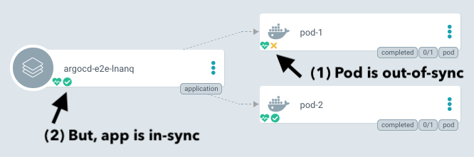

# Compare Options

## Ignoring Resources That Are Extraneous

>v1.1

You may wish to exclude resources from the app's overall sync status under certain circumstances. E.g. if they are generated by a tool. This can be done by adding this annotation on the resource you wish to exclude:

```yaml
metadata:
  annotations:
    argocd.argoproj.io/compare-options: IgnoreExtraneous
```



!!! note
    This only affects the sync status. If the resource's health is degraded, then the app will also be degraded.

Kustomize has a feature that allows you to generate config maps ([read more ⧉](https://github.com/kubernetes-sigs/kustomize/blob/master/examples/configGeneration.md)). You can set `generatorOptions` to add this annotation so that your app remains in sync:

```yaml
configMapGenerator:
  - name: my-map
    literals:
      - foo=bar
generatorOptions:
  annotations:
    argocd.argoproj.io/compare-options: IgnoreExtraneous
kind: Kustomization
``` 
 
!!! note
    `generatorOptions` adds annotations to both config maps and secrets ([read more ⧉](https://github.com/kubernetes-sigs/kustomize/blob/master/examples/generatorOptions.md)).
    
You may wish to combine this with the [`Prune=false` sync option](sync-options.md).
