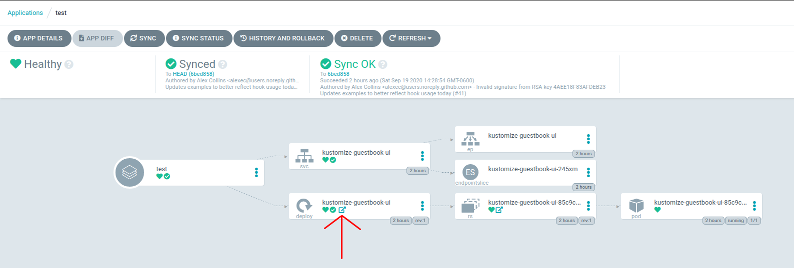

# Add external URL

You can add additional external links to Argo CD dashboard. For example
links monitoring pages or documentation instead of just ingress hosts or other apps.

ArgoCD generates a clickable links to external pages for a resource based on per resource annotation.

Example:
```yaml
apiVersion: apps/v1
kind: Deployment
metadata:
  name: my-svc
  annotations:
    link.argocd.argoproj.io/external-link: http://my-grafana.example.com/pre-generated-link
```


The external link icon will be visible for respective resource on ArgoCD application details page.



