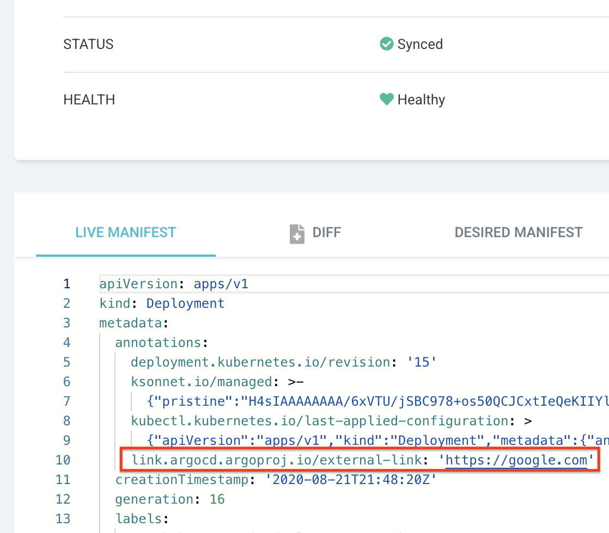
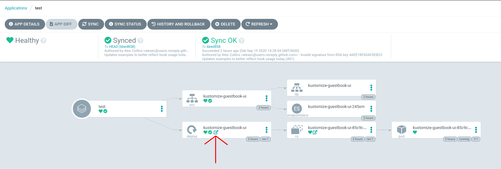

# External URL Links

ArgoCD automatically generates clickable links to external pages that your application exposes.
This is usually done via detecting hosts / URLs from your `Ingress` resources or the hostnames of
your Gateway API routes (`HTTPRoute`, `GRPCRoute` and `TLSRoute`).

These detected URLs are also exposed on `app.status.summary.externalURLs`, which is available to
notification templates and other integrations.

## Gateway API routes

When using the [Gateway API](https://gateway-api.sigs.k8s.io/), the hostnames declared in a route's
`spec.hostnames` are exposed as external URLs. This is useful when Gateways are shared and use
wildcard listener hostnames, because the application's actual public hostname exists only on the
route.

Routes do not carry TLS/scheme information (that is defined on the parent Gateway listener), so the
generated URLs default to `https`.

Example:
```yaml
apiVersion: gateway.networking.k8s.io/v1
kind: HTTPRoute
metadata:
  name: my-app
spec:
  parentRefs:
  - name: shared-gateway
  hostnames:
  - my-app.example.com   # exposed as https://my-app.example.com
  rules:
  - backendRefs:
    - name: my-app
      port: 8080
```

`TCPRoute` and `UDPRoute` do not have hostnames and therefore produce no external URLs.

## Add external URL

You can add additional external links to Argo CD dashboard. For example
links to monitoring pages or documentation, instead of just ingress hosts or other apps.

ArgoCD generates clickable links to external pages for a resource based on per resource annotation.

Example:
```yaml
apiVersion: apps/v1
kind: Deployment
metadata:
  name: my-svc
  annotations:
    link.argocd.argoproj.io/external-link: http://my-grafana.example.com/pre-generated-link
```


The external link icon will be visible for respective resource on ArgoCD application details page.



## Ignore autogenerated external URLs

If an ingress or Gateway API resource should be ignored by ArgoCD's autodetection of external URLs, such as a
dummy ingress pointing to a 404 page, you can add the `argocd.argoproj.io/ignore-default-links: "true"` annotation.
This will remove any links inferred from the resource's spec (ingress rules, Gateway listeners or route hostnames)
from the ArgoCD UI. Any links added by `link.argocd.argoproj.io` annotations are unchanged.

Example:
```yaml
apiVersion: networking.k8s.io/v1
kind: Ingress
metadata:
  annotations:
    link.argocd.argoproj.io/external-link: https://optional.show-me-instead.example.com/
    argocd.argoproj.io/ignore-default-links: "true"
spec:
  rules:
  - host: dont-show-me.internal.example.com
    ...
```
