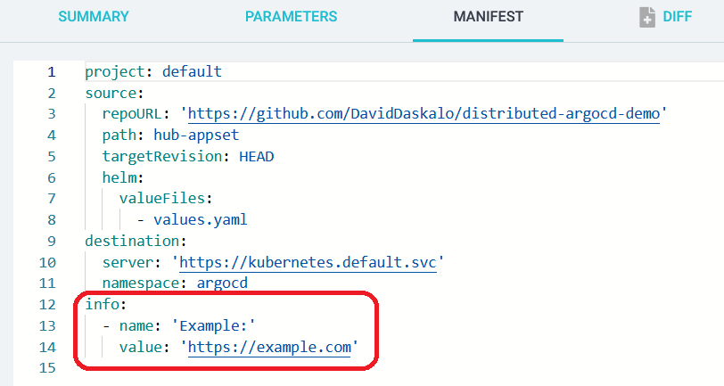
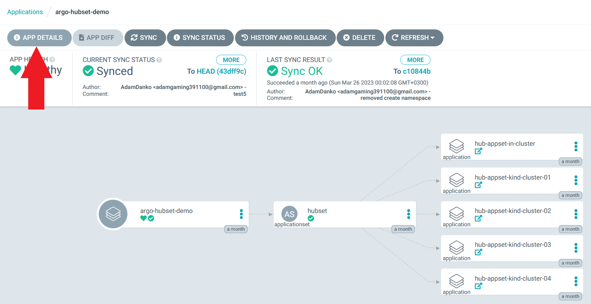
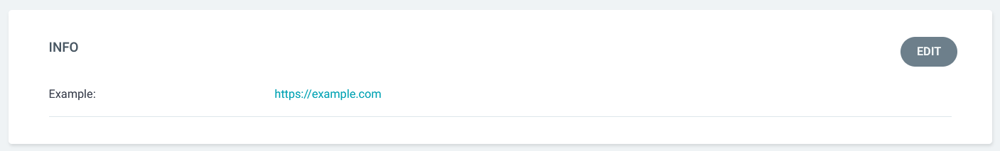

# Add extra Application info

You can add additional information to an Application on your Argo CD dashboard.
If you wish to add clickable links, see [Add external URL](https://argo-cd.readthedocs.io/en/stable/user-guide/external-url/). 

This is done by providing the 'info' field a key-value in your Application manifest.

Example:
```yaml
project: argo-demo
source:
  repoURL: 'https://demo'
  path: argo-demo
destination:
  server: https://demo
  namespace: argo-demo
info:
  - name: Example:
    value: >-
      https://example.com
```


The additional information will be visible on the Argo CD Application details page.




