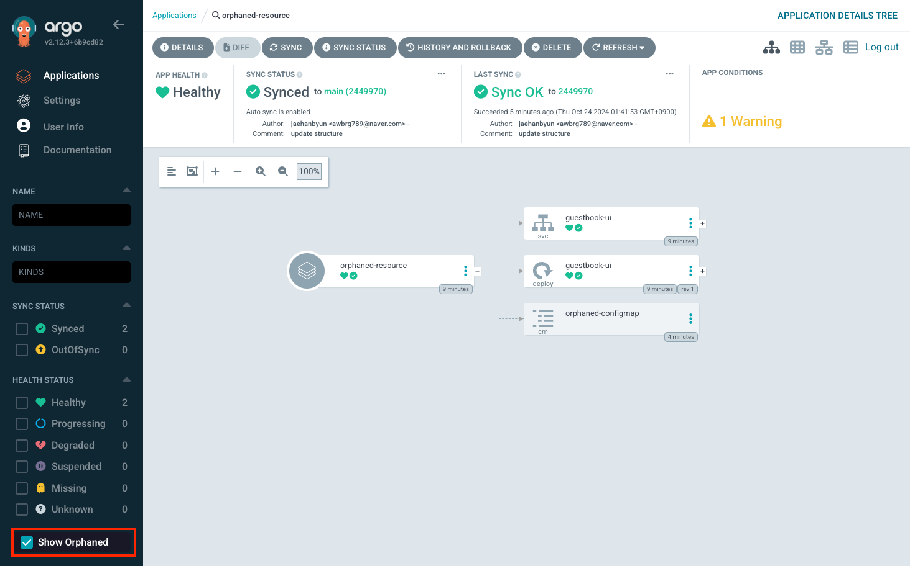

# Orphaned Resources Monitoring

Orphaned Kubernetes resource is a top-level namespaced resource which does not belong to any Argo CD Application. The Orphaned Resources Monitoring feature allows detecting
orphaned resources, generate a warning and inspect/remove resources using Argo CD UI.

The Orphaned Resources monitoring is enabled in [Project](projects.md) settings. Once the feature is enabled each project application which target namespace has orphaned resource
will get a warning condition. The orphaned resources can be located using the application details page:

Before enabling feature you might consider disabling warning. In this case application users are going to see orphaned resources in the UI but application is won't get a warning condition.

## Exceptions

Not every resource in the Kubernetes cluster is controlled by the end user. Following resources are never considered as orphaned:

* Namespaced resources denied in the project. Usually, such resources are managed by cluster administrators and not supposed to be modified by namespace user.
* `ServiceAccount` with name `default` ( and corresponding auto-generated `ServiceAccountToken` ).
* `Service` with name `kubernetes` in the `default` namespace.
