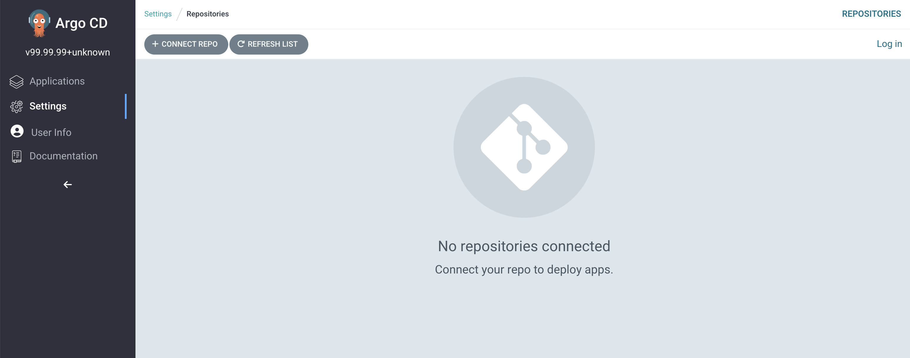
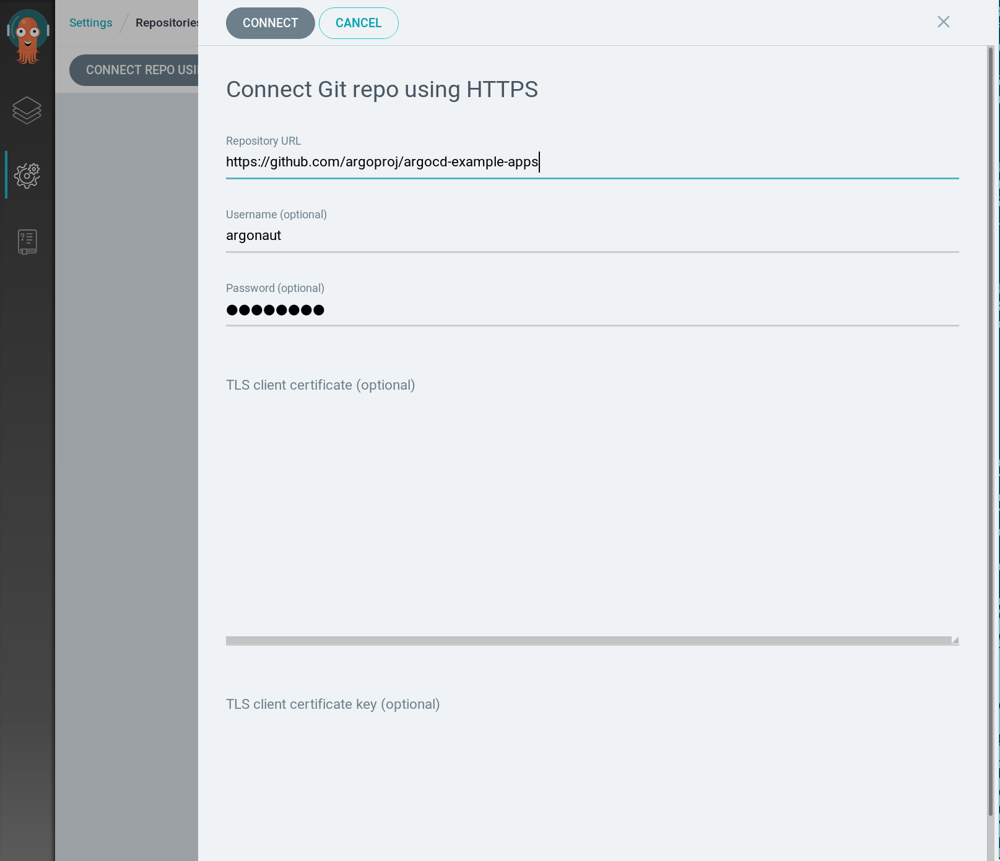
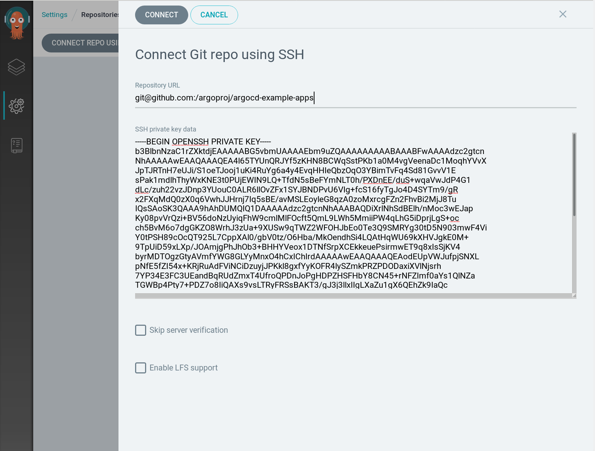
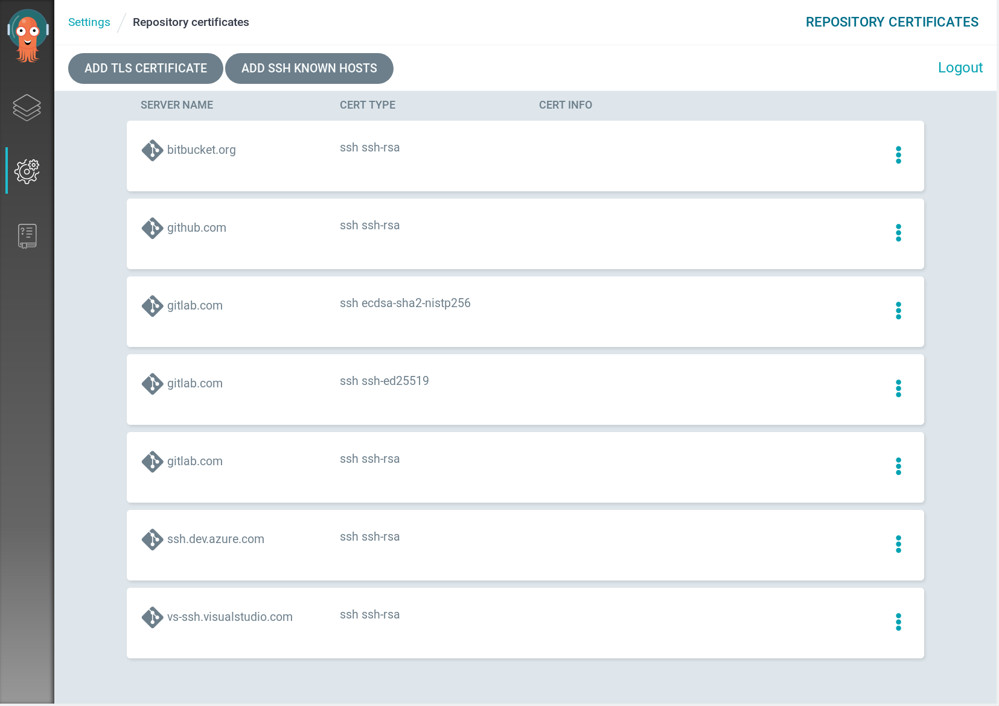
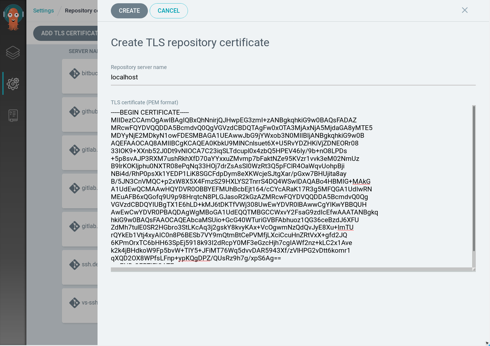
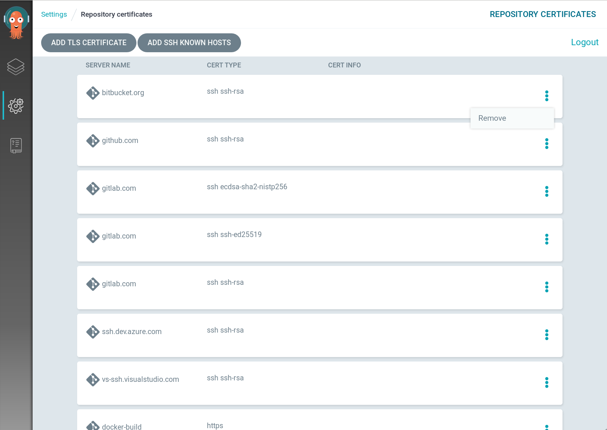
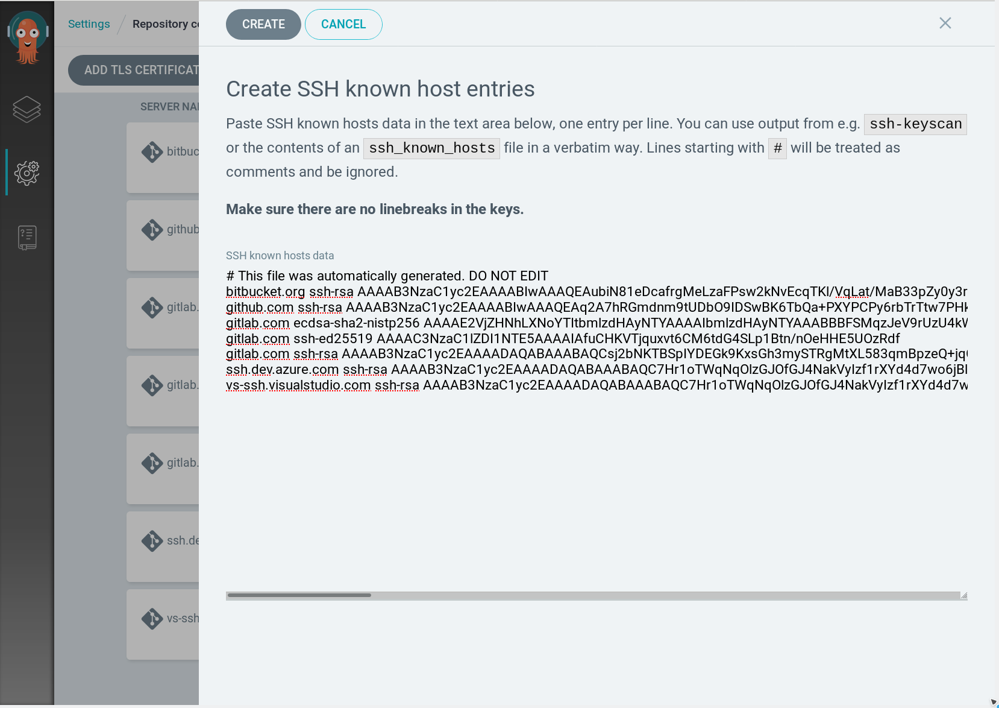

# Private Repositories

!!!note
    Some Git hosters - notably GitLab and possibly on-premise GitLab instances as well - require you to
    specify the `.git` suffix in the repository URL, otherwise they will send a HTTP 301 redirect to the
    repository URL suffixed with `.git`. ArgoCD will **not** follow these redirects, so you have to
    adapt your repository URL to be suffixed with `.git`.

## Credentials

If application manifests are located in private repository then repository credentials have to be configured. Argo CD supports both HTTP and SSH Git credentials.

### HTTPS Username And Password Credential

Private repositories that require a username and password typically have a URL that start with `https://` rather than `git@` or `ssh://`. 

Credentials can be configured using Argo CD CLI:

```bash
argocd repo add https://github.com/argoproj/argocd-example-apps --username <username> --password <password>
```

or UI:

> v1.2 or later

1. Navigate to `Settings/Repositories`

    

1. Click `Connect Repo using HTTPS` button and enter credentials 

    

    *Note: username in screenshot is for illustration purposes only , we have no relationship to this GitHub account should it exist.*

1. Click `Connect` to test the connection and have the repository added 

> earlier than v1.2

1. Navigate to `Settings/Repositories`
1. Click `Connect Repo` button and enter HTTP credentials


#### Access Token

Instead of using username and password you might use access token. Following instructions of your Git hosting service to generate the token:

* [Github](https://help.github.com/en/articles/creating-a-personal-access-token-for-the-command-line)
* [Gitlab](https://docs.gitlab.com/ee/user/project/deploy_tokens/)
* [Bitbucket](https://confluence.atlassian.com/bitbucketserver/personal-access-tokens-939515499.html)

Then, connect the repository using any non-empty string as username and the access token value as a password. 

!!!note
    For some services, you might have to specify your account name as the username instead of any string.

### TLS Client Certificates for HTTPS repositories

> v1.2 and later

If your repository server requires you to use TLS client certificates for authentication, you can configure ArgoCD repositories to make use of them. For this purpose, `--tls-client-cert-path` and `--tls-client-cert-key-path` switches to the `argocd repo add` command can be used to specify the files on your local system containing client certificate and the corresponding key, respectively:

```
argocd repo add https://repo.example.com/repo.git --tls-client-cert-path ~/mycert.crt --tls-client-cert-key-path ~/mycert.key
```

Of course, you can also use this in combination with the `--username` and `--password` switches, if your repository server should require this. The options `--tls-client-cert-path` and `--tls-client-cert-key-path` must always be specified together.

Your TLS client certificate and corresponding key can also be configured using the UI, see instructions for adding Git repos using HTTPS.

!!! note
    Your client certificate and key data must be in PEM format, other formats (such as PKCS12) are not understood. Also make sure that your certificate's key is not password protected, otherwise it cannot be used by ArgoCD.

!!! note
    When pasting TLS client certificate and key in the text areas in the web UI, make sure they contain no unintended line breaks or additional characters.

### SSH Private Key Credential

Private repositories that require an SSH private key have a URL that typically start with `git@` or `ssh://` rather than `https://`.  

> v1.2 or later

You can configure your Git repository using HTTPS either using the CLI or the UI.

Using the CLI:

```
argocd repo add git@github.com:argoproj/argocd-example-apps.git --ssh-private-key-path ~/.ssh/id_rsa
```

Using the UI:

1. Navigate to `Settings/Repositories`

    

1. Click `Connect Repo using SSH` button, enter the URL and paste the SSH private key 

    

1. Click `Connect` to test the connection and have the repository added 

!!!note
    When pasting SSH private key in the UI, make sure there are no unintended line breaks or additional characters in the text area

!!!note 
    When your SSH repository is served from a non-standard port, you have to use `ssh://`-style URLs to specify your repository. The scp-style `git@yourgit.com:yourrepo` URLs do **not** support port specification, and will treat any port number as part of the repository's path.

> earlier than v1.2

The Argo CD UI don't support configuring SSH credentials. The SSH credentials can only be configured using the Argo CD CLI:

```
argocd repo add git@github.com:argoproj/argocd-example-apps.git --ssh-private-key-path ~/.ssh/id_rsa
```

## Credential templates

> previous to v1.4

Credential templates are available only via declarative setup, see [Repository credentials](../../operator-manual/declarative-setup#repository-credentials) in Operator Manual.

> v1.4 and later

You can also set up credentials to serve as templates for connecting repositories, without having to repeat credential configuration. For example, if you setup credential templates for the URL prefix `https://github.com/argoproj`, these credentials will be used for all repositories with this URL as prefix (e.g. `https://github.com/argoproj/argocd-example-apps`) that do not have their own credentials configured.

To set up a credential template using the Web UI, simply fill in all relevant credential information in the __Connect repo using SSH__ or __Connect repo using HTTPS__ dialogues (as described above), but select __Save as credential template__ instead of __Connect__ to save the credential template. Be sure to only enter the prefix URL (i.e. `https://github.com/argoproj`) instead of the complete repository URL (i.e. `https://github.com/argoproj/argocd-example-apps`) in the field __Repository URL__

To manage credential templates using the CLI, use the `repocreds` sub-command, for example `argocd repocreds add https://github.com/argoproj --username youruser --password yourpass` would setup a credential template for the URL prefix `https://github.com/argoproj` using the specified username/password combination. Similar to the `repo` sub-command, you can also list and remove repository credentials using the `argocd repocreds list` and `argocd repocreds rm` commands, respectively.

In order for ArgoCD to use a credential template for any given repository, the following conditions must be met:

* The repository must either not be configured at all, or if configured, must not contain any credential information 
* The URL configured for a credential template (e.g. `https://github.com/argoproj`) must match as prefix for the repository URL (e.g. `https://github.com/argoproj/argocd-example-apps`). 

!!! note
    Repositories that require authentication can be added using CLI or Web UI without specifying credentials only after a matching repository credential has been set up

!!! note
    Matching credential template URL prefixes is done on a _best match_ effort, so the longest (best) match will take precedence. The order of definition is not important, as opposed to pre v1.4 configuration.

The following is an example CLI session, depicting repository credential set-up:

```bash
# Try to add a private repository without specifying credentials, will fail
$ argocd repo add https://docker-build/repos/argocd-example-apps
FATA[0000] rpc error: code = Unknown desc = authentication required 

# Setup a credential template for all repos under https://docker-build/repos
$ argocd repocreds add https://docker-build/repos --username test --password test
repository credentials for 'https://docker-build/repos' added

# Repeat first step, add repo without specifying credentials
# URL for template matches, will succeed
$ argocd repo add https://docker-build/repos/argocd-example-apps
repository 'https://docker-build/repos/argocd-example-apps' added

# Add another repo under https://docker-build/repos, specifying invalid creds
# Will fail, because it will not use the template (has own creds)
$ argocd repo add https://docker-build/repos/example-apps-part-two --username test --password invalid
FATA[0000] rpc error: code = Unknown desc = authentication required
```

## Self-signed & Untrusted TLS Certificates

> v1.2 or later

If you are connecting a repository on a HTTPS server using a self-signed certificate, or a certificate signed by a custom Certificate Authority (CA) which are not known to ArgoCD, the repository will not be added due to security reasons. This is indicated by an error message such as `x509: certificate signed by unknown authority`.

1. You can let ArgoCD connect the repository in an insecure way, without verifying the server's certificate at all. This can be accomplished by using the `--insecure-skip-server-verification` flag when adding the repository with the `argocd` CLI utility. However, this should be done only for non-production setups, as it imposes a serious security issue through possible man-in-the-middle attacks.

2. You can configure ArgoCD to use a custom certificate for the verification of the server's certificate using the `cert add-tls` command of the `argocd` CLI utility. This is the recommended method and suitable for production use. In order to do so, you will need the server's certificate, or the certificate of the CA used to sign the server's certificate, in PEM format.

!!! note
    For invalid server certificates, such as those without matching server name, or those that are expired, adding a CA certificate will not help. In this case, your only option will be to use the `--insecure-skip-server-verification` flag to connect the repository. You are strongly urged to use a valid certificate on the repository server, or to urge the server's administrator to replace the faulty certificate with a valid one.

!!! note
    TLS certificates are configured on a per-server, not on a per-repository basis. If you connect multiple repositories from the same server, you only have to configure the certificates once for this server.

!!! note
    It can take up to a couple of minutes until the changes performed by the `argocd cert` command are propagated across your cluster, depending on your Kubernetes setup.

### Managing TLS certificates using the CLI

You can list all configured TLS certificates by using the `argocd cert list` command using the `--cert-type https` modifier:

```bash
$ argocd cert list --cert-type https
HOSTNAME      TYPE   SUBTYPE  FINGERPRINT/SUBJECT
docker-build  https  rsa      CN=ArgoCD Test CA
localhost     https  rsa      CN=localhost
```

Example for adding  a HTTPS repository to ArgoCD without verifying the server's certificate (**Caution:** This is **not** recommended for production use):

```bash
argocd repo add --insecure-skip-server-verification https://git.example.com/test-repo

```

Example for adding a CA certificate contained in file `~/myca-cert.pem` to properly verify the repository server:

```bash
argocd cert add-tls git.example.com --from ~/myca-cert.pem
argocd repo add https://git.example.com/test-repo
```

You can also add more than one PEM for a server by concatenating them into the input stream. This might be useful if the repository server is about to replace the server certificate, possibly with one signed by a different CA. This way, you can have the old (current) as well as the new (future) certificate co-existing. If you already have the old certificate configured, use the `--upsert` flag and add the old and the new one in a single run:

```bash
cat cert1.pem cert2.pem | argocd cert add-tls git.example.com --upsert
```

!!! note
    To replace an existing certificate for a server, use the `--upsert` flag to the `cert add-tls` CLI command. 

Finally, TLS certificates can be removed using the `argocd cert rm` command with the `--cert-type https` modifier:

```bash
argocd cert rm --cert-type https localhost
```

### Managing TLS certificates using the ArgoCD web UI

It is possible to add and remove TLS certificates using the ArgoCD web UI:

1. In the navigation pane to the left, click on "Settings" and choose "Certificates" from the settings menu

1. The following page lists all currently configured certificates and provides you with the option to add either a new TLS certificate or SSH known entries: 

    

1. Click on "Add TLS certificate", fill in relevant data and click on "Create". Take care to specify only the FQDN of your repository server (not the URL) and that you C&P the complete PEM of your TLS certificate into the text area field, including the `----BEGIN CERTIFICATE----` and `----END CERTIFICATE----` lines:

    

1. To remove a certificate, click on the small three-dotted button next to the certificate entry, select "Remove" from the pop-up menu and confirm the removal in the following dialogue.

    

### Managing TLS certificates using declarative configuration

You can also manage TLS certificates in a declarative, self-managed ArgoCD setup. All TLS certificates are stored in the ConfigMap object `argocd-tls-cert-cm`.
Please refer to the [Operator Manual](../../operator-manual/declarative-setup/#repositories-using-self-signed-tls-certificates-or-are-signed-by-custom-ca) for more information.

> Before v1.2

We do not currently have first-class support for this. See [#1513](https://github.com/argoproj/argo-cd/issues/1513).

As a work-around, you can customize your Argo CD image. See [#1344](https://github.com/argoproj/argo-cd/issues/1344#issuecomment-479811810)

## Unknown SSH Hosts

If you are using a privately hosted Git service over SSH, then you have the following  options:

> v1.2 or later

1. You can let ArgoCD connect the repository in an insecure way, without verifying the server's SSH host key at all. This can be accomplished by using the `--insecure-skip-server-verification` flag when adding the repository with the `argocd` CLI utility. However, this should be done only for non-production setups, as it imposes a serious security issue through possible man-in-the-middle attacks.

2. You can make the server's SSH public key known to ArgoCD by using the `cert add-ssh` command of the `argocd` CLI utility. This is the recommended method and suitable for production use. In order to do so, you will need the server's SSH public host key, in the `known_hosts` format understood by `ssh`. You can get the server's public SSH host key e.g. by using the `ssh-keyscan` utility.

!!! note
    It can take up to a couple of minutes until the changes performed by the `argocd cert` command are propagated across your cluster, depending on your Kubernetes setup.
  
!!! note
    When importing SSH known hosts key from a `known_hosts` file, the hostnames or IP addresses in the input data must **not** be hashed. If your `known_hosts` file contains hashed entries, it cannot be used as input source for adding SSH known hosts - neither in the CLI nor in the UI. If you absolutely wish to use hashed known hosts data, the only option will be using declarative setup (see below). Be aware that this will break CLI and UI certificate management, so it is generally not recommended.

### Managing SSH Known Hosts using the CLI

You can list all configured SSH known host entries using the `argocd cert list` command with the `--cert-type ssh` modifier:

```bash
$ argocd cert list --cert-type ssh
HOSTNAME                 TYPE  SUBTYPE              FINGERPRINT/SUBJECT
bitbucket.org            ssh   ssh-rsa              SHA256:zzXQOXSRBEiUtuE8AikJYKwbHaxvSc0ojez9YXaGp1A
github.com               ssh   ssh-rsa              SHA256:nThbg6kXUpJWGl7E1IGOCspRomTxdCARLviKw6E5SY8
gitlab.com               ssh   ecdsa-sha2-nistp256  SHA256:HbW3g8zUjNSksFbqTiUWPWg2Bq1x8xdGUrliXFzSnUw
gitlab.com               ssh   ssh-ed25519          SHA256:eUXGGm1YGsMAS7vkcx6JOJdOGHPem5gQp4taiCfCLB8
gitlab.com               ssh   ssh-rsa              SHA256:ROQFvPThGrW4RuWLoL9tq9I9zJ42fK4XywyRtbOz/EQ
ssh.dev.azure.com        ssh   ssh-rsa              SHA256:ohD8VZEXGWo6Ez8GSEJQ9WpafgLFsOfLOtGGQCQo6Og
vs-ssh.visualstudio.com  ssh   ssh-rsa              SHA256:ohD8VZEXGWo6Ez8GSEJQ9WpafgLFsOfLOtGGQCQo6Og
```

For adding SSH known host entries, the `argocd cert add-ssh` command can be used. You can either add from a file (using the `--from <file>` modifier), or by reading `stdin` when the `--batch` modifier was specified. In both cases, input must be in `known_hosts` format as understood by the OpenSSH client.

Example for adding all available SSH public host keys for a server to ArgoCD, as collected by `ssh-keyscan`:

```bash
ssh-keyscan server.example.com | argocd cert add-ssh --batch 

```

Example for importing an existing `known_hosts` file to ArgoCD:

```bash
argocd cert add-ssh --batch --from /etc/ssh/ssh_known_hosts
```

Finally, SSH known host entries can be removed using the `argocd cert rm` command with the `--cert-type ssh` modifier:

```bash
argocd cert rm bitbucket.org --cert-type ssh
```

If you have multiple SSH known host entries for a given host with different key sub-types (e.g. as for gitlab.com in the example above, there are keys of sub-types `ssh-rsa`, `ssh-ed25519` and `ecdsa-sha2-nistp256`) and you want to only remove one of them, you can further narrow down the selection using the `--cert-sub-type` modifier:

```bash
argocd cert rm gitlab.com --cert-type ssh --cert-sub-type ssh-ed25519
```

### Managing SSH known hosts data using the ArgoCD web UI

It is possible to add and remove SSH known hosts entries using the ArgoCD web UI:

1. In the navigation pane to the left, click on "Settings" and choose "Certificates" from the settings menu

1. The following page lists all currently configured certificates and provides you with the option to add either a new TLS certificate or SSH known entries: 

    

1. Click on "Add SSH known hosts" and paste your SSH known hosts data in the following mask. **Important**: Make sure there are no line breaks in the entries (key data) when you paste the data. Afterwards, click on "Create".

    

1. To remove a certificate, click on the small three-dotted button next to the certificate entry, select "Remove" from the pop-up menu and confirm the removal in the following dialogue.

    

### Managing SSH known hosts data using declarative setup

You can also manage SSH known hosts entries in a declarative, self-managed ArgoCD setup. All SSH public host keys are stored in the ConfigMap object `argocd-ssh-known-hosts-cm`. For more details, please refer to the [Operator Manual](../../operator-manual/declarative-setup/#ssh-known-host-public-keys)

> Before v1.2

 
(1) You can customize the Argo CD Docker image by adding the host's SSH public key to `/etc/ssh/ssh_known_hosts`. Additional entries to this file can be generated using the `ssh-keyscan` utility (e.g. `ssh-keyscan your-private-git-server.com`. For more information see [example](https://github.com/argoproj/argo-cd/tree/master/examples/known-hosts) which demonstrates how `/etc/ssh/ssh_known_hosts` can be customized.

!!! note
    The `/etc/ssh/ssh_known_hosts` should include Git host on each Argo CD deployment as well as on a computer where `argocd repo add` is executed. After resolving issue
    [#1514](https://github.com/argoproj/argo-cd/issues/1514) only `argocd-repo-server` deployment has to be customized.

(1) Add repository using Argo CD CLI and `--insecure-ignore-host-key` flag:

```bash
argocd repo add git@github.com:argoproj/argocd-example-apps.git --ssh-private-key-path ~/.ssh/id_rsa --insecure-ignore-host-key 
```

!!! warning "Don't use in production"
    The `--insecure-ignore-host-key` should not be used in production as this is subject to man-in-the-middle attacks. 

!!! warning "This does not work for Kustomize remote bases or custom plugins"
    For Kustomize support, see [#827](https://github.com/argoproj/argo-cd/issues/827).

## Git Submodules

> v1.4 or later

Submodules are supported and will be picked up automatically. If the submodule repository requires authentication then the credentials will need to match the credentials of the parent repository. Set ARGOCD_GIT_MODULES_ENABLED=false to disable submodule support

## Declarative Configuration

See [declarative setup](../../operator-manual/declarative-setup#Repositories)

