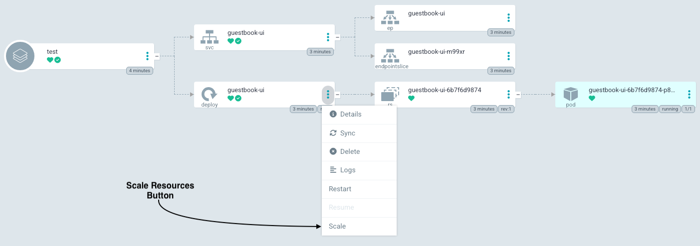
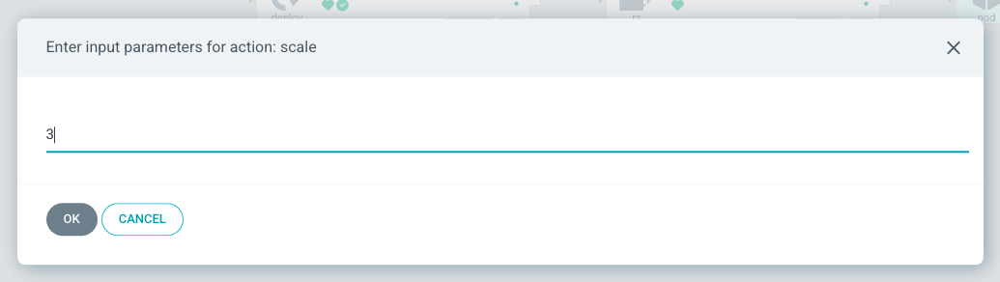
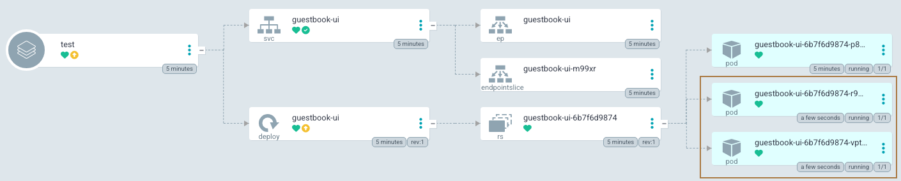

# Scale Resources in ArgoCD UI

This enables users to scale resources directly from the ArgoCD UI. Users will be able to increase or decrease the number of replicas (Pods) for Jobs, Deployments, and StatefulSets by using input field. The feature aims to enhance user experience, especially for non-technical users, by eliminating the need to modify configuration files or use kubectl commands for scaling.

## Example Usage
1. User navigates to a Deployment, StatefulSet or Job in any ArgoCD application.
2. User clicks on the Actions dropdown and selects "Scale".
  
3. A modal pops up showing an input field `Enter input parameters for action: scale` with the current number of Pods.
4. User adjusts the number of Pods by entering a number.
  
5. User presses OK, and the resource is scaled accordingly.
  

!!! note
    This feature will only apply to `Jobs`, `Deployments`, and `StatefulSets`.

!!! note
    Ensure that invalid values (e.g., `non-numeric` characters, `negative` numbers, or values beyond the `max integer limit`) cannot be entered.
