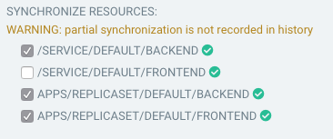

# Selective Sync

A _selective sync_ is one where only some resources are sync'd. You can choose which resources from the UI or the CLI:

When doing so, bear in mind that:

- Your sync is **not** recorded in the history, and so rollback is not possible.
- [Hooks](sync-waves.md) are **not** run.
