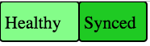

# Status Badge

Argo CD can display a badge with health and sync status for any application. The feature is disabled by default because badge image is available to any user without authentication.
The feature can be enabled using `statusbadge.enabled` key of `argocd-cm` ConfigMap (see [argocd-cm.yaml](../operator-manual/argocd-cm.yaml)).

To show this badge, use the following URL format `${argoCdBaseUrl}/api/badge?name=${appName}`, e.g. http://localhost:8080/api/badge?name=guestbook.
The URLs for status image are available on application details page:

1. Navigate to application details page and click on 'Details' button.
2. Scroll down to 'Status Badge' section.
3. Select the required template such as URL, Markdown etc. for the status image URL.
4. Copy the text and paste it into your README or website.

## Configuration Options

Following configuration options are available and they are configurable using query parameters:

- `revision`: The revision of the application.
- `lastSyncTime`: The time when the application was last synced.

### Revision

To display the application revision within the badge, use the the query parameter `revision=true`, e.g. http://localhost:8080/api/badge?name=guestbook&revision=true

### Last Sync Time

To display when the last sync time was within the badge, use the the query parameter `lastSyncTime=true`, e.g. http://localhost:8080/api/badge?name=guestbook&lastSyncTime=true

