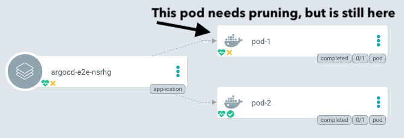
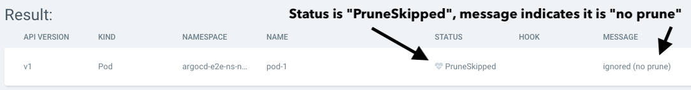

# Sync Options

Argo CD allows users to customize some aspects of how it syncs the desired state in the target cluster. Some Sync Options can be defined as annotations in a specific resource. Most of the Sync Options are configured in the Application resource `spec.syncPolicy.syncOptions` attribute. Multiple Sync Options which are configured with the `argocd.argoproj.io/sync-options` annotation can be concatenated with a `,` in the annotation value; white spaces will be trimmed.

Below you can find details about each available Sync Option:

## No Prune Resources

>v1.1

You may wish to prevent an object from being pruned:

```yaml
metadata:
  annotations:
    argocd.argoproj.io/sync-options: Prune=false
```

In the UI, the pod will simply appear as out-of-sync:




The sync-status panel shows that pruning was skipped, and why:



The app will be out of sync if Argo CD expects a resource to be pruned. You may wish to use this along with [compare options](compare-options.md).

## Disable Kubectl Validation

For a certain class of objects, it is necessary to `kubectl apply` them using the `--validate=false` flag. Examples of this are Kubernetes types which uses `RawExtension`, such as [ServiceCatalog](https://github.com/kubernetes-incubator/service-catalog/blob/master/pkg/apis/servicecatalog/v1beta1/types.go#L497). You can do using this annotations:


```yaml
metadata:
  annotations:
    argocd.argoproj.io/sync-options: Validate=false
```

If you want to exclude a whole class of objects globally, consider setting `resource.customizations` in [system level configuration](../user-guide/diffing.md#system-level-configuration).

## Skip Dry Run for new custom resources types

When syncing a custom resource which is not yet known to the cluster, there are generally two options:

1) The CRD manifest is part of the same sync. Then Argo CD will automatically skip the dry run, the CRD will be applied and the resource can be created.
2) In some cases the CRD is not part of the sync, but it could be created in another way, e.g. by a controller in the cluster. An example is [gatekeeper](https://github.com/open-policy-agent/gatekeeper),
which creates CRDs in response to user defined `ConstraintTemplates`. Argo CD cannot find the CRD in the sync and will fail with the error `the server could not find the requested resource`.

To skip the dry run for missing resource types, use the following annotation:

```yaml
metadata:
  annotations:
    argocd.argoproj.io/sync-options: SkipDryRunOnMissingResource=true
```

The dry run will still be executed if the CRD is already present in the cluster.

## No Resource Deletion

For certain resources you might want to retain them even after your application is deleted, for eg. Persistent Volume Claims.
In such situations you can stop those resources from being cleaned up during app deletion by using the following annotation:


```yaml
metadata:
  annotations:
    argocd.argoproj.io/sync-options: Delete=false
```

## Selective Sync

Currently when syncing using auto sync Argo CD applies every object in the application.
For applications containing thousands of objects this takes quite a long time and puts undue pressure on the api server.
Turning on selective sync option which will sync only out-of-sync resources.

You can add this option by following ways

1) Add `ApplyOutOfSyncOnly=true` in manifest

Example:

```yaml
apiVersion: argoproj.io/v1alpha1
kind: Application
spec:
  syncPolicy:
    syncOptions:
    - ApplyOutOfSyncOnly=true
```

2) Set sync option via argocd cli

Example:

```bash
$ argocd app set guestbook --sync-option ApplyOutOfSyncOnly=true
```

## Resources Prune Deletion Propagation Policy

By default, extraneous resources get pruned using foreground deletion policy. The propagation policy can be controlled
using `PrunePropagationPolicy` sync option. Supported policies are background, foreground and orphan.
More information about those policies could be found [here](https://kubernetes.io/docs/concepts/workloads/controllers/garbage-collection/#controlling-how-the-garbage-collector-deletes-dependents).

```yaml
apiVersion: argoproj.io/v1alpha1
kind: Application
spec:
  syncPolicy:
    syncOptions:
    - PrunePropagationPolicy=foreground
```

## Prune Last

This feature is to allow the ability for resource pruning to happen as a final, implicit wave of a sync operation,
after the other resources have been deployed and become healthy, and after all other waves completed successfully.

```yaml
apiVersion: argoproj.io/v1alpha1
kind: Application
spec:
  syncPolicy:
    syncOptions:
    - PruneLast=true
```

This can also be configured at individual resource level.
```yaml
metadata:
  annotations:
    argocd.argoproj.io/sync-options: PruneLast=true
```

## Replace Resource Instead Of Applying Changes

By default, Argo CD executes `kubectl apply` operation to apply the configuration stored in Git. In some cases
`kubectl apply` is not suitable. For example, resource spec might be too big and won't fit into
`kubectl.kubernetes.io/last-applied-configuration` annotation that is added by `kubectl apply`. In such cases you
might use `Replace=true` sync option:


```yaml
apiVersion: argoproj.io/v1alpha1
kind: Application
spec:
  syncPolicy:
    syncOptions:
    - Replace=true
```

If the `Replace=true` sync option is set the Argo CD will use `kubectl replace` or `kubectl create` command to apply changes.

!!! warning
      During the sync process, the resources will be synchronized using the 'kubectl replace/create' command.
      This sync option has the potential to be destructive and might lead to resources having to be recreated, which could cause an outage for your application.

This can also be configured at individual resource level.
```yaml
metadata:
  annotations:
    argocd.argoproj.io/sync-options: Replace=true
```

## Force Sync

For certain resources you might want to delete and recreate. e.g. job resources that should run every time when syncing.

!!! warning
      During the sync process, the resources will be synchronized using the 'kubectl delete/create' command.
      This sync option has a destructive action, which could cause an outage for your application.

In such cases you might use `Force=true` sync option in target resources annotation:
```yaml
metadata:
  annotations:
    argocd.argoproj.io/sync-options: Force=true,Replace=true
```

## Server-Side Apply

This option enables Kubernetes
[Server-Side Apply](https://kubernetes.io/docs/reference/using-api/server-side-apply/).

By default, Argo CD executes `kubectl apply` operation to apply the configuration stored in Git.
This is a client side operation that relies on `kubectl.kubernetes.io/last-applied-configuration`
annotation to store the previous resource state.

However, there are some cases where you want to use `kubectl apply --server-side` over `kubectl apply`:

- Resource is too big to fit in 262144 bytes allowed annotation size. In this case
  server-side apply can be used to avoid this issue as the annotation is not used in this case.
- Patching of existing resources on the cluster that are not fully managed by Argo CD.
- Use a more declarative approach, which tracks a user's field management, rather than a user's last
  applied state.

If `ServerSideApply=true` sync option is set, Argo CD will use `kubectl apply --server-side`
command to apply changes.

It can be enabled at the application level like in the example below:

```yaml
apiVersion: argoproj.io/v1alpha1
kind: Application
spec:
  syncPolicy:
    syncOptions:
    - ServerSideApply=true
```

To enable ServerSideApply just for an individual resource, the sync-option annotation
can be used:

```yaml
metadata:
  annotations:
    argocd.argoproj.io/sync-options: ServerSideApply=true
```

ServerSideApply can also be used to patch existing resources by providing a partial
yaml. For example, if there is a requirement to update just the number of replicas
in a given Deployment, the following yaml can be provided to Argo CD:

```yaml
apiVersion: apps/v1
kind: Deployment
metadata:
  name: my-deployment
spec:
  replicas: 3
```

Note that by the Deployment schema specification, this isn't a valid manifest. In this
case an additional sync option *must* be provided to skip schema validation. The example
below shows how to configure the application to enable the two necessary sync options:

```yaml
apiVersion: argoproj.io/v1alpha1
kind: Application
spec:
  syncPolicy:
    syncOptions:
    - ServerSideApply=true
    - Validate=false
```

In this case, Argo CD will use `kubectl apply --server-side --validate=false` command
to apply changes.

Note: [`Replace=true`](#replace-resource-instead-of-applying-changes) takes precedence over `ServerSideApply=true`.

## Fail the sync if a shared resource is found

By default, Argo CD will apply all manifests found in the git path configured in the Application regardless if the resources defined in the yamls are already applied by another Application. If the `FailOnSharedResource` sync option is set, Argo CD will fail the sync whenever it finds a resource in the current Application that is already applied in the cluster by another Application.

```yaml
apiVersion: argoproj.io/v1alpha1
kind: Application
spec:
  syncPolicy:
    syncOptions:
    - FailOnSharedResource=true
```

## Respect ignore difference configs

This sync option is used to enable Argo CD to consider the configurations made in the `spec.ignoreDifferences` attribute also during the sync stage. By default, Argo CD uses the `ignoreDifferences` config just for computing the diff between the live and desired state which defines if the application is synced or not. However during the sync stage, the desired state is applied as-is. The patch is calculated using a 3-way-merge between the live state the desired state and the `last-applied-configuration` annotation. This sometimes leads to an undesired results. This behavior can be changed by setting the `RespectIgnoreDifferences=true` sync option like in the example below:

```yaml
apiVersion: argoproj.io/v1alpha1
kind: Application
spec:

  ignoreDifferences:
  - group: "apps"
    kind: "Deployment"
    jsonPointers:
    - /spec/replicas

  syncPolicy:
    syncOptions:
    - RespectIgnoreDifferences=true
```

The example above shows how an Argo CD Application can be configured so it will ignore the `spec.replicas` field from the desired state (git) during the sync stage. This is achieved by calculating and pre-patching the desired state before applying it in the cluster. Note that the `RespectIgnoreDifferences` sync option is only effective when the resource is already created in the cluster. If the Application is being created and no live state exists, the desired state is applied as-is.

## Create Namespace

```yaml
apiVersion: argoproj.io/v1alpha1
kind: Application
metadata:
  namespace: argocd
spec:
  destination:
    server: https://kubernetes.default.svc
    namespace: some-namespace
  syncPolicy:
    syncOptions:
    - CreateNamespace=true
```

The example above shows how an Argo CD Application can be configured so it will create the namespace specified in `spec.destination.namespace` if it doesn't exist already. Without this either declared in the Application manifest or passed in the CLI via `--sync-option CreateNamespace=true`, the Application will fail to sync if the namespace doesn't exist.

Note that the namespace to be created must be informed in the `spec.destination.namespace` field of the Application resource. The `metadata.namespace` field in the Application's child manifests must match this value, or can be omitted, so resources are created in the proper destination.

### Namespace Metadata

We can also add labels and annotations to the namespace through `managedNamespaceMetadata`. If we extend the example above
we could potentially do something like below:

```yaml
apiVersion: argoproj.io/v1alpha1
kind: Application
metadata:
  namespace: test
spec:
  syncPolicy:
    managedNamespaceMetadata:
      labels: # The labels to set on the application namespace
        any: label
        you: like
      annotations: # The annotations to set on the application namespace
        the: same
        applies: for
        annotations: on-the-namespace
    syncOptions:
    - CreateNamespace=true
```

In order for Argo CD to manage the labels and annotations on the namespace, `CreateNamespace=true` needs to be set as a
sync option, otherwise nothing will happen. If the namespace doesn't already exist, or if it already exists and doesn't
already have labels and/or annotations set on it, you're good to go. Using `managedNamespaceMetadata` will also set the
resource tracking label (or annotation) on the namespace, so you can easily track which namespaces are managed by Argo CD.

In the case you do not have any custom annotations or labels but would nonetheless want to have resource tracking set on
your namespace, that can be done by setting `managedNamespaceMetadata` with an empty `labels` and/or `annotations` map,
like the example below:

```yaml
apiVersion: argoproj.io/v1alpha1
kind: Application
metadata:
  namespace: test
spec:
  syncPolicy:
    managedNamespaceMetadata:
      labels: # The labels to set on the application namespace
      annotations: # The annotations to set on the application namespace
    syncOptions:
    - CreateNamespace=true
```

In the case where Argo CD is "adopting" an existing namespace which already has metadata set on it, you should first
[upgrade the resource to server-side apply](https://kubernetes.io/docs/reference/using-api/server-side-apply/#upgrading-from-client-side-apply-to-server-side-apply)
before enabling `managedNamespaceMetadata`. Argo CD relies on `kubectl`, which does not support managing 
client-side-applied resources with server-side-applies. If you do not upgrade the resource to server-side apply, Argo CD
may remove existing labels/annotations, which may or may not be the desired behavior.

Another thing to keep mind of is that if you have a k8s manifest for the same namespace in your Argo CD application, that
will take precedence and *overwrite whatever values that have been set in `managedNamespaceMetadata`*. In other words, if
you have an application that sets `managedNamespaceMetadata`

```yaml
apiVersion: argoproj.io/v1alpha1
kind: Application
spec:
  syncPolicy:
    managedNamespaceMetadata:
      annotations:
        abc: 123
    syncOptions:
      - CreateNamespace=true
```

But you also have a k8s manifest with a matching name

```yaml
apiVersion: v1
kind: Namespace
metadata:
  name: foobar
  annotations:
    foo: bar
    something: completely-different
```

The resulting namespace will have its annotations set to

```yaml
  annotations:
    foo: bar
    something: completely-different
```
