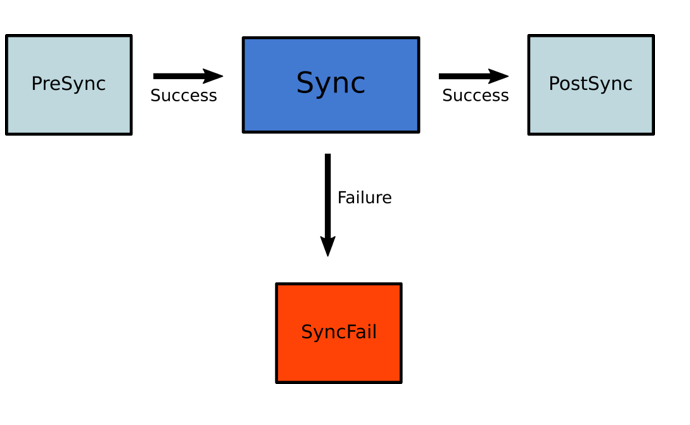
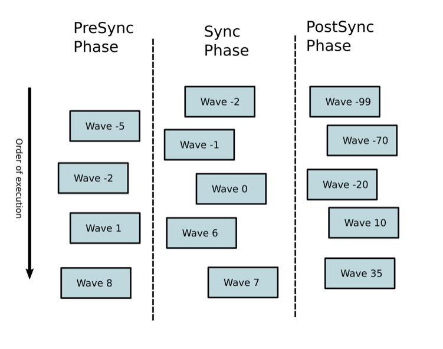

# Sync Phases and Waves

Sync phases and hooks define when resources are applied such as before or after the main sync operation. This makes it possible to define jobs, or any other resource to run or be applied in any specific order.

Argo CD has the following hook types:

| Hook | Description |
|------|-------------|
| `PreSync` | Executes prior to the application of the manifests. |
| `Sync`  | Executes after all `PreSync` hooks completed and were successful, at the same time as the application of the manifests. |
| `Skip` | Indicates to Argo CD to skip the application of the manifest. |
| `PostSync` | Executes after all `Sync` hooks completed and were successful, a successful application, and all resources in a `Healthy` state. |
| `SyncFail` | Executes when the sync operation fails. |
| `PostDelete` | Executes after all Application resources are deleted. _Available starting in v2.10._ |

Adding the argocd.argoproj.io/hook annotation to a resource will assign it to a specific phase. During a Sync operation, Argo CD will apply the resource during the appropriate phase of the deployment. Hooks can be any type of Kubernetes resource kind, but tend to be Pod, Job or Argo Workflows. Multiple hooks can be specified as a comma separated list.

## How phases work?

Argo CD will respect resources assigned to different phases, during a sync operation Argo CD will do the following.

Apply all the resources marked as PreSync hooks. If any of them fails the whole sync process will stop and will be marked as failed
Apply all the resources marked as Sync hooks. If any of them fails the whole sync process will be marked as failed. Hooks marked with SyncFail will also run
Apply all the resources marked as PostSync hooks. If any of them fails the whole sync process will be marked as failed.
Hooks marked with Skip will not be applied.

Here is a graphical overview of the sync process:



You can use this simple lifecycle method in various scenarios. For example you can run an essential check as a PreSync hook. If it fails then the whole sync operation will stop preventing the deployment from taking place. In a similar manner you can run smoke tests as PostSync hooks. If they succeed you know that your application has passed the validation. If they fail then the whole deployment will be marked as failed and Argo CD can then notify you in order to take further actions.

Hooks at the SyncFail phase can be used for cleanup actions and other housekeeping tasks. Note that if they themselves fail, Argo CD will not do anything special (other than marking the whole operation as failed).

Note that hooks do not run during a selective sync operation.

## Hook lifecycle and cleanup

Argo CD offers several methods to clean up hooks and decide how much history will be kept for previous runs.
In the most basic case you can use the argocd.argoproj.io/hook-delete-policy to decide when a hook will be deleted.
This can take the following values:

| Policy | Description |
|--------|-------------|
| `HookSucceeded` | The hook resource is deleted after the hook succeeded (e.g. Job/Workflow completed successfully). |
| `HookFailed` | The hook resource is deleted after the hook failed. |
| `BeforeHookCreation` | Any existing hook resource is deleted before the new one is created (since v1.3). It is meant to be used with `/metadata/name`. |


## How sync waves work?

Argo CD also offers an alternative method of changing the sync order of resources. These are sync waves. They are defined by the argocd.argoproj.io/sync-wave annotation. The value is an integer that defines the ordering (ArgoCD will start deploying from the lowest number and finish with the highest number).

Hooks and resources are assigned to wave 0 by default. The wave can be negative, so you can create a wave that runs before all other resources.

When a sync operation takes place, Argo CD will:
Order all resources according to their wave (lowest to highest)
Apply the resources according to the resulting sequence

There is currently a delay between each sync wave in order to give other controllers a chance to react to the spec change that was just applied. This also prevents Argo CD from assessing resource health too quickly (against the stale object), causing hooks to fire prematurely. The current delay between each sync wave is 2 seconds and can be configured via the environment variable ARGOCD_SYNC_WAVE_DELAY.

## Combining Sync waves and hooks

While you can use sync waves on their own, for maximum flexibility you can combine them with hooks. This way you can use sync phases for coarse grained ordering and sync waves for defining the exact order of a resource within an individual phase.



When Argo CD starts a sync, it orders the resources in the following precedence:

The phase
The wave they are in (lower values first)
By kind (e.g. namespaces first and then other Kubernetes resources, followed by custom resources)
By name

Once the order is defined:

First Argo CD determines the number of the first wave to apply. This is the first number where any resource is out-of-sync or unhealthy.
It applies resources in that wave.
It repeats this process until all phases and waves are in-sync and healthy.

Because an application can have resources that are unhealthy in the first wave, it may be that the app can never get to healthy.

## How Do I Configure Phases?

Pre-sync and post-sync can only contain hooks. Apply the hook annotation:

```yaml
metadata:
  annotations:
    argocd.argoproj.io/hook: PreSync
```

[Read more about hooks](resource_hooks.md).

## How Do I Configure Waves?

Specify the wave using the following annotation:

```yaml
metadata:
  annotations:
    argocd.argoproj.io/sync-wave: "5"
```

Hooks and resources are assigned to wave zero by default. The wave can be negative, so you can create a wave that runs before all other resources.

## Examples

### Send message to Slack when sync completes

The following example uses the Slack API to send a a Slack message when sync completes:

```yaml
apiVersion: batch/v1
kind: Job
metadata:
  generateName: app-slack-notification-
  annotations:
    argocd.argoproj.io/hook: PostSync
    argocd.argoproj.io/hook-delete-policy: HookSucceeded
spec:
  template:
    spec:
      containers:
        - name: slack-notification
          image: curlimages/curl
          command:
            - curl
            - '-X'
            - POST
            - '--data-urlencode'
            - >-
              payload={"channel": "#somechannel", "username": "hello", "text":
              "App Sync succeeded", "icon_emoji": ":ghost:"}
            - 'https://hooks.slack.com/services/...'
      restartPolicy: Never
  backoffLimit: 2
```

The following example runs a db migration command before the main sync operation (also in wave -1):
```yaml
apiVersion: batch/v1
kind: Job
metadata:
  name: db-migrate
  annotations:
    argocd.argoproj.io/hook: PreSync
    argocd.argoproj.io/hook-delete-policy: HookSucceeded
    argocd.argoproj.io/sync-wave: '-1'
spec:
  ttlSecondsAfterFinished: 360
  template:
    spec:
      containers:
        - name: postgresql-client
          image: 'my-postgres-data:11.5'
          imagePullPolicy: Always
          env:
            - name: PGPASSWORD
              value: admin
            - name: POSTGRES_HOST
              value: my_postgresql_db
          command:
            - psql
            - '-h=my_postgresql_db'
            - '-U postgres'
            - '-f preload.sql'
      restartPolicy: Never
  backoffLimit: 1
```

### Work around ArgoCD sync failure

Upgrading ingress-nginx controller (managed by helm) with ArgoCD 2.x sometimes fails to work resulting in:

.|.
-|-
OPERATION|Sync
PHASE|Running
MESSAGE|waiting for completion of hook batch/Job/ingress-nginx-admission-create

.|.
-|-
KIND     |batch/v1/Job
NAMESPACE|ingress-nginx
NAME     |ingress-nginx-admission-create
STATUS   |Running
HOOK     |PreSync
MESSAGE  |Pending deletion

To work around this, a helm user can add:

```yaml
ingress-nginx:
  controller:
    admissionWebhooks:
      annotations:
        argocd.argoproj.io/hook: Skip
```

Which results in a successful sync.
