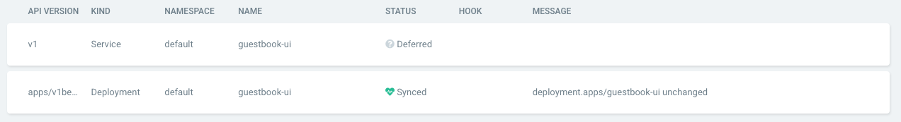

# Sync Waves

Argo CD can sync resources in waves, waiting until resources in preceding waves are in-sync and healthy before syncing subsequent waves.

One use case would be that deployment B should not start until deployment A is fully running with a new image. You could put deployment A in the first wave and deployment B in the second wave. 

## How Do I Configure Waves?

Specify the wave of a resources using the following annotation:

```yaml
metadata:
  annotations:
    argocd.argoproj.io/sync-wave: "5"
```

Resources are assigned to wave zero by default. The wave can be negative, so you can create a wave that runs before all other resources.

## How Does It Work?

When Argo CD starts a sync, it orders the resources in the following precedence:

* The wave they are in (lower values first)
* By kind (e.g. namespaces first)
* By name 

It then determines which the number of the next wave to apply. This is the first number where any resource is out-of-sync or unhealthy.
 
It applies resources in that wave.  Resources in the future waves are marked as "deferred".

It repeats this process until all waves are in in-sync and healthy.

Because an application can have resources that are unhealthy in the first wave, it may be that the app can never get to healthy.
    
Attempts to get the app into sync will continue indefinitely, but each attempt is subject to exponential back-off.

## How Do I Know If An App In Doing A Sync With Waves?

Under the application details, you'll see the message "more objects to apply"? You'll also see "deferred" resources below this:



## How Can I Terminate A Sync?

To terminate the sync, click on the "synchronisation" then "terminate":

 