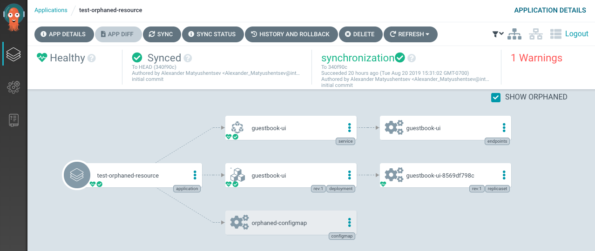

# Unmanaged Resources Monitoring

Unmanaged Resources are top-level Kubernetes namespaced resources which do not belong to any Argo CD Application. The Unmanaged Resources Monitoring feature allows detecting
unmanaged resources, generate a warning and inspect/remove resources using Argo CD UI.

The Unmanaged Resources monitoring is enabled in [Project](projects.md) settings. Once the feature is enabled each project application in which target namespace has unmanaged resources
will get a warning condition. The unmanaged resources can be located using the application details page:

Before enabling feature you might consider disabling warning. In this case application users are going to see unmanaged resources in the UI but application is won't get a warning condition.

## Exceptions

Not every resource in the Kubernetes cluster is controlled by the end user. Following resources are never considered as unmanaged:

* Namespaced resources denied in the project. Usually, such resources are managed by cluster administrators and not supposed to be modified by namespace user.
* `ServiceAccount` with name `default` ( and corresponding auto-generated `ServiceAccountToken` ).
* `Service` with name `kubernetes` in the `default` namespace.
* `ConfigMap` with name `kube-root-ca.crt` in all namespaces.
